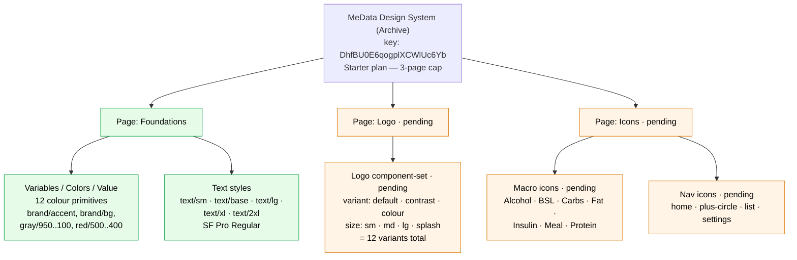
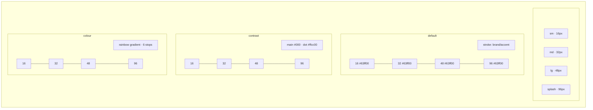

# UI Baseline — Placeholder Previews

These SVG files and diagrams are **placeholder previews** of the design-system assets the `ui-restoration` spec is authoring into Figma. The **canonical archive is the Figma file** (`DhfBU0E6qogplXCWlUc6Yb` — "MeData Design System (Archive)"); see [`../figma-archive.md`](../figma-archive.md). These local artifacts exist because the Figma Starter plan's 6 tool calls / month cap was exhausted on 2026-06-09 before the Logo and Icons pages could be authored, and the next quota window is 2026-07-01.

All path data and colour values are read verbatim from [`specs/ui-restoration/design-system.md`](../../../specs/ui-restoration/design-system.md). The source-of-truth code is at commit `3b5d54d` (decision_log Decision 2); read via `git show 3b5d54d:<path>`.

---

## Logo (3 variants)

The MeData glyph: `viewBox="0 0 128 128"`, three sub-paths, `stroke-width="24"`, round caps/joins, `fill="none"`. Static fully-drawn end-state (matches `prefers-reduced-motion: reduce`). See design-system.md §2.1–§2.5 for path data, animation, and sizing.

| Variant | Preview | Stroke (main) | Stroke (dot) |
|---|---|---|---|
| `default` |  | `#63ff00` | `#63ff00` |
| `contrast` |  | `#000000` | `#ffcc00` |
| `colour` |  | rainbow linear gradient (6 stops) | rainbow linear gradient (6 stops) |

SVG scales freely; one file per variant is enough. The four size tokens (`sm` 16, `md` 32, `lg` 48, `splash` 96) are rendered by sizing the `` / `<Logo>` consumer, not by maintaining 12 separate files.

Source files: [`logo/logo-default.svg`](./logo/logo-default.svg), [`logo/logo-contrast.svg`](./logo/logo-contrast.svg), [`logo/logo-colour.svg`](./logo/logo-colour.svg).

---

## Macro / drink icons (7)

24×24, `stroke="currentColor"`, round caps/joins. Per-sub-path `stroke-width` per design-system.md §7.1.

| Icon | Preview | Source |
|---|---|---|
| Alcohol (wine glass) |  | [alcohol.svg](./icons/macro/alcohol.svg) |
| BSL (blood drop) |  | [bsl.svg](./icons/macro/bsl.svg) |
| Carbs (bread loaf) |  | [carbs.svg](./icons/macro/carbs.svg) |
| Fat (oil drop) |  | [fat.svg](./icons/macro/fat.svg) |
| Insulin (syringe) |  | [insulin.svg](./icons/macro/insulin.svg) |
| Meal (open book) |  | [meal.svg](./icons/macro/meal.svg) |
| Protein (drumstick) |  | [protein.svg](./icons/macro/protein.svg) |

**Note on Insulin:** the syringe barrel is an SVG `<rect>` element (rotated 45°) per the snapshot source — it cannot be expressed as a single path `d`. The other three sub-paths (needle tip, plunger handle, measurement marks) are paths.

**Note on Protein:** the bone end is an SVG `<circle>` element per the snapshot source.

---

## Navigation icons (4)

24×24, `stroke="currentColor"`, `stroke-width="2"`, round caps/joins. Per design-system.md §7.2. Source data was inlined in `BottomNav.svelte` (`git show 3b5d54d:src/lib/components/layout/BottomNav.svelte`).

| Icon | Preview | Source |
|---|---|---|
| home |  | [home.svg](./icons/nav/home.svg) |
| plus-circle |  | [plus-circle.svg](./icons/nav/plus-circle.svg) |
| list |  | [list.svg](./icons/nav/list.svg) |
| settings |  | [settings.svg](./icons/nav/settings.svg) |

**Note on settings:** the §7.2 path data in design-system.md is elided (`…`); the full Heroicons-v1 cog path (gear + centre circle, two sub-paths) was re-read from the snapshot at `3b5d54d:src/lib/components/layout/BottomNav.svelte` and is used verbatim here.

---

## Figma file structure

What the file looks like today vs what the `ui-restoration` spec aims for. Items pending the next Figma MCP quota window are marked `(pending)`.



---

## Logo variant matrix

3 variants × 4 sizes = 12 component-set members. SVG scales freely, so the placeholders are stored per-variant only — Figma instantiates per size.



---

## Animation state machine — Button

The Button component (design-system.md §3.1, §8.2) cycles between visible interaction states. Spring physics and shimmer / ripple are documented-only (decision_log Decision 7); the variants below are what the Figma file will represent.

```mermaid
stateDiagram-v2
  [*] --> default

  default --> hover: pointer enter
  hover --> default: pointer leave
  hover --> pressed: pointer down
  pressed --> hover: pointer up (still over)
  pressed --> default: pointer up (left)

  default --> loading: prop loading=true
  loading --> default: prop loading=false
  default --> disabled: prop disabled=true
  disabled --> default: prop disabled=false

  note right of loading
    Leading 16px spinner.
    Click suppressed.
  end note

  note right of disabled
    opacity 0.5
    cursor not-allowed
  end note

  note left of pressed
    Spring scale 0.97
    (stiffness 0.3, damping 0.8)
    + ripple at pointer
    (documented in §8.2,
     not animated in Figma)
  end note
```

---

## Uplift to Figma

When the Figma MCP quota resets (2026-07-01 at earliest), these placeholders translate one-to-one into Figma constructs. Re-author with a single `use_figma` call to stay within quota.

### Pages to create

| Page | Status |
|---|---|
| `Foundations` | Exists. Hosts variables and text styles. |
| `Logo` | Create. Host the Logo component-set. |
| `Icons` | Create. Host both macro and nav icon components on one page (3-page Starter cap). |

### Logo component-set

| Placeholder SVG | Figma target |
|---|---|
| `logo/logo-default.svg` | `Logo` component-set, all 4 `variant=default, size=*` variants. Stroke on every sub-path bound to variable `brand/accent` (not baked hex). |
| `logo/logo-contrast.svg` | `Logo` component-set, all 4 `variant=contrast, size=*` variants. Main + right-vertical stroke baked `#000000`; centre-dot stroke baked `#ffcc00`. |
| `logo/logo-colour.svg` | `Logo` component-set, all 4 `variant=colour, size=*` variants. Stroke on every sub-path is a `GRADIENT_LINEAR` paint with the 6 stops from §2.2, identity gradient transform (horizontal). |

For every variant: sub-paths are the three from §2.1, `viewBox` `0 0 128 128`, `strokeWeight = 24 × (size/128)`, `strokeCap = 'ROUND'`, `strokeJoin = 'ROUND'`, `fills = []`. Component description: `MeData logo (role=img, aria-label="MeData logo")`.

### Icon components

| Placeholder SVG | Figma target |
|---|---|
| `icons/macro/alcohol.svg` | Component `AlcoholIcon`, 24×24. Strokes bound to `gray/400`. |
| `icons/macro/bsl.svg` | Component `BSLIcon`, 24×24. Strokes bound to `gray/400`. |
| `icons/macro/carbs.svg` | Component `CarbsIcon`, 24×24. Strokes bound to `gray/400`. |
| `icons/macro/fat.svg` | Component `FatIcon`, 24×24. Strokes bound to `gray/400`. |
| `icons/macro/insulin.svg` | Component `InsulinIcon`, 24×24. Sub-paths plus a rotated `<rect>` (barrel) authored as a Figma rectangle with rotation 45°. Strokes bound to `gray/400`. |
| `icons/macro/meal.svg` | Component `MealIcon`, 24×24. Strokes bound to `gray/400`. |
| `icons/macro/protein.svg` | Component `ProteinIcon`, 24×24. Includes an ellipse (`cx=17, cy=7, r=1.5`) for the bone end. Strokes bound to `gray/400`. |
| `icons/nav/home.svg` | Component `home`, 24×24. Stroke bound to `gray/400`. |
| `icons/nav/plus-circle.svg` | Component `plus-circle`, 24×24. Stroke bound to `gray/400`. |
| `icons/nav/list.svg` | Component `list`, 24×24. Stroke bound to `gray/400`. |
| `icons/nav/settings.svg` | Component `settings`, 24×24. Two sub-paths (gear + centre circle). Stroke bound to `gray/400`. |

All icons: `currentColor` → bind stroke to `gray/400` (default), with an active state that re-binds to `brand/accent` (Requirement 4.3). `fills = []`. Component description: `<name> icon. aria-hidden=true.`.

### Variable bindings (use `setBoundVariableForPaint`)

```js
// Resolve variables by name from the Colors collection
const colorsCollection = (await figma.variables.getLocalVariableCollectionsAsync())
  .find(c => c.name === 'Colors');
const allVars = await Promise.all(colorsCollection.variableIds.map(id =>
  figma.variables.getVariableByIdAsync(id)));
const byName = Object.fromEntries(allVars.map(v => [v.name, v]));
const brandAccent = byName['brand/accent'];
const gray400 = byName['gray/400'];

// Bind a stroke to a variable (must capture the returned paint and reassign)
const base = { type: 'SOLID', color: { r: 0, g: 0, b: 0 } };
vec.strokes = [figma.variables.setBoundVariableForPaint(base, 'color', brandAccent)];
```

### Rainbow gradient stops (verbatim from §2.2)

```js
const colourGradientPaint = {
  type: 'GRADIENT_LINEAR',
  gradientTransform: [[1, 0, 0], [0, 1, 0]], // identity = horizontal
  gradientStops: [
    { position: 0.0, color: { r: 0xE4/255, g: 0x03/255, b: 0x03/255, a: 1 } },
    { position: 0.2, color: { r: 0xFF/255, g: 0x8C/255, b: 0x00/255, a: 1 } },
    { position: 0.4, color: { r: 0xFF/255, g: 0xED/255, b: 0x00/255, a: 1 } },
    { position: 0.6, color: { r: 0x00/255, g: 0x80/255, b: 0x26/255, a: 1 } },
    { position: 0.8, color: { r: 0x24/255, g: 0x40/255, b: 0x8E/255, a: 1 } },
    { position: 1.0, color: { r: 0x73/255, g: 0x29/255, b: 0x82/255, a: 1 } },
  ],
};
```

### After uplift

When tasks 4, 5, 6 are complete in Figma:

```
rune complete 4
rune complete 5
rune complete 6
```

Task 7 (screenshot verification) is a separate call — budget for it.
