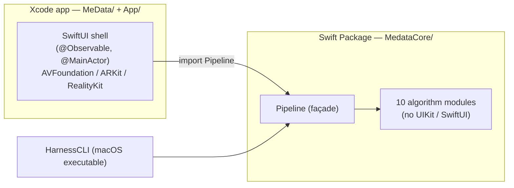
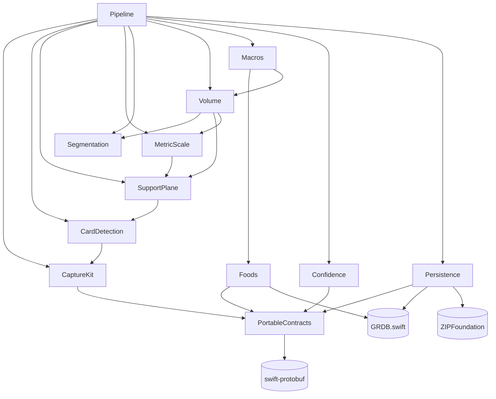
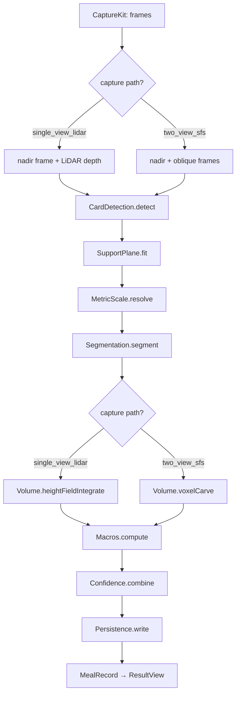
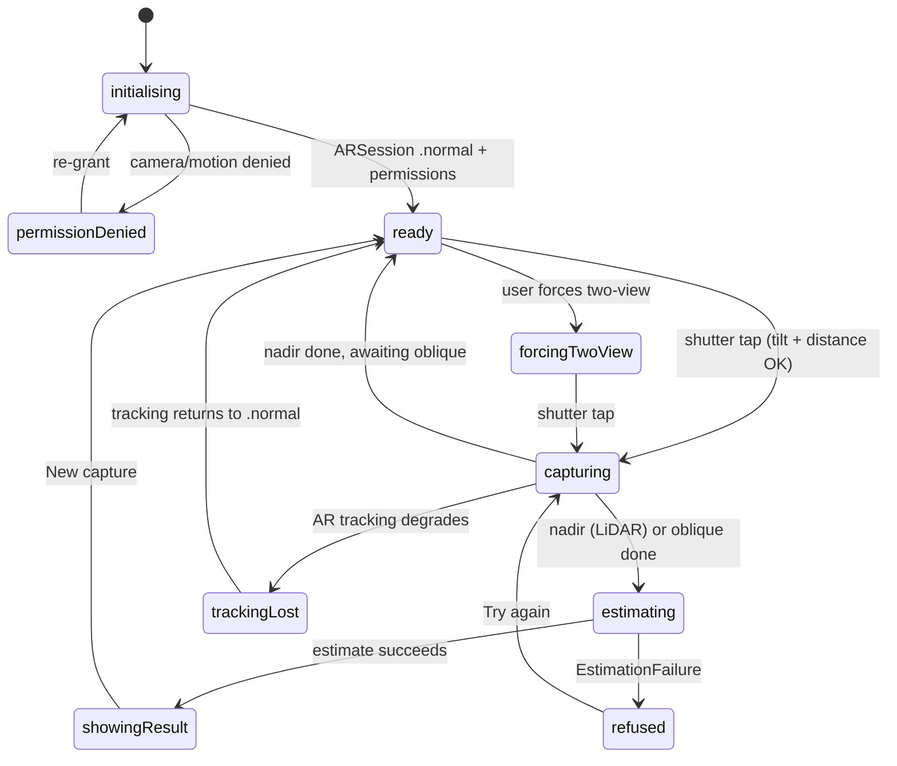

# MeData Architecture

**Audience:** Swift developers joining the project. This document explains the layers,
abstractions, and conventions of the codebase so you can read and extend it without
re-deriving the design. It describes *what is* and *why*; it does not restate the
requirements or the maths — those live in the specs (see [Specifications](#specifications)).

**Status:** reflects the codebase on the `research` branch. Implementation-progress
notes (what was built when, gotchas found during a task) live in
[`docs/agent-notes/`](agent-notes/) and are deliberately kept separate from this
evergreen architecture overview.

---

## 1. What the app does

MeData estimates the carbohydrate content of a meal from one or two iPhone photographs
using **deterministic on-device computer vision** — geometry, an on-device food
segmenter, a bundled food-composition database, and offline-calibrated per-class
correction factors. There is no LLM and no network call in the estimation path
(it supersedes an earlier LLM-based MVP — `specs/research/decision_log.md` Decision 1).

The core transformation is:

```
photo(s) → silhouettes → visual hull H → V_c (volume per class)
         → m_c = V_c · ρ_c (mass) → C = Σ m_c · κ_c / 100 (carbs)
```

See `specs/research/requirements.md` for the full mathematical pipeline, modelling
assumptions, and academic provenance.

**Hardware floor:** iPhone 13 Pro Max and later (rear LiDAR). **OS floor:** iOS 26.5.
(`specs/research/requirements.md` Req 1.2. The capture engine relaxes this at runtime
for non-LiDAR devices — see [`docs/ios-device-setup.md`](ios-device-setup.md) device
matrix — but calibration and performance bars are measured on iPhone 13 Pro Max.)

### 1.1 Delivery phases — what works today

V1 ships in three ordered phases (`specs/research/requirements.md` §0). Phases 1 and 2
ship with a development stub in the segmenter slot; numeric accuracy targets gate
**Phase 3 only**.

- **Phase 1 — running on device (current).** Full capture → segmentation (dev-stub) →
  volume → macros → result on iPhone 13 Pro Max. Capture flow, gating, persistence,
  refusal paths and confidence combination are real; the segmenter emits a centred
  ellipse food mask (`specs/research/requirements.md` §23.2) so carb numbers are
  placeholders. `DEV_STUB_SEGMENTER` is the swift-build flag that selects this engine.
- **Phase 2 — UI/UX iteration.** Capture-flow polish against real-device usage; no new
  pipeline algorithms.
- **Phase 3 — data veracity & modelling.** Bundled trained Core ML segmenter, β_c
  calibration via `HarnessCLI calibrate`, accuracy harness exercised against the §21.3
  reference; placeholder banner from §23.3 removed.

### 1.2 Why the test scene is a fruit plate

A plate of fruit is the canonical Phase 1 test scene because it gives clean geometric
inputs: mostly-convex items sitting flat on a single support plane, which the LiDAR
plane fit and voxel carve / height-field integration handle cleanly. The pipeline
itself is food-agnostic at the geometry layer — volume → mass → carbs is just numbers
— so the choice is about reducing noise during Phase 1 bring-up, not about a limit of
the design.

Generalisation beyond fruit lands in Phase 3 and is gated on two trained components:
the segmenter's `ClassPalette` (which pixel classes count as which food) and the
`Foods` density / carbs-per-gram look-up. Until both cover a broader food set,
non-fruit dishes may segment poorly and density estimates fall back to defaults; the
geometry, gating and persistence paths are unaffected.

---

## 2. Two-target topology

The repo is one SwiftPM package plus one Xcode app project. The single most important
architectural rule is the split between them:



| Path | Target | Imports UIKit/SwiftUI? | Purpose |
|---|---|---|---|
| `App/` | iOS app source | Yes | SwiftUI capture-flow shell |
| `MeData/MeData.xcodeproj` | iOS app project | — | Committed Xcode project; references `App/*.swift` *in place* |
| `MedataCore/` | SwiftPM library | **No** | Platform-neutral pipeline + algorithms |
| `HarnessCore/` + `HarnessCLI/` | SwiftPM lib + macOS exe | No | Offline accuracy/calibration runner |

**Why the split:** every algorithm module in `MedataCore` is free of iOS-only types so
the maths can be re-derived on Android later, and so the whole pipeline runs headless on
macOS under `HarnessCLI` for calibration and accuracy testing
(`specs/research/decision_log.md` Decision 2). The app target imports only the `Pipeline`
module and a small SwiftUI surface.

> The Xcode project references `App/*.swift` and the local SPM by relative path
> (`../../medata`). It only resolves when the checkout directory is literally named
> `medata`. See [`docs/agent-notes/swift-package.md`](agent-notes/swift-package.md) and
> [`docs/ios-device-setup.md`](ios-device-setup.md).

---

## 3. The pipeline: layered modules

`MedataCore` is twelve modules. Dependencies flow strictly downward — every arrow points
at a module that knows nothing about its callers. `PortableContracts` is the foundation
every other module shares; `Pipeline` is the façade the app and harness consume.



| Module | Responsibility | Key abstraction |
|---|---|---|
| `PortableContracts` | Cross-platform record types (`Vec3`, `Mat4`, `Pb*` protobuf types) | Wire format shared by all modules |
| `CaptureKit` | AVFoundation / ARKit / Core Motion bridge | `CaptureSession` **actor**, `RawFrame` |
| `CardDetection` | ID-1 card detection + P4P pose | `CardDetector` protocol |
| `SupportPlane` | RANSAC plane fit (LiDAR) / iterative card-only fit | `SupportPlane`, `BinaryMask` |
| `MetricScale` | Resolve mm-per-pixel, scale uncertainty σ_s | Pure resolver function |
| `Segmentation` | Core ML wrapper, pre/post-process, σ_seg | `SegmenterInferenceEngine` protocol |
| `Volume` | Metal voxel-carve (two-view) / height-field (single-view) | `VoxelCarveEstimator`, `HeightFieldEstimator` |
| `Foods` | Food-composition DB (CoFID + AFCD) | `FoodDatabase` protocol |
| `Macros` | mass & carbs per class | Pure `Macros.compute(...)` |
| `Confidence` | σ_meal combination | Pure `Confidence.combine(...)` |
| `Persistence` | SQLite meal records, artefacts, retention, export | `PersistenceStore` |
| `Pipeline` | Orchestrates the per-path stage graph | `Pipeline.estimate(_:)` |

Detailed signatures and the portable algorithm pseudocode are in
`specs/research/design.md` §3 (Components and Interfaces) and §6 (Algorithms).

### 3.1 Estimation data flow

Stages run as one `async` pipeline driven by `Pipeline.estimate(_:)`. Each stage produces
a record consumed by the next; there is no global mutable state. A stage that cannot
proceed (no card and no LiDAR; LiDAR coverage too low; plane-fit failure; all classes too
small) returns an `EstimationFailure` and the pipeline short-circuits.



### 3.2 Two capture paths

The two paths share every module and diverge only at the volume-estimation stage.
The path is **chosen before segmentation** and frozen onto the meal record:

- **`single_view_lidar`** — chosen when LiDAR is available, a support plane is detected,
  and LiDAR coverage over the food region is ≥ 80%. One nadir photo; volume by
  height-field integration against the LiDAR depth map.
- **`two_view_sfs`** — the fallback (no LiDAR, low coverage, or user override). Two photos
  (nadir + oblique); volume by Metal voxel carving from the two silhouettes.

The decision rule lives in two places that must agree: `Pipeline/CapturePathDispatch.swift`
(`selectCapturePath`) on the core side, and `App/CapturePathDecider.swift` on the UI side
(used live to show the path hint before capture).

---

## 4. The UI: one state machine

The iOS shell is a thin SwiftUI layer over a single `@Observable @MainActor`
`CaptureFlowModel` that owns a `CaptureState` state machine. **All behaviour is in the
model; the views are composition only.** This is what makes the flow unit-testable without
a camera. Full spec: `specs/ui/design.md`.



Key UI conventions (and the reasoning behind them):

- **Single source of truth.** `CaptureState` is an `Equatable` enum with associated
  values carrying the data each state needs (e.g. a frozen `GatingSnapshot`). Illegal
  transitions trip `assertionFailure` in debug.
- **High-churn signals are isolated.** A child `@Observable LiveIndicatorModel` holds the
  ~60 Hz tilt/distance/coverage values so live writes don't re-render the whole
  `CaptureFlowView`. `LiveSampleObserver` feeds it from an `AsyncStream<ARFrame>`.
- **One `ARSession`.** `ARKitCaptureEngine` adopts the `ARView`'s session and is its sole
  delegate — running a second session contends for the camera and crashes. Do not
  reintroduce one (see `docs/agent-notes/ui-capture-flow.md`).
- **Path hint frozen at shutter tap.** The snapshot is captured synchronously on the same
  MainActor tick as the tap, before any `await`, so live updates can't change an in-flight
  capture.
- **Test seam.** `CaptureFlowModel` holds `any PipelineEstimator` (a protocol in
  `MedataCore`), so tests inject a `MockPipeline` and production injects the real
  `Pipeline`.

---

## 5. Cross-cutting conventions

These are the norms that recur across the codebase. Follow them when adding code.

### 5.1 Portable contracts, not `simd` at boundaries

Any type that crosses a module boundary uses the portable `Vec3` / `Mat4` / `Data`-bytes
representation from `PortableContracts`, **never** `simd_float3` / `simd_float4x4`. The
`simd_*` types are converted to portable types at exactly one place —
`CaptureKit/SimdAdapter.swift` — before exposure. This keeps the algorithm modules free of
Apple-specific vector types and lets a future Android port share the same wire format.

Persistent records are protobuf (`Pb*` types generated from `.proto` schemas in
`PortableContracts/Schemas/`, `swift_prefix = "Pb"`). Serialisation is protobuf-JSON via
`SwiftProtobuf.jsonString()`, guaranteeing byte-identical encoding across a future
Kotlin consumer (`specs/research/decision_log.md` Decision 31). Regenerate with
`bash MedataCore/Sources/PortableContracts/Schemas/generate.sh`.

### 5.2 Swift 6 concurrency model

- `CaptureSession` is an **actor** — serial access so capture, stop, and frame delivery
  cannot race.
- `CaptureFlowModel`, `LiveIndicatorModel`, `LiveSampleObserver` are `@MainActor`.
- View models use the `@Observable` macro (not `ObservableObject`/`@Published`). The app
  owns them with `@State`; pass with `@Bindable` for bindings.
- Everything crossing an actor boundary is `Sendable` (`RawFrame`, `MealRecord`,
  `GatingSnapshot`, …). `MetalContext` is `@unchecked Sendable`, justified by Apple's
  documented `MTLDevice`/`MTLCommandQueue` thread-safety.
- Long-running stage work checks cancellation; note the caveat that the *core* pipeline
  currently has no cooperative cancellation points, so UI backgrounding is best-effort
  (`specs/ui/decision_log.md` Decision 12).

See `rules/language-rules/swift.md` (global) for the full Swift 6 / SwiftUI ruleset this
project follows.

### 5.3 Pure functions and protocol seams for testability

The numeric modules (`MetricScale`, `Macros`, `Confidence`, `CapturePathDecider`) are pure
functions or stateless enums — deterministic given their inputs, trivially testable.
Stateful collaborators are reached through protocols (`CardDetector`,
`SegmenterInferenceEngine`, `FoodDatabase`, `PipelineEstimator`, `CaptureEngine`) so tests
inject mocks. `RawFrame.fixture(...)` is the canonical way to build frames in tests.

### 5.4 Determinism

The pipeline is deterministic: two runs on the same fixture must produce identical output.
RNG (RANSAC seeding) uses a fixed seed derived from a deterministic hash; volume kernels
promote to FP32 for stable accumulation. This is what makes the offline accuracy harness
and β-calibration round-trip meaningful.

### 5.5 Irish / British English everywhere

All user-facing strings, identifiers, comments, and docs use Irish/British spelling
(*colour*, *recognised*, *fibre*, *behaviour*, *analyse*). This is enforced in CI:

```sh
bash tools/check_spelling.sh
```

### 5.6 Build & test

```sh
swift build        # all module targets + HarnessCLI
swift test         # MedataCore unit/property/integration tests
```

The iOS app builds from `MeData/MeData.xcodeproj` — see
[`docs/ios-device-setup.md`](ios-device-setup.md). App-side unit tests
(`MeData/Tests/`, Swift Testing) and XCUITests (`MeData/UITests/`) are **not** wired into
the committed Xcode project; add a temporary test target to run them (see
`docs/agent-notes/ui-capture-flow.md`).

---

## 6. Data & persistence

`MealRecord` is the durable output of one estimation. It is `Sendable, Equatable,
Hashable` (Hashable is required by `NavigationStack`'s `navigationDestination`). Composite
fields use `Pb*` sub-types so `Persistence` need not import the native algorithm modules.

The SQLite schema (`specs/research/design.md` §4.1) has five tables: `meals`,
`meal_classes`, `meal_artefacts`, `corrections`, `meta`. **Corrections are immutable** —
always INSERT, never UPDATE — so the original estimate is never mutated. Retention sweeps
run via `BackgroundTasks` with a foreground fallback that fires if the last sweep is older
than 24 h. Export zips the DB + artefacts via ZIPFoundation
(`PersistenceStore.exportArchive()`).

The food database ships bundled: CoFID 2024 base (`cofid_db.sqlite`) with the AFCD database
(`afcd_db.sqlite`) ATTACHed and merged via `COALESCE` (CoFID wins for shared classes; IFCDB
overlay removed per Decision 39). See `docs/agent-notes/persistence.md` for GRDB specifics.

---

## 7. Offline calibration & accuracy (HarnessCLI)

The per-class bulk-correction factors (β_c) are **calibrated offline on macOS**, never on
device. `HarnessCore` runs the full `Pipeline` headless over a fixture test set
(`MealFixture` protobuf schema), and `HarnessCLI` is the SwiftPM executable that drives
accuracy reporting, the segmenter mIoU bench, and β-calibration. This is only possible
because `MedataCore` has no iOS-only dependencies (§2). See `specs/research/design.md`
§6.9 and §7.3.

---

## 8. Specifications

Design lives in the specs; this document links to it rather than duplicating it. Each
feature is a subfolder of `specs/` with requirements, design, decision log, tasks, and
prerequisites. **[`specs/OVERVIEW.md`](../specs/OVERVIEW.md) is the canonical index** —
status, summary and per-spec file listing for every feature and bugfix spec; consult it
first when looking for prior work on a topic.

The two foundational specs this architecture sits on top of:

| Spec | What it covers |
|---|---|
| [`specs/research/requirements.md`](../specs/research/requirements.md) | Numbered requirements, §0 phase plan, §1.2 hardware floor (iPhone 13 Pro Max + iOS 26.5), §23 dev-stub phasing, mathematical pipeline, modelling assumptions, academic sources |
| [`specs/research/design.md`](../specs/research/design.md) | Module map, interfaces (§3), data models (§4), portable algorithm pseudocode (§6), testing strategy (§7) |
| [`specs/research/decision_log.md`](../specs/research/decision_log.md) | Architectural decisions D1–D47 (LLM→CV, platform-neutral core, protobuf contracts, …) |
| [`specs/research/tasks.md`](../specs/research/tasks.md) | Implementation task breakdown |
| [`specs/ui/requirements.md`](../specs/ui/requirements.md) | Capture-flow UI requirements |
| [`specs/ui/design.md`](../specs/ui/design.md) | `CaptureFlowModel` state machine, components, AR-session ownership, test seams |
| [`specs/ui/decision_log.md`](../specs/ui/decision_log.md) | UI decisions (live-signal source, best-effort backgrounding, single-session fix, …) |

For everything else — `rawframe-rgb-conversion`, `event-log-schema`,
`pipeline-real-device-correctness`, `shutter-blocked-feedback`, and active bugfix specs
under `specs/bugfixes/` — go through `specs/OVERVIEW.md`.

---

## 9. Where to make common changes

| Task | Location |
|---|---|
| Change a capture-flow transition | `App/CaptureFlowModel.swift` + `specs/ui/design.md` state table |
| Adjust live tilt/distance/coverage maths | `App/LiveSampleObserver.swift` (`LiveSampleMath`) |
| Change the single-vs-two-view rule | `Pipeline/CapturePathDispatch.swift` **and** `App/CapturePathDecider.swift` |
| Add/modify a persisted field | edit the `.proto` in `PortableContracts/Schemas/`, regenerate, update `Persistence` |
| Change a volume algorithm | `Volume/` (Metal kernels in `Volume/Kernels/`) + `specs/research/design.md` §6.6/§6.7 |
| Retrain/replace the segmenter | `tools/segmenter/export.py` → `segmenter.mlpackage` (the canonical artefact name everywhere: export output, `.gitignore`, and the `PipelineFactory.makeSegmenter` loader all agree). **Known gap (Phase 3):** the loader reads it from `Bundle.main` rather than via `Bundle.module` / the `GRDBFoodDatabase.bundled()` pattern, and the resource is not yet declared in `Package.swift`; align the loader to the `Bundle.module` pattern when the trained model lands. |
| Regenerate the food DB | `tools/food_db/generate.py` |
| Change confidence thresholds | `Confidence/` + `App/ResultView.swift` (pill labels) |
| Add an app-facing core type | re-export it from `Pipeline.swift` (`@_exported import`) |
</content>
</invoke>
