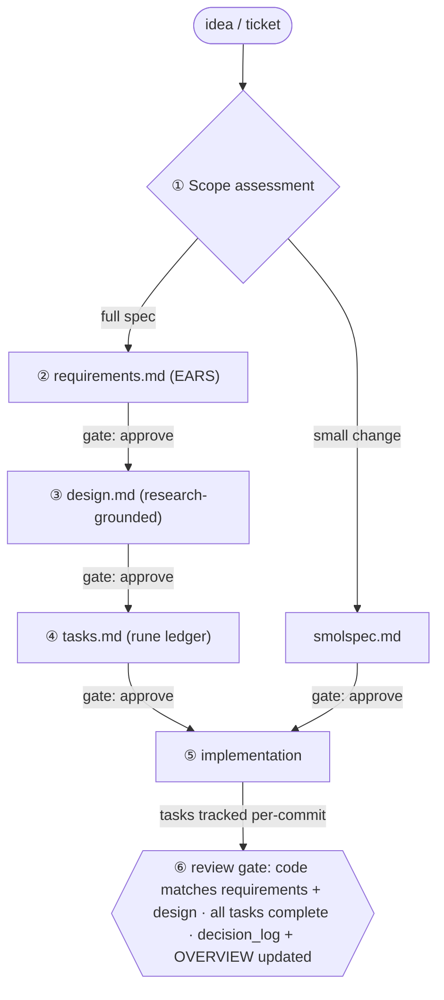
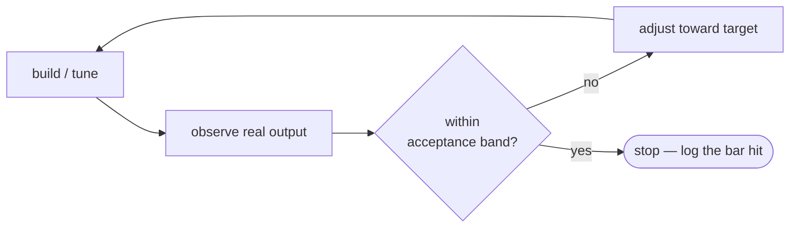

# Spec-Driven Development Process

**Audience:** anyone adding or changing a feature in Medata.

**Status:** the governing description of how specs are written, tracked, and turned into
code in this repository. It documents the process *as practised* (the "starwave" spec
skills, `rune`, decision logs) and matures it for the roadmap: an Android port and new
data input streams (biometrics, blood glucose, and other signals layered on top of the
carb-estimation core).

This file is the **process** source of truth. The **product/architecture** sources of
truth are the specs themselves ([`OVERVIEW.md`](OVERVIEW.md) indexes them) and
[`docs/architecture.md`](../docs/architecture.md). For cross-cutting decisions see
[`DECISIONS.md`](DECISIONS.md).

---

## 1. Core principle: the spec is the source of truth

Every non-trivial change is described before it is built, and the description outlives the
change. Code implements a spec; it does not replace it. When code and spec disagree, that
is a defect in one of them to be reconciled, not a state to leave standing.

This buys three things that matter as the project grows past one person and one platform:

- **Onboarding.** A new developer, expert, or agent reads the spec folder, not the diff
  history, to understand *what* a subsystem does and *why*.
- **Portability.** The Android port reuses the algorithm and data specs unchanged; only
  the platform-binding layer is re-specified (see §9).
- **Auditability.** The estimation pipeline is grounded in published research and clinical
  constraints. The decision logs record why each modelling choice was made, so a reviewer
  can check the maths against the cited sources, not against folklore.

## 2. Separation of concerns: one spec, distinct artifacts

A feature is described by **separate, scoped artifacts**, each answering one question.
Keeping them separate is what lets different *concerns* — and later different *people* —
own different parts of the same feature without colliding.

| Artifact | Answers | Concern / future owner | Driven by |
|---|---|---|---|
| `requirements.md` | **What** must be true, and for whom | Product / clinical / domain | `/starwave:requirements` |
| `design.md` | **How** it is built — architecture, data models, algorithms, maths | Engineering / protocol | `/starwave:design` |
| `tasks.md` | **Execution** — the ordered, trackable checklist (optional in iterative mode, §5) | Implementer (dev or agent) | `/starwave:tasks`, `rune` |
| `decision_log.md` | **Why** each load-bearing choice was made | Whoever made the call | maintained as decisions land |
| `prerequisites.md` | Preconditions/inputs a large spec assumes | Engineering | created for large specs |

Today **one developer wears all the hats** and the AI agents assist within each. The
separation is not bureaucracy — it is the seam along which the team will later split:
when a clinical or cryptographic expert joins, they own `requirements.md` or `design.md`
respectively, and the boundary already exists. Build for that seam now; do not collapse
the documents into one just because one person currently writes all of them.

## 3. Standard directory structure

One folder per feature under `specs/`, named for the feature (kebab-case). The folder name
*is* the feature name.

```
specs/
├── PROCESS.md            # this file — how specs are developed
├── OVERVIEW.md           # the index of every spec + status (keep in sync)
├── DECISIONS.md          # meta decision log — cross-cutting decisions distilled
├── <feature-name>/
│   ├── requirements.md   # the WHAT (EARS-format acceptance criteria)
│   ├── design.md         # the HOW (architecture, data models, algorithms)
│   ├── tasks.md          # the EXECUTION ledger (rune-managed)
│   ├── decision_log.md   # the WHY (Enhanced Nygard ADR entries)
│   └── prerequisites.md  # optional — preconditions for large specs
└── bugfixes/
    └── <bug-name>/        # fix-bug reports keep their own decision_log.md
```

**Small changes use one file, not five.** A change under ~80 LOC touching 1–3 files with
clear requirements is a **smolspec**: a single `smolspec.md` (Overview / Requirements /
Implementation Approach / Risks) plus a `tasks.md` and `decision_log.md`. See
`specs/lidar-first-scale-fallback/` for the shape. Do not manufacture a full five-document
spec for a one-function change — that is process for its own sake.

## 4. The development loop

The loop is sequential with an **explicit approval gate** between phases. Each phase has a
skill that drives it; the orchestrator is `/starwave:creating-spec`.



1. **Scope assessment** — research the affected code, estimate size, choose smolspec vs
   full spec. When uncertain, default to the full spec.
2. **Requirements** — the *what*, in EARS (§6). No solutions here.
3. **Design** — the *how*. For Medata this is research-grounded: cite the literature and
   record the maths. No code yet.
4. **Tasks** — decompose design into an ordered checklist mapped back to requirements,
   created with `rune` (§7).
5. **Implementation** — execute tasks in order; update the ledger per commit.
6. **Review** — the SSOT gate (§8).

This linear path is the **full-spec** loop. Smolspecs collapse phases 2–4 into one document;
**iterative** work (§5) replaces the task ledger with a target-and-converge loop. The
*gates* still apply in every mode.

**The gates are the process.** Do not start design before requirements are agreed, or code
before its plan exists — a `tasks.md` ledger in full/smol mode, or an agreed target and
acceptance band in iterative mode (§5). For a solo developer the "approval" is a deliberate
self-review (the
`/explain-like` skill is useful here — explaining the design at three levels surfaces gaps);
the gate is real even when the approver and author are the same person.

## 5. Choosing the mode: full spec, smolspec, or iterative

Three modes. Pick by the *nature* of the work, not size alone.

**Full spec** — a feature with a definable correct answer. The default; required for
anything touching the estimation maths, the data model, refusal/safety paths, or a public
contract, regardless of line count.

**Smolspec** — small, isolated change. Use only when *all* hold: <80 LOC, 1–3 files, single
component, clear requirements, no breaking changes, no cross-cutting concerns (security,
performance, privacy, clinical safety). If *any* fails, use the full spec.

**Iterative (taste/target-driven)** — work that converges on a *target* by judgement rather
than against a fixed pass/fail list: UI look-and-feel, motion, copy tone; and
research/calibration tuning (per-class β_c, confidence thresholds) where you tune toward an
accuracy target on the test set. Here "complete" is replaced by *"near enough is good enough
against the target"*. A `tasks.md` ledger often adds nothing — there is no fixed, orderable
checklist, only a loop you stop when the result meets the bar.

### The iterative loop

`requirements.md` still defines the **targets and acceptance bands** — what "good enough"
means, measurably where it can be (e.g. "carb MAE ≤ target on the v1 set", "matches the
design-system spacing scale", "shutter reachable one-handed"). `design.md` records the
approach and points at the reference. Then iterate:



- **The target is an artifact, not a memory.** For UI it is `design-system/MASTER.md` and
  the per-page docs in `design-system/pages/`; for tuning it is the accuracy target and the
  test set. Iterating against a *written* target is what keeps "taste" reviewable.
- **Observe with real output** — screenshots / on-device runs (the `verify` and `run`
  skills, the loop in `docs/agent-notes/device-build-and-test.md`), never assumptions.
- **Get an independent read** — the `ui-ux-reviewer` skill, or a second-opinion critique
  from an `mcp-devtools` agent (`gemini-agent` / `codex-agent`) against the design-system
  reference, catches taste drift a single author misses. `swiftui-forms` covers form layout.
- **Stop at the bar.** When the output is inside the band, stop — do not gold-plate. Record
  the bar reached and any conscious "near enough" trade-offs in `decision_log.md`.

**`tasks.md` is optional in this mode.** When the work is a convergence loop rather than an
orderable checklist, omit it — the targets in `requirements.md` plus the decision log carry
the state. (Sibling precedent: rune's `batch-positional-file-arg` and
`general/TECH-IMPROVEMENTS.md` ship without a tasks ledger.) Add a `tasks.md` only when
discrete, separable steps actually emerge.

## 6. Requirements in EARS

Acceptance criteria use EARS (Easy Approach to Requirements Syntax) with `SHALL`, **each**
criterion individually anchored so design and tasks can reference it:

```markdown
### 1. Long-Form Event Log Table
**User Story:** As a data scientist, I want an atomic long-form log of events, so that I
can add new metrics without changing the schema.

**Acceptance Criteria:**
1. <a name="1.1"></a>The system SHALL persist events in a single table ...
2. <a name="1.2"></a>The system SHALL store the canonical scalar measurement in `value` ...
```

Requirements state observable system behaviour and constraints — never an implementation.
"WHEN \<trigger\>, THE SYSTEM SHALL \<action\>" is the canonical event-driven form; plain
"The system SHALL \<action\>" covers invariants. Reference units and domain rules
explicitly (Medata is metric-only — glucose in mmol/L, never mg/dL).

## 7. Stateful task ledgering and execution

Tasks are a **programmatic, version-controlled ledger**, not prose and not throwaway
chat-driven TODOs. `tasks.md` is managed with the `rune` CLI so state lives in the file and
moves with the repo.

```bash
rune create specs/<feature>/tasks.md --title "<Feature>"   # scaffold
rune add    specs/<feature>/tasks.md --title "..." --phase "Phase 1"
rune next   specs/<feature>/tasks.md                        # next ready task
rune progress specs/<feature>/tasks.md 1.2                  # mark in-progress
rune complete specs/<feature>/tasks.md 1.2.1                # mark done
rune list   specs/<feature>/tasks.md --filter pending
```

Update the ledger as work happens — set a task in-progress when you start it and complete
it in the same commit that lands its code, so the ledger and the tree never drift. A task
should name the requirement(s) it satisfies and the file(s) it touches. Iterative work (§5)
omits the ledger; its state lives in the targets and the decision log instead.

**Orchestration (`orbit`).** The repo carries an `.orbit.yaml` for driving a coding agent
over the ledger. `rune`'s streams/owner model and `orbit` exist to run **parallel** agents
across independent tasks. For a single developer this is optional — the ledger is valuable
on its own. Reach for orchestration when a spec has genuinely parallel, independent task
streams (e.g. a platform port where Android bindings and a shared-core refactor proceed at
once), not by default. We do **not** require moving every change through an orchestrator;
the requirement is that task *state* is tracked in `rune`, not how the tasks are executed.

## 8. Keeping spec and code aligned (SSOT enforcement)

The spec stays authoritative through the **review gate**, not through tooling that guesses
at meaning. A change is done only when:

- every task in `tasks.md` is `[x]`;
- the code matches `requirements.md` (behaviour) and `design.md` (structure/maths) — the
  reviewer checks this directly, the same separation-of-concerns the documents were
  written along;
- new load-bearing choices are in `decision_log.md`, and `OVERVIEW.md` reflects the spec's
  status.

> **Why no pre-commit "alignment" hook.** A git hook that truly judged whether changed code
> still satisfies the requirements/design would need a language model in the commit path:
> slow, non-deterministic, and adversarial to a solo developer's commit loop. Structural
> checks a hook *could* do deterministically (folder well-formed, OVERVIEW in sync) are low
> value relative to that friction. We deliberately enforce alignment at the review gate
> instead. If lightweight structural linting is ever wanted, run it in CI as a non-blocking
> check — not as a commit-blocking hook.

## 9. Scaling the process for the roadmap

The roadmap is the reason the process must be mature now. Two expansions are anticipated;
each has a defined shape so it does not force an ad-hoc reorganisation later.

**New data input streams (biometrics, blood glucose, …).** Each new stream is a **new
sibling spec** under `specs/`, not an edit to `research/`. The persistence layer already
anticipates this: the event-log schema stores any metric as a new `event_type` with no
schema change (`specs/event-log-schema/`). A new stream's spec owns its ingestion,
validation, units, and how it relates to existing events. The carb-estimation core
(`research/`) stays focused; correlation features (e.g. glucose-vs-meal) are their own
specs that depend on both.

**Android port.** The estimation pipeline is already specified to be **platform-agnostic at
the algorithm layer** — `research/` design §8 (Portability Notes) and Req 18 (Portable
Pipeline Contracts) define the seam between portable algorithms and platform bindings
(ARKit, Metal, SwiftUI). When Android work begins, the split is along that existing seam: a
platform-agnostic core spec (algorithms, data models, maths, contracts — reused verbatim)
and a per-platform binding spec (capture, depth, compute, UI). Do not duplicate the maths
into a second monolith.

## 10. Decomposing a monolithic spec

A large spec earns a split when separate concerns within it acquire **separate owners,
separate platforms, or separate change-cadences** — the same seams as §2 and §9. Splitting
earlier is premature: it scatters cross-references (`§9`, `Decision 43`, σ-maths that span
sections) for no current benefit and makes the spec *harder* to keep coherent. Splitting
later, once a forcing function exists, pays for the churn.

**Pattern when the time comes:** keep the root spec as the canonical overview (shared maths,
modelling assumptions, the cross-cutting decision log) and extract self-contained concerns
into child specs that link back up; rewrite cross-references in the same pass; carry each
extracted decision's history with it.

**`research/` — verdict (2026-06-25).** `research/` is monolithic (23 requirement areas, a
large design, a large decision log) and is a candidate for decomposition. Applying the
criterion above, it is **not split yet**, because no forcing function is active: there is
one developer, one platform, and the internal portability seam (§8 / Req 18) already
isolates the future Android boundary on paper. The split becomes worthwhile — and should
follow the pattern above — when **either** the Android port starts (extract the
platform-agnostic core from the iOS bindings) **or** a concern inside it gains an
independent owner. The most self-contained extraction candidate, when triggered, is the
density + macronutrient concern (Req 11–12): pure data and arithmetic, platform-independent,
and the natural attachment point for blood-glucose correlation work. Until then `research/`
stays cohesive by design, not by neglect.

## 11. Quick checklist

Before opening a change for review:

- [ ] Right mode chosen (full / smol / iterative, §5); folder follows §3.
- [ ] `requirements.md` in EARS, criteria anchored; no implementation leaked in — or, in
  iterative mode, the target and acceptance band are stated and measurable where possible.
- [ ] `design.md` cites sources / records maths where relevant; no requirements restated.
- [ ] `tasks.md` exists in `rune`, tasks map to requirements, state is current — *unless*
  iterative mode, where the converge-on-target loop and decision log carry the state.
- [ ] Code matches requirements + design; refusal/units/safety paths honoured.
- [ ] `decision_log.md` has any load-bearing decisions (Enhanced Nygard ADR format).
- [ ] `OVERVIEW.md` updated (status + links); `DECISIONS.md` updated if cross-cutting.
