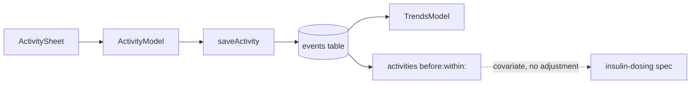

# Design: Activity Events

Implements [requirements.md](requirements.md). Decisions in
[decision_log.md](decision_log.md).

## Overview

Activity is a fifth event type in the existing `events` table. It follows the
`insulin` and `intake` rows exactly: a typed value struct in
`MedataCore/Sources/Persistence/`, a `save…`/`delete…` pair on
`PersistenceStore`, a metadata JSON payload, an entry sheet in `App/`, and a
marker series on the Graph.

Nothing here is novel. That is deliberate — `EventType`'s own comment states
"Future event types extend this namespace with additional constants", and every
deviation from the insulin row's shape would be a deviation medreg and the export
archive would have to learn about.



## 1. Core types

In `MedataCore/Sources/Persistence/`, mirroring `InsulinDose`:

```swift
// Raw values are the stable machine keys stored in metadata.kind (Req 1.4).
public enum ActivityKind: String, Sendable, Equatable, CaseIterable {
    case swim, waterpolo, cycle, run, walk, gym, other

    // Req 2.2 / Decision 2. A property of the activity, not of the session,
    // so it costs nothing at entry time.
    public var character: ActivityCharacter {
        switch self {
        case .cycle, .run, .swim, .walk: .aerobic
        case .gym: .anaerobic
        case .waterpolo: .mixed
        case .other: .mixed
        }
    }
}

public enum ActivityCharacter: String, Sendable, Equatable, CaseIterable {
    case aerobic, anaerobic, mixed
}

public enum ActivityProvenance: String, Sendable, Equatable, CaseIterable {
    case manual, healthkit          // Req 1.6 / Decision 4
}

public struct ActivityEvent: Sendable, Equatable {
    public static let metadataSchemaVersion = 1

    public let id: UUID
    public let timestamp: Date          // activity START (Req 6.1)
    public let kind: ActivityKind
    public let durationMinutes: Double? // nil == unrecorded, never 0 (Req 1.5)
    public let provenance: ActivityProvenance
    public let note: String?
}
```

`character` is derived from `kind` rather than stored. It is a fixed property of
the kind, so storing it would let a row disagree with the enum after an edit —
and the enum is the thing a regression joins on.

`swim` is classed `aerobic` and `waterpolo` `mixed` deliberately: lap swimming is
sustained, waterpolo is intermittent sprint work with a contact load. Decision 1
records that the `anaerobic` character may not reduce insulin requirement at all,
which is precisely why the two are not collapsed.

## 2. Row shape

`value` carries **duration in minutes**, or is absent when no duration was
given. This matches the convention the other rows already use — `bsl` puts
mmol/L in `value`, `insulin` puts units, `intake` puts carbohydrate grams — so
the one continuous quantity of the event lands in the one numeric column.

```json
{
  "schema_version": 1,
  "kind": "waterpolo",
  "provenance": "manual",
  "note": "…"
}
```

`note` is omitted entirely when nil, exactly as `InsulinDose` does. `character`
is **not** written: it is derivable from `kind`, and writing it would create two
sources of truth for the field a later model keys on.

### Store surface

```swift
func saveActivity(_ activity: ActivityEvent) async throws
func deleteActivityEvent(id: UUID) async throws

// Req 5.1 — the lookback. Returns events whose timestamp falls in
// (instant - interval, instant], newest first.
func activities(before instant: Date, within interval: TimeInterval) async throws -> [ActivityEvent]
```

`activities(before:within:)` exists so a dosing model asks one question rather
than reimplementing an interval query and a metadata decode. Its default
`interval` at the call site is 36 hours (Req 5.2, Decision 3); the parameter is
required here so the caller's window is always visible in the code that uses it.

Rows that fail to decode are dropped, matching how `TrendsModel` already handles
insulin rows with unreadable metadata.

## 3. Entry surface

`ActivitySheet` + `ActivityModel` in `App/`, modelled directly on
`InsulinDoseSheet` / `InsulinDoseModel`:

- A plain `.sheet` at medium detent — the same weight as the dose sheet, not a
  full-screen cover.
- Kind as a scrolling row of labelled chips, preselected to the most recently
  used kind (Req 3.3) read from `SettingsKeys`. A repeat activity is
  open → Save.
- Duration as an optional stepper, blank by default, never blocking Save
  (Req 3.4). Blank saves `nil`, not `0`.
- Timestamp defaults to now with a compact date-time control to move it
  (Req 3.2) — activity is routinely logged afterwards, which is the one place
  this sheet diverges from the dose sheet's now-only behaviour.
- Deep link `medata://activity/add` (Req 3.5), registered in the same
  `CFBundleURLTypes` array in `MeData/Info.plist` and handled in
  `AppRoot.handleDeepLink`. It inherits the existing `pendingDeepLink`
  resume behaviour, so arriving while another presentation animates out is not
  dropped.

No intensity control, no effort rating, no calorie field (Req 2.4).

## 4. Display

- **Graph day view**: a `RuleMark` spanning start to start+duration where a
  duration exists, a point mark where it does not (Req 4.2). It sits in its own
  band below the insulin band, keyed off the same `glucoseAxisMax` fraction the
  insulin band already uses so it stays clear of the glucose plot under both Auto
  and Fixed y-scales.
- **Week/Month**: per-day count, x-aligned with the existing carbohydrate
  buckets via `TrendsMath.dailyBuckets`.
- **Records**: a row carrying kind label and duration, deletable by the same
  swipe the insulin rows use (Req 3.6). This requires the same `List`-inside-
  `ScrollView` treatment with a pinned height that the Day-view insulin list
  needed — without the height pin it collapses to zero.
- New colour tokens in `Colors.swift`, distinct from both insulin series and
  from the glucose trace.

## 5. What this design does not do

There is no adjustment path. `activities(before:within:)` is the entire
integration surface, and nothing in `MedataCore` or `App` consumes it within this
spec (Req 5.3, Decision 5). The dosing spec picks it up.

The lookback returning an empty array is an ordinary result, not an error
condition — for the first weeks after this ships it is the expected one.

## 6. Test surface

Per the MVP test gate, `MedataCore` maths and encoding get tests; no app-target
test scaffolding is added.

- Round-trip: save → `events(in:type:)` → decode returns the same values.
- `nil` duration omits `value` and decodes back to `nil`, never `0` (Req 1.5).
- `note` omitted when nil, matching the insulin payload.
- `activities(before:within:)` boundary behaviour: an event exactly at
  `instant - interval` is excluded, one exactly at `instant` is included.
- `character` mapping is exhaustive over `ActivityKind.allCases`, so adding a
  kind without classifying it fails the build rather than silently defaulting.
