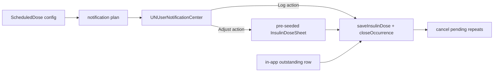

# Design: Dose Schedule

Implements [requirements.md](requirements.md). Decisions in
[decision_log.md](decision_log.md).

## Overview

Three pieces, deliberately separable:

1. A **schedule** — plain configuration, stored beside the other settings.
2. An **occurrence ledger** — one row per due instance, carrying its outcome. This is
   the only new persisted state.
3. A **notification plan** — a set of pending local notifications derived from the
   schedule, cancelled when an occurrence closes.

The insulin event itself is unchanged. A dose logged from a reminder is an ordinary
`insulin` row (Req 4.2), so medreg's convention and every existing reader are
untouched.



## 1. The repeat, without background execution

iOS has no "repeat until acknowledged" trigger. The mechanism is to schedule the
whole prompt sequence up front and cancel what is left when the dose closes:

- One `UNCalendarNotificationTrigger` at the scheduled time, `repeats: true` so the
  daily occurrence needs no re-arming.
- **K follow-ups** at interval **I** after it, as `UNTimeIntervalNotificationTrigger`
  requests with derived identifiers.
- On discharge (logged or skipped), `removePendingNotificationRequests` for that
  occurrence's follow-up identifiers, and `removeDeliveredNotifications` for any
  already shown.

The cutoff of Req 3.3 is therefore `K × I` and needs no timer. Nothing runs in the
background to keep the reminder alive, which matters because
`App/GlucoseConnectionsModel.swift` already spends the app's background budget on the
CGM `BGAppRefreshTask` and this must not compete with it.

Seed values: **I = 30 minutes, K = 4** — a two-hour tail. Both configurable per
Reqs 3.2 and 3.3. They are a starting point, not a finding.

Identifiers are derived, never stored: `dose.<scheduleID>.<yyyy-MM-dd>.<n>` where `n`
is 0 for the due notification and 1…K for follow-ups. Deriving them means a
cancellation never depends on having persisted a notification handle.

## 2. One-tap logging

A `UNNotificationCategory` carrying two actions:

| Action | Options | Effect |
|---|---|---|
| `LOG_NOMINAL` | none (background) | writes the insulin event and closes the occurrence, app never foregrounded |
| `ADJUST` | `.foreground` | opens the dose sheet pre-seeded with kind and nominal units |

`LOG_NOMINAL` omitting `.foreground` is the whole point (Decision 2): iOS launches the
app in the background, `UNUserNotificationCenterDelegate.userNotificationCenter(_:didReceive:)`
runs, the row is written, the completion handler fires. The developer sees the
notification vanish and nothing else.

That handler is a code path with no precedent here — it runs with the app not
running, under a short system deadline, and it must reach GRDB. It gets the shortest
possible body: resolve the occurrence, write, close, cancel, done. No UI, no
migration work, no CGM poll.

## 3. Idempotency

Req 4.6 is load-bearing because an action can fire from a stale notification — a
follow-up already delivered before the dose was logged elsewhere.

The occurrence row is the guard. `closeOccurrence` is a conditional write: it
records an outcome only if the occurrence is still `outstanding`, and reports whether
it did. The insulin event is written **only** when that transition succeeds. So a
second tap finds the occurrence already closed and writes nothing.

This is a single-process, single-writer path, so unlike the widget snapshot guard it
can be a genuine compare-and-set rather than an advisory one.

## 4. Data model

```swift
// Configuration. Foundation-only, no store dependency.
public struct ScheduledDose: Sendable, Equatable, Identifiable {
    public let id: UUID
    public var hour: Int              // local wall clock (Req 1.6)
    public var minute: Int
    public var nominalUnits: Double
    public var kind: InsulinKind      // reuses the shipped enum
    public var isEnabled: Bool
}

public enum OccurrenceOutcome: String, Sendable, Equatable, CaseIterable {
    case outstanding, logged, skipped, missed
}

public struct DoseOccurrence: Sendable, Equatable {
    public let id: UUID
    public let scheduleID: UUID
    public let dueAt: Date            // the scheduled instant
    public var outcome: OccurrenceOutcome
    public var closedAt: Date?        // when logged/skipped/missed (Req 4.3)
    public var insulinEventID: UUID?  // nil unless logged (Req 6.3)
    public var wasNominal: Bool?      // Req 5.2
}
```

`ScheduledDose` lives in settings — it is configuration, and giving it a table would
imply a history it does not have. `DoseOccurrence` gets a table: it is an event
record, it accumulates, and Req 6.2 requires missed and skipped instances to persist
because an absent event is indistinguishable from an unlogged one.

The occurrence table follows `estimation_outcomes` and `dose_suggestions`: a derived
side table whose writes do **not** fire `eventsDidChange`. Only the insulin event
does that, so history refreshes exactly once per logged dose.

Req 4.4's lateness data needs no new column — `dueAt` and `closedAt` on the same row
give it by subtraction.

## 5. Missed occurrences

Req 2.3 caps outstanding occurrences at one per schedule. The transition happens
lazily, not on a timer: whenever the occurrence set is read — app foreground, or a
notification handler resolving its occurrence — any `outstanding` row whose successor
is already due is closed as `missed`.

Lazy evaluation avoids a background task purely for bookkeeping, at the cost of a
missed row not being marked until something looks. Since nothing acts on `missed`
beyond recording it, that latency is harmless.

## 6. Degraded mode

Req 7.2's no-authorisation path is not a special case — it is the same surface with
the notifications absent. The occurrence ledger is written and read identically; only
the notification plan is skipped. The in-app outstanding row (Req 2.4) and its
one-tap discharge (Req 4.5) carry the whole feature.

This is why Req 2.4 insists the outstanding state must not depend on a notification
having been delivered. The ledger is the source of truth; notifications are a view
onto it.

## 7. Placement

- `ScheduledDose`, `DoseOccurrence`, `OccurrenceOutcome` and the occurrence
  transitions: `MedataCore/Sources/Persistence/`, beside `InsulinDose`.
- The pure parts — next-occurrence-for-a-schedule, the missed-successor rule, the
  notification identifier derivation — are Foundation-only free functions taking a
  `Calendar` and a `Date` explicitly, so they are testable without a device, a clock,
  or a notification centre.
- Notification scheduling and the delegate: `App/`, since `UNUserNotificationCenter`
  is app-target machinery.

Req 8.1 requires the notification layer be built as a general local-reminder
capability rather than a basal-specific one, so the fat follow-up
(`specs/data/insulin-dosing` task 22) can adopt it. Concretely: the scheduler takes a
reminder description — identifier prefix, fire date, category, payload — and knows
nothing about insulin.

## 8. Test surface

MedataCore maths and transitions only; no app-target scaffolding.

- Next occurrence across a daylight-saving transition stays at 07:30 local (Req 1.6).
- The missed-successor rule closes exactly one occurrence, not a backlog.
- `closeOccurrence` is idempotent: the second call reports no transition and the
  caller writes no event (Req 4.6).
- A skipped or missed occurrence writes no insulin event of any amount, including
  zero (Req 6.3).
- Notification identifiers derive deterministically from schedule id and local date.
- Editing a `ScheduledDose` leaves already-closed occurrences byte-identical
  (Req 1.5).

## 9. Open questions

- **I and K are guesses.** 30 minutes × 4 is reasoned, not measured. Once occurrences
  carry `dueAt` and `closedAt`, the distribution of how long a dose actually stays
  outstanding is measurable and both values can be set from it.
- **Whether the repeating notification is enough** — Decision 3 is `proposed` for
  exactly this reason. The Live Activity alternative stays available and additive.
- **Whether `ScheduledDose` should ever hold more than two entries.** The developer's
  regime is twice daily; the model permits N, which may be unnecessary generality.
