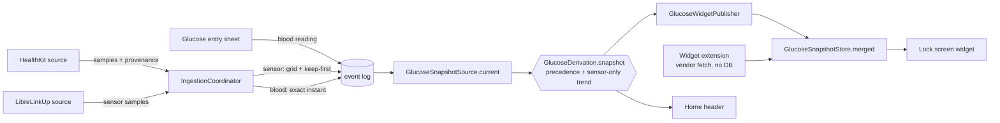

# Design: Fingerstick Glucose

## Overview

Blood readings enter the existing `bsl` stream carrying a provenance marker, stored at their true instant rather than on the 5-minute sensor grid, each stamped with the sensor's concurrent value and the delta against it. Precedence is a pure function over readings, shared by the app and the widget extension, so both resolve "the current value" identically without the extension gaining database access. The trend derives from one provenance at a time — sensor first, blood alone when no sensor series qualifies.

## Architecture

### Provenance on the reading

`GlucoseReading` (GlucoseWidgetShared, Foundation-only) gains a provenance case. Two values, per `decision_log.md` Decision 4:

```swift
public enum GlucoseProvenance: String, Codable, Sendable { case sensor, blood }
```

Stored form: `bsl` event `metadata.provenance`. Absent means sensor, which satisfies Req 7.1 with no migration and no backfill. The existing `metadata.source_id` continues to record the route (`healthkit`, `librelinkup`, `manual`, screenshot import) and satisfies Req 2.6; provenance cannot be derived from it, because a `healthkit` sample may be either.

### Two write paths, chosen by provenance

| Provenance | Store method | Instant | Duplicate rule |
|---|---|---|---|
| sensor | `ingestLiveBsl` (existing) | snapped to 5-minute grid | keep-first across sources |
| blood | `recordBloodBsl` (new) | exact, unsnapped | `(source_id, native_id)` when a native id exists; none otherwise |

`IngestionCoordinator.ingest` is the routing point: `GlucoseSample` gains a `provenance` field, the coordinator partitions the batch and sends each half down its path. Sources stay unaware of the split — a source reports what it measured, the coordinator decides how it is stored. This keeps Req 7.2's guarantee structural: the sensor path is the code that exists today, entered only by sensor samples.

Blood readings bypass the grid because the grid is a cross-source dedup device for samples of one continuous trace (Decision 6). A fingerstick has no counterpart to deduplicate against, so snapping would falsify its instant and manufacture a collision with the sensor row at that mark.

`recordBloodBsl` returns the new event's `UUID` so the caller can report it, matching `saveInsulinDose`'s shape. It writes one row in one transaction and emits exactly one `eventsDidChange`. It is insert-only — it holds no UPDATE and no DELETE against any existing row — which is how Reqs 4.1 and 4.4 are met structurally rather than by discipline: a blood reading sharing an instant with a sensor reading produces a second row with its own id, and both remain individually retrievable and deletable.

**The pairing stamp.** Inside the same transaction, before the INSERT, `recordBloodBsl` reads the latest sensor-provenance row within the 15 minutes preceding the blood instant and stamps `paired_sensor_value`, `paired_sensor_instant`, and `sensor_delta` (blood minus sensor) into the new event's metadata (Decision 12, Req 4.5). With no such row the keys are absent. It is a read, never a mutation — the path stays insert-only. The delta is derivable from the other two keys; it is stored anyway so a future error analysis is one `json_extract` away, redundancy accepted at one key.

**Idempotence.** `HealthKitGlucoseSource.connect` re-runs a 90-day backfill on every connect; for sensor readings keep-first absorbs the repeat. Blood readings have no keep-first, so the repeat would duplicate. Dedup is a `json_extract(metadata, '$.native_id')` lookup gated on `source_id`, using `HKObject.uuid` as the native id. Hand entries carry no native id and are never deduplicated — two fingersticks a minute apart are two readings, not a repeat.

### Precedence

One pure function in `GlucoseDerivation`, called by both the app's `GlucoseSnapshotSource.current` and the widget extension's own derivation:

```swift
public static func snapshot(
    from readings: [GlucoseReading], now: Date, holdWindow: TimeInterval
) -> GlucoseSnapshot
```

- **Displayed reading** — the latest blood reading whose timestamp lies within `holdWindow` of `now`; otherwise the latest reading of any provenance (Reqs 3.1, 3.3, 3.4). A blood reading whose instant already precedes `now` by more than the window is never selected, which is Req 3.9 falling out of the same comparison rather than a separate branch.
- **Trend** — one provenance at a time (Req 5.1): the rate runs over the sensor readings; when they fail the existing count-and-span rules it runs over the blood readings alone under the same rules; a mixed series is never regressed, which is what stops a modality offset being reported as a rate (Decision 7). The widget extension's own fetch holds only vendor sensor data, so its derivation is the sensor pass by construction; the blood fallback is reachable only app-side, where the published snapshot carries its result to the widget.
- **Status** — band of the displayed reading, unchanged.

Placing this in `GlucoseDerivation` rather than in either caller follows the extraction already made for the same reason: two surfaces deriving "the latest reading and its trend" independently is how they drift (`GlucoseSnapshotSource` header note, home-router Decision 15).

### The snapshot contract, and the two-writer problem

`GlucoseSnapshot` goes to `schemaVersion = 2`, adding:

```swift
public let provenance: GlucoseProvenance?   // of the displayed reading  (Req 3.5)
public let holdsUntil: Date?                // non-nil only while a blood reading holds
```

`holdsUntil` is an **absolute date**, computed app-side as `bloodInstant + holdWindow`. The extension therefore never reads the hold-window setting — it compares a date it already has. The setting stays app-private in `SettingsKeys` (default 900 s), and is not App Group state.

The problem this solves: since glucose-lock-widget Decision 16 the extension fetches LibreLinkUp itself and has no database access, so it cannot see blood readings at all; since Decision 19 `GlucoseSnapshotStore.write` is monotonic in `readingDate`. A blood reading at 13:02 held on home would be clobbered by the extension's 13:05 sensor fetch, because 13:05 > 13:02 and the extension has no way to know better. That is Req 3.8.

`GlucoseSnapshotStore` gains one pure policy function, replacing `supersedesStored`:

```swift
static func merged(_ candidate: GlucoseSnapshot, into stored: GlucoseSnapshot, now: Date)
    -> GlucoseSnapshot?     // nil = do not write
```

| Case | Condition | Result |
|---|---|---|
| 1 | `stored.holdsUntil > now` and `candidate.provenance == .sensor` | keep stored's displayed reading; adopt `candidate.trend` |
| 2 | same `readingDate` and `provenance` as stored | adopt candidate only if its trend differs |
| 3 | otherwise | candidate if `candidate.readingDate > stored.readingDate`, else nil |

Case 3 is Decision 19 unchanged. Case 1 is required for correctness, not polish — without it case 3 accepts the clobber. Case 2 exists because during a hold the app republishes the *same* displayed reading with a freshly derived trend; under a strictly-newer rule that write is refused and the arrow freezes for the whole window, in the foreground as well as the background. Cases 1 and 2 together keep the arrow live while the value is held.

The invariant the guard preserves is unchanged in substance: **the displayed reading's date never decreases.** Cases 1 and 2 do not move it at all.

Keeping the rule inside the store rather than in either writer is deliberate and inherited from Decision 19 — "Any future writer inherits the rule by construction."

Req 3.6 needs no work here: `holdsUntil` does not alter `readingDate`, so the existing ladder in `GlucoseTimeline.render` already measures a held reading's age from the blood instant. A blood reading held to the end of a 15-minute window reaches exactly the boundary at which the ladder would begin de-emphasising it, which is the coincidence Decision 3 chose the default for.

### Deleting the displayed reading

The monotonic guard has a hole that Req 6.2 makes this spec's problem. Deleting the displayed reading leaves the recomputed snapshot carrying an *older* `readingDate` than the stored one, so every case above rejects it and the widget keeps rendering a reading that no longer exists. Decision 19 covered the history emptying completely — a candidate with no reading is the never-recorded state and always writes — but not a partial delete falling back to an older reading.

A fourth, narrow case answers it: a write may be marked as following a deletion, and is then admitted regardless of dates **only when the stored snapshot's `readingDate` is one of the instants just removed**.

```swift
public static func write(
    _ snapshot: GlucoseSnapshot, replacingDeleted removed: [Date] = [], to defaults: ...
) -> Bool
```

The narrowing matters. An unconditional force-write would reinstate exactly the Decision 19 regression, in which a stale app-side recompute rolled the snapshot back over a newer reading the extension had fetched. Restricted to the removed instants, a rollback can only discard a reading the app has just destroyed, and a newer extension fetch the app never saw is left alone.

Call sites: the deletion paths in `RecordsModel` — `deleteBslEvent(id:)`, `deleteRecords(mealIDs:eventIDs:)`, and the date-range and delete-all purges from `specs/ui/records-deletion` — pass the removed `bsl` timestamps to the publisher. Deletions of other event types pass nothing and behave as today.



### HealthKit writer classification

HealthKit carries no CGM/BGM flag; `HKMetadataKeyBloodGlucoseMealTime` encodes meal timing only. Classification therefore keys on `sample.sourceRevision.source.bundleIdentifier` — always present, unlike `HKDevice`, which any writer may leave nil.

`HealthKitGlucoseSource` records each observed writer (bundle id, display name, and `HKDevice.name`/`manufacturer` when present) into `UserDefaults.standard` under `glucose.healthkit.writers`, and reads a per-writer classification from the same place. Unclassified writers yield `.sensor` (Req 1.2) — the fail-safe direction, since mistaking a sensor for blood would grant it a 15-minute hold it has not earned.

The literal values identifying a Contour sample are not specified here and must not be invented: they are read off a real sample on device (see `prerequisites.md`) and then set through the Settings surface. The classification list is what makes that possible without a rebuild, and is why Req 1.5 exists.

### Surfaces

| Surface | File | Change |
|---|---|---|
| Home header | `App/HomeView.swift`, `HomeGlucoseModel.swift` | the reading becomes a route to Graph (Req 2.7, Decision 5 — the extension home-router Decision 15 anticipated) and renders `snapshot.provenance` (Req 3.5) |
| Home BSL control | `App/HomeView.swift` | a BSL `Button` joins the Dose row, the pair echoing the Capture/Intake row with the prominent and plain treatments inverted — Dose plain in the leading slot, BSL accent-prominent in the trailing slot; raises the entry sheet (Req 2.1). With dose-schedule's attempt-2 `OutstandingDoseControl` active, that control occupies the Dose slot beside BSL |
| Entry sheet | `App/LogSheet.swift` (`.glucose` mode), `App/GlucoseEntrySheet.swift` (`GlucoseEntryContent`), `GlucoseEntryModel.swift` | below. *(Was a standalone sheet until 2026-08-28; folded into `LogSheet` as its fourth mode by `specs/ui/unified-entry-sheet` Decision 3, once the insulin mode gained the same keypad and the detent mismatch that had kept them apart went away. Req 2.3's budget is preserved: every entry point opens `LogSheet` directly in its own mode, so the mode menu is never on the way in.)* |
| Deep link | `App/AppRoot.swift` | `medata://glucose/add` joins the `DeepLink` enum and `handleDeepLink`, reusing the existing `pendingDeepLink` sequencing |
| Launcher widget | `MeData/MeDataWidgets/MeDataWidgets.swift` | a fourth `Widget` matching `InsulinDoseWidget` exactly — `LauncherView`, `LauncherProvider`, same supported families, `kind: "ie.medata.widget.glucose.add"` |
| Lock-screen widget | `MedataCore/Sources/GlucoseWidgetShared/GlucoseTimeline.swift`, `MeData/MeDataWidgets/GlucoseWidget.swift` | the render names the displayed reading's provenance (Req 3.5); the extension's own fetch labels readings `.sensor` and passes a zero hold window |
| Graph | `App/TrendsModel.swift`, `TrendsView.swift` | sensor readings keep the existing `LineMark` trace; blood readings become a separate `PointMark` series (Req 4.2) |
| Records | `App/RecordsModel.swift`, `RecordsView.swift` | `GlucoseRow` carries provenance; the row labels it (Req 4.3) |
| Settings | `App/GlucoseConnectionsView.swift`, `SettingsView.swift` | the writer-classification list, and the hold-window control |

New `App/` files need the four-place `project.pbxproj` registration (`docs/agent-notes/ui-capture-flow.md`).

### Entry control

Req 2.3's four-interaction budget for any value in 1.0–30.0 is what selects the control, and it excludes both obvious candidates. The insulin sheet's 0.1-step accelerating stepper needs 51 taps for 7.0 → 12.1. A `decimalPad` text field with an explicit point costs 5 interactions for 12.1 (`1`,`2`,`.`,`1`, Save).

An autofocused numeric pad with **implicit tenths** — digits shift in from the right, `1`,`2`,`1` reading as 12.1 — costs at most 4 for every value in range, because no value needs more than three digits:

*(The rule and the pad are now shared with the insulin mode as `DigitEntry` and `NumericEntryPad` in `App/NumericEntryPad.swift` — `specs/ui/unified-entry-sheet` Req 1. The stepper this section rejected has since been deleted from the insulin sheet for the same reason it was rejected here, plus one this section did not need to make: a relative control and a digit buffer disagree about the value after any mixed sequence.)*

| Value | Keystrokes | + Save | Total |
|---|---|---|---|
| 1.0 | `1` `0` | 1 | 3 |
| 8.4 | `8` `4` | 1 | 3 |
| 12.1 | `1` `2` `1` | 1 | 4 |
| 30.0 | `3` `0` `0` | 1 | 4 |

The displayed value is formatted live so the implicit point is visible rather than remembered. Back-dating reuses the compact `DatePicker(selection:in: ...Date())` row shared by the insulin, activity, and carb-entry sheets, and is not on the path to Save (Req 2.4).

### Pattern extension audit

Every consumer of `bsl` rows or `GlucoseReading`, and whether provenance reaches it:

| Call site | Needs provenance | Rationale |
|---|---|---|
| `GlucoseSnapshotSource.current:44` | yes | constructs the readings precedence runs over |
| `GlucoseDerivation.snapshot` / `.trend` | yes | selection and the trend exclusion |
| `GlucoseSnapshotStore.write` | yes | hold rule, case 1 |
| `App/TrendsModel.swift:157` | yes | splits trace from markers |
| `App/RecordsModel.swift:222` | yes | row label |
| Widget extension vendor fetch → `GlucoseReading` | yes, constant | vendor data is always `.sensor`; passes the literal |
| `recordBloodBsl` pairing read | yes | selects the latest sensor-provenance row in the preceding 15 minutes for the delta stamp (Req 4.5) |
| `ingestBsl` (screenshot import) | no | sensor by construction, path unchanged |
| `App/GlucoseImportModel.swift` | no | same |
| `deleteBslEvent(id:)` | no | provenance-agnostic; Req 6.1 needs no change |
| `RecordsModel` deletion paths | timestamps, not provenance | must pass removed `bsl` instants to the publisher so Req 6.2's rollback is authorised |
| `deleteRecords(mealIDs:eventIDs:)` | no | same |
| `mergeBslKeepFirst` | no | sensor path only, by routing |

## Data Models

```swift
// GlucoseWidgetShared
public enum GlucoseProvenance: String, Codable, Sendable { case sensor, blood }

public struct GlucoseReading {
    public let timestamp: Date
    public let mmolL: Double
    public let provenance: GlucoseProvenance   // new; defaulted .sensor at the call sites above
}

// Persistence
public struct BloodBslReading: Sendable, Equatable {
    public let instant: Date          // exact, not grid-snapped
    public let mmolL: Double          // one decimal, rounded by the caller's single rounding point
    public let sourceID: String       // "healthkit" | "manual"
    public let nativeID: String?      // HKObject.uuid; nil for hand entry
}
```

Stored `metadata` for a blood reading: `provenance: "blood"`, `source_id`, `native_id` when present, and — when a sensor-provenance reading exists in the preceding 15 minutes — `paired_sensor_value`, `paired_sensor_instant`, `sensor_delta` (Req 4.5). Keys absent rather than null when nil, matching `liveBslMetadataJSON`.

## Error Handling

| Failure | Behaviour |
|---|---|
| Hand entry outside 1.0–30.0 | unreachable — the pad cannot express it; the store rejects out-of-range as `saveInsulinDose` does, so a deep-linked or future caller cannot bypass the UI bound |
| Blood sample re-delivered by HealthKit | dedup on `(source_id, native_id)`; the write is a no-op and no notification is emitted |
| No sensor reading within 15 minutes of the blood instant | the pairing keys are absent; recording proceeds unchanged (Req 4.5) |
| Snapshot schema v1 read by a v2 build | existing behaviour — `read` returns `.neverRecorded` on version mismatch, self-correcting on the next publish. App and extension ship in one build, so the mismatch window is a single launch |
| `holdsUntil` stale after the window setting changes mid-hold | the next publish recomputes it; the stale value can only extend or shorten one hold |
| Writer classified as blood in error | no data is destroyed (Decision 2); reclassifying corrects subsequent samples, and existing rows are correctable only by deletion |

## Testing Strategy

The project's gate for app and UI work is build plus device inspection, and `CLAUDE.md` forbids new test scaffolding unless asked. Tests here are therefore confined to the pure functions in MedataCore, which is where `make test` already runs:

| Unit | Cases |
|---|---|
| `GlucoseDerivation.snapshot(from:now:holdWindow:)` | blood inside window wins over a newer sensor reading; blood outside window loses; latest of two in-window blood readings wins (Req 3.4); back-dated beyond the window never displays (Req 3.9); empty and sensor-only inputs unchanged |
| `GlucoseDerivation.trend` | a blood reading in the window does not move the sensor-derived rate (Req 5.1); a blood-only series satisfying the count-and-span rules yields a blood-derived trend, and one failing them yields none (Req 5.2); a mixed series is never regressed; sensor rules unchanged |
| `GlucoseSnapshotStore.merged` | each of the three cases; the invariant that the displayed reading's date never decreases; a sensor candidate during a hold refreshes trend but not value |
| `GlucoseSnapshotStore.write(_:replacingDeleted:)` | deleting the displayed reading rolls the snapshot back to an older one (Req 6.2); a removed instant that is not the displayed one does not authorise a rollback |
| `recordBloodBsl` | instant stored unsnapped; re-delivery with the same native id is a no-op; two hand entries at the same instant both persist; the pairing stamp records the latest in-window sensor row and is absent when none exists (Req 4.5) |

The `merged` invariant — displayed reading date is non-decreasing across any sequence of writes — is the one property-based candidate here. It is written as example-based cases covering the three branches instead, because adopting a property-testing framework would be new scaffolding of exactly the kind the project's test gate excludes.

Device verification (`prerequisites.md`), not automated: reading a real Contour sample's writer identity to set the classification, the Lock Screen holding a blood value across a sensor tick, and the launcher widget's deep link.
