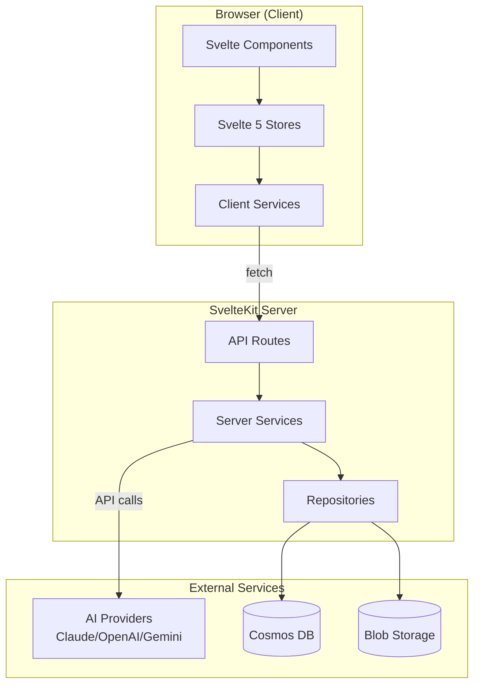
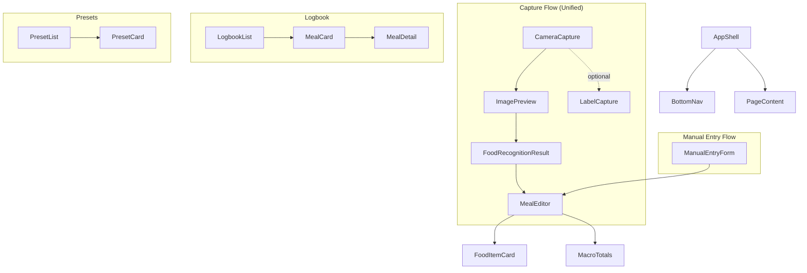
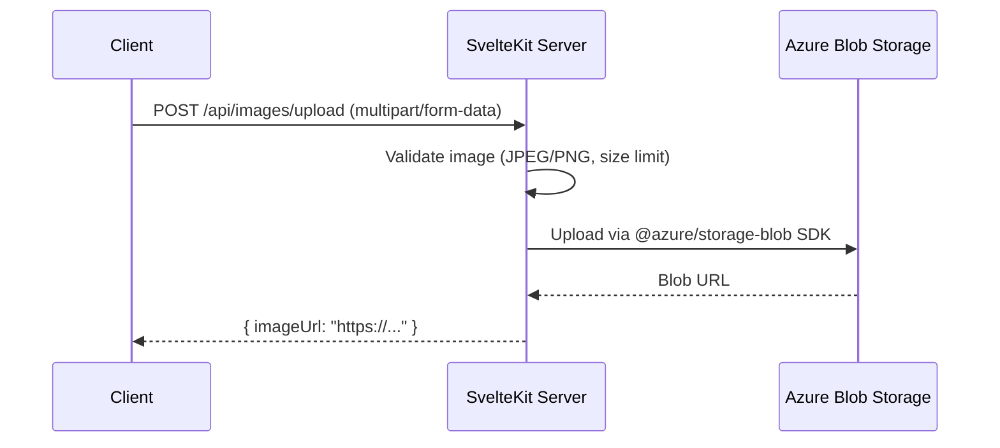
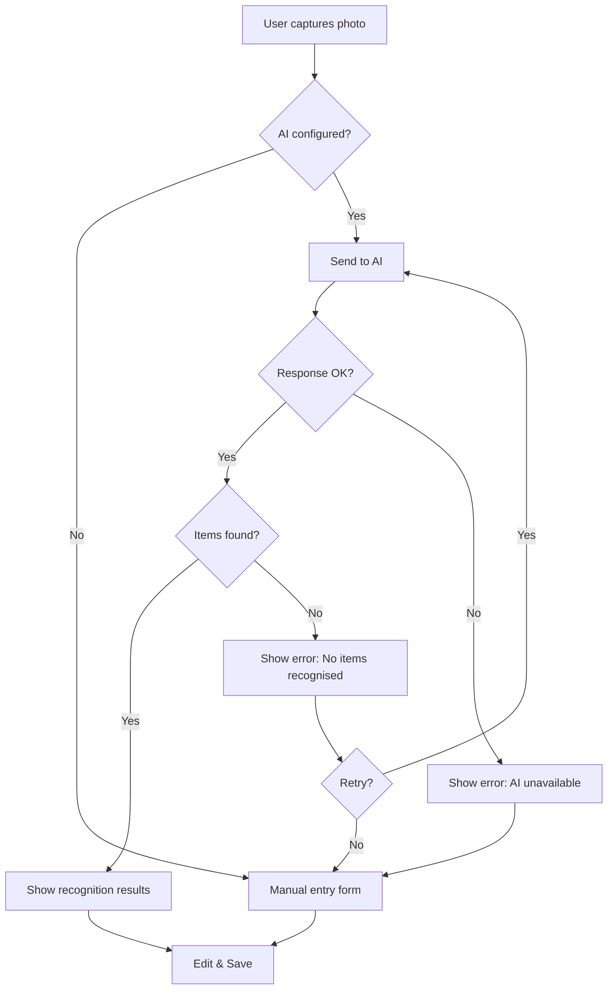
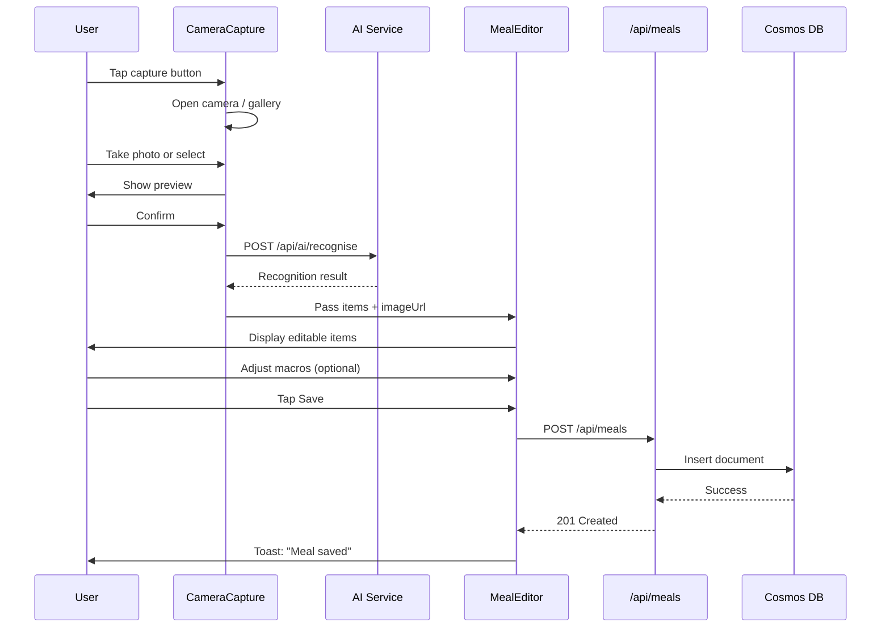
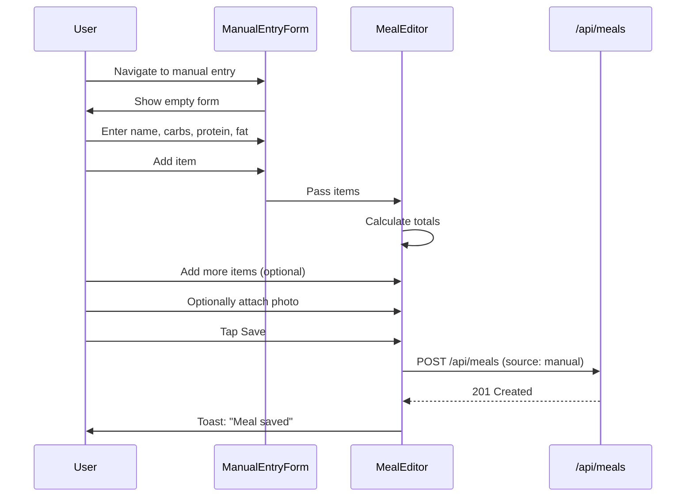
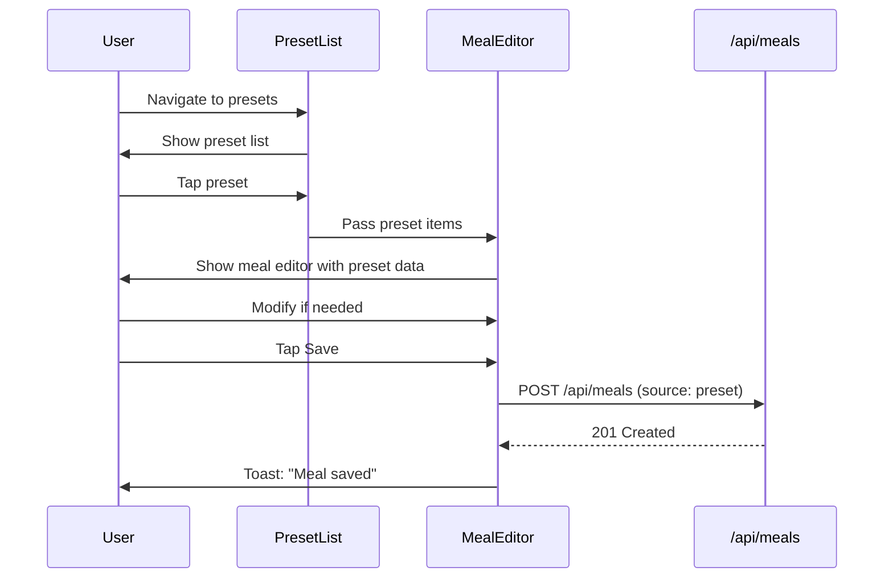
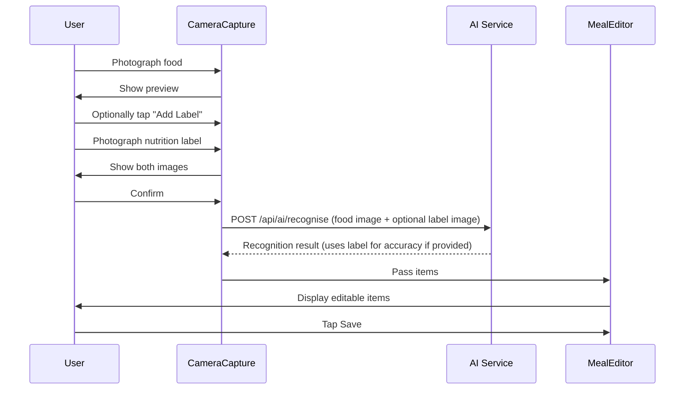

# MeData MVP Design Document

**Version:** 2.6
**Last Updated:** 2026-02-05
**Status:** Draft
**Requirements Version:** 1.2

---

## 1. Overview

### 1.1 Purpose

This document defines the technical design for the MeData MVP - a personal health data repository focused on food macro capture via photography. The design implements all requirements from `requirements.md` v1.2 while adhering to the coding standards in `constitution.md`.

### 1.2 Scope

**MVP delivers:**
- Photo-based food macro estimation using AI
- Manual macro entry with frictionless UX
- Meal storage with history/logbook view
- Meal presets for quick logging
- Nutrition label scanning (Australian format)

**MVP does not include:**
- Insulin, BSL, exercise tracking
- Offline support
- Authentication
- Data export

### 1.3 Key Design Decisions

| Decision | Choice | Rationale |
|----------|--------|-----------|
| AI Response Format | Structured JSON | Reliable parsing (D-DES-001) |
| Image Retention | 30 days | Balance storage vs utility (D-DES-002) |
| Calories | Not stored | Derived from macros if needed (D-REQ-016) |
| Auth | None | Single-user MVP (D-REQ-011) |
| Client/Server | Server-side services | Security, data access (D-DES-003) |
| Macro Totals | Stored with meal | Immutable record once saved (D-DES-012) |
| Pagination | By day | Aligns with user mental model (D-DES-007) |
| Settings | Env vars only | Simplify MVP (D-DES-008) |
| Branding | Use existing static/ assets | Logo already designed (D10) |

### 1.4 Static Assets

The following brand assets exist in `static/` and must be integrated:

| Asset | Purpose | Usage |
|-------|---------|-------|
| `icon.svg` | Main logo (#63ff00 green "d") | App shell header |
| `favicon-default.svg` | Default favicon | `app.html` link |
| `favicon-colour.svg` | Rainbow gradient variant | PWA manifest alternate |
| `favicon-contrast.svg` | High contrast variant | Accessibility option |
| `favicon.ico` | Binary fallback | Legacy browser support |

**Brand Colours (from constitution.md §10.2):**
- Brand accent: `#63ff00` (neon green)
- Brand background: `#064e3b` (dark teal)
- Primary background: `#0a0a0a` (gray-950)

### 1.5 Research Tasks

The following require research during implementation:

| Task | Scope | Output |
|------|-------|--------|
| AI Prompt Design | Research optimal prompts for food recognition across providers | Documented prompt templates |
| Azure Blob Upload | Follow Microsoft best practices for SvelteKit | Implementation guide |
| Image Upload Orchestration | Best practice for capture → upload → AI → save flow | Sequence documentation |
| Cosmos DB Partition Strategy | Validate day-based partition key performance for date range queries | Performance validation |
| SvelteKit Best Practices | Client/server boundary patterns | Architecture validation |

**Note:** Cosmos DB partition strategy and image upload orchestration should be researched using Azure documentation before finalising implementation. Design may be refined based on research findings.

---

## 2. Architecture

### 2.1 System Architecture



### 2.2 Layered Architecture

Per `constitution.md` §3.1:

```
┌─────────────────────────────────────────────────────────────┐
│  Presentation Layer                                          │
│  Svelte 5 Components (src/lib/components/)                  │
│  - CameraCapture, FoodRecognitionResult, MealEditor         │
│  - LogbookList, PresetList, ManualEntryForm                 │
└─────────────────────────────────┬───────────────────────────┘
                                  │
┌─────────────────────────────────▼───────────────────────────┐
│  State Layer                                                 │
│  Svelte 5 Stores with Runes (src/lib/stores/)               │
│  - meals.svelte.ts, presets.svelte.ts, ui.svelte.ts         │
└─────────────────────────────────┬───────────────────────────┘
                                  │
┌─────────────────────────────────▼───────────────────────────┐
│  Service Layer (Framework-Agnostic)                          │
│  src/lib/services/                                           │
│  - MealService, PresetService, FoodRecognitionService       │
└─────────────────────────────────┬───────────────────────────┘
                                  │
┌─────────────────────────────────▼───────────────────────────┐
│  Repository Layer                                            │
│  src/lib/repositories/                                       │
│  - IMealRepository, IPresetRepository, IImageRepository     │
└─────────────────────────────────┬───────────────────────────┘
                                  │
┌─────────────────────────────────▼───────────────────────────┐
│  Storage Layer                                               │
│  Azure Cosmos DB (meals, presets)                           │
│  Azure Blob Storage (images, 30-day TTL)                    │
└─────────────────────────────────────────────────────────────┘
```

### 2.3 PWA Configuration

**Requirements:** NF.5

The app is installable as a PWA via manifest.json.

```json
// static/manifest.json
{
  "name": "MeData",
  "short_name": "MeData",
  "description": "Personal food macro tracking via photo",
  "start_url": "/",
  "display": "standalone",
  "background_color": "#0a0a0a",
  "theme_color": "#63ff00",
  "icons": [
    { "src": "/icon.svg", "sizes": "any", "type": "image/svg+xml" },
    { "src": "/favicon.ico", "sizes": "48x48", "type": "image/x-icon" }
  ]
}
```

**app.html integration:**
```html
<link rel="icon" href="%sveltekit.assets%/favicon-default.svg" type="image/svg+xml" />
<link rel="alternate icon" href="%sveltekit.assets%/favicon.ico" />
<link rel="manifest" href="%sveltekit.assets%/manifest.json" />
<meta name="theme-color" content="#63ff00" />
<meta name="apple-mobile-web-app-capable" content="yes" />
```

**Note:** The manifest enables "Add to Home Screen" on supported browsers.

---

## 3. Components and Interfaces

### 3.1 Component Hierarchy



**Note:** Label scanning is integrated into the capture flow, not a separate workflow. User can optionally add a label photo to improve accuracy for packaged foods.

### 3.2 Key Components

#### CameraCapture.svelte
**Requirements:** 1.1, 1.2, 1.3, 1.4, 1.5, 1.6, 7.1-7.6

```typescript
interface CaptureResult {
  foodImage: Blob;
  labelImage?: Blob;           // Optional - for packaged foods
  source: 'camera' | 'gallery';
}

interface Props {
  onCapture: (result: CaptureResult) => void;
  onCancel?: () => void;
}
```

**Behaviour:**
- Uses MediaDevices API for rear camera access
- Falls back to file input for gallery selection
- Accepts JPEG and PNG only
- Shows preview before confirming
- **"Add Label" button** to optionally capture nutrition label
- Sends both images (if label provided) to unified AI endpoint

#### MealEditor.svelte
**Requirements:** 3.1, 3.2, 3.3, 3.6, 3.7, 5.1-5.5

```typescript
interface Props {
  initialItems?: FoodItem[];
  imageUrl?: string;
  source: MealDataSource;
  onSave: (meal: CreateMealInput) => void;
  onCancel?: () => void;
}
```

**Behaviour:**
- Displays food items with inline editing
- Large tap targets for carbs/fat fields (44×44px minimum)
- Auto-recalculates totals on any change
- Supports add/remove items
- Timestamp defaults to now, adjustable

#### FoodItemCard.svelte
**Requirements:** 3.7, 5.2, 5.3, 9.2

```typescript
interface Props {
  item: FoodItem;
  confidence?: number;
  onUpdate: (item: FoodItem) => void;
  onRemove: () => void;
}
```

**Behaviour:**
- Name field with free text
- Carbs, protein, fat as numeric inputs with large tap targets
- Optional confidence badge (from AI)
- Update numberics (by selecting from AI results) or free text name (for manual entry).

#### LogbookList.svelte
**Requirements:** 8.1, 8.2, 8.3

```typescript
interface Props {
  meals: Meal[];
  onSelect: (meal: Meal) => void;
  onEdit: (meal: Meal) => void;
  onDelete: (mealId: string) => void;
}
```

**Behaviour:**
- Chronological list, newest first
- Shows timestamp, log type (meal, blood sugar, insulin), and a simple number (insulin would be for example, 12u Bolus, or 5.6 mmol/L for blood sugar, or for meals, the total carbs. As the units of measurement will be very well known to the user, it can be in very small or out of the way font.)
- Expandable cards for detail view
- Edit/delete actions per record.

### 3.3 Service Interfaces

#### IFoodRecognitionService
**Requirements:** 2.1-2.10, 7.1-7.6

```typescript
interface IFoodRecognitionService {
  recognise(image: Blob, labelContext?: LabelContext): Promise<FoodRecognitionResult>;
  isConfigured(): boolean;
  getProviderName(): string;
}

// Optional context from a nutrition label scan
interface LabelContext {
  labelImage: Blob;            // The label photo for OCR
  // AI extracts nutrition data and uses it to improve food estimation
}
```

**Unified Recognition Flow:**
- User photographs food
- **Optionally** add a label photo for context (packaged foods)
- AI analyses food photo, using label data (if provided) for more accurate macros
- Same output format regardless of whether label was provided

**Baseline AI Prompt Template (refine during implementation):**

```
// Unified Food Recognition Prompt (with optional label context)

Analyse this food image and estimate macronutrients for each item.

{IF labelImage provided}
A nutrition label is also provided. Use it to determine accurate per-serving
macros for packaged items. The label follows Australian format (per serving + per 100g).
Estimate how many servings are shown in the food photo.
{END IF}

Return JSON only: {
  "items": [{
    "name": string,
    "carbs": number,
    "protein": number,
    "fat": number,
    "confidence": 0-1,
    "servingsEstimated": number | null  // Only if label provided
  }]
}
Values in grams. Confidence reflects certainty in identification and portion estimate.
```

interface FoodRecognitionResult {
  items: RecognisedFoodItem[];
  totalMacros: MacroData;
  confidence: number;
  provider: string;
  processingTimeMs: number;
}

interface RecognisedFoodItem {
  name: string;
  quantity: number;            // From AI, not stored in meal
  unit: string;                // From AI, not stored in meal
  carbs: number;
  protein: number;
  fat: number;
  confidence: number;
}

// Note: When converting RecognisedFoodItem to FoodItem for storage,
// quantity and unit are intentionally discarded. Only name + macros are stored.

interface LabelParseResult {
  servingSize: string;
  servingsPerContainer?: number;
  perServing: MacroData;
  per100g?: MacroData;
  confidence: number;
}
```

#### IMealRepository
**Requirements:** 4.1-4.8, 8.4, 8.5

```typescript
interface IMealRepository {
  create(meal: CreateMealInput): Promise<Meal>;
  getById(id: string): Promise<Meal | null>;
  getByDay(date: Date): Promise<Meal[]>;           // Paginate by day (D-DES-007)
  getByDateRange(start: Date, end: Date): Promise<Meal[]>;
  update(id: string, updates: UpdateMealInput): Promise<Meal>;
  delete(id: string): Promise<void>;
}

interface CreateMealInput {
  timestamp: number;           // Unix ms, UTC
  items: FoodItem[];
  totalCarbs: number;          // Calculated before save, stored immutably
  totalProtein: number;
  totalFat: number;
  source: MealDataSource;
  imageUrl?: string;
  confidence?: number;
}
```

#### IPresetRepository
**Requirements:** 6.1-6.8

```typescript
interface IPresetRepository {
  create(preset: CreatePresetInput): Promise<Preset>;
  getById(id: string): Promise<Preset | null>;
  getAll(): Promise<Preset[]>;
  getByCategory(category: PresetCategory): Promise<Preset[]>;
  update(id: string, updates: UpdatePresetInput): Promise<Preset>;
  delete(id: string): Promise<void>;
}

interface CreatePresetInput {
  name: string;                // Can be emoji-only
  category: PresetCategory;    // 'meal' | 'snack'
  items: FoodItem[];
  // Note: totals calculated from items, same as meals (D-DES-012)
}
```

#### IImageRepository
**Requirements:** 4.3, 11.2

```typescript
interface IImageRepository {
  upload(image: Buffer, folder: string, filename: string): Promise<string>;  // Returns URL
  delete(url: string): Promise<void>;
}
```

### 3.4 Image Upload Flow

Per [Microsoft best practices](https://techcommunity.microsoft.com/blog/appsonazureblog/deploy-full-stack-server-side-rendered-sveltekit-applications-to-azure-static-we/4092981) and [SvelteKit Azure Blob tutorials](https://lojeda.co/blog/file-upload-svelte/), image upload is handled server-side (D-DES-010):



**Implementation:**
- Server-side upload using `@azure/storage-blob` SDK
- Storage account credentials in env vars (never exposed to client)
- 30-day TTL configured via Azure lifecycle policy
- Max image size: 10MB (configurable)

---

## 4. Data Models

### 4.1 Core Types

```typescript
// src/lib/types/meal.ts

interface FoodItem {
  name: string;
  quantity?: number;
  unit?: string;
  carbs: number;               // grams, non-negative
  protein: number;             // grams, non-negative
  fat: number;                 // grams, non-negative
}

interface MacroData {
  carbs: number;
  protein: number;
  fat: number;
}

type MealDataSource = 'manual' | 'ai_image' | 'label_scan' | 'preset';
type PresetCategory = 'meal' | 'snack';

interface Meal {
  id: string;
  timestamp: number;           // Unix ms, UTC (Req 4.7)
  items: FoodItem[];
  totalCarbs: number;          // Stored, immutable once saved (D-DES-012)
  totalProtein: number;        // Stored, immutable once saved
  totalFat: number;            // Stored, immutable once saved
  source: MealDataSource;      // Req 4.2
  imageUrl?: string;           // May expire after 30 days (show placeholder on 404)
  confidence?: number;         // From AI, 0-1
  createdAt: number;           // Unix ms (Req 10.1)
  updatedAt: number;           // Unix ms (Req 10.2)
}

// Utility function to calculate totals (used before saving, not on read)
function calculateMealTotals(items: FoodItem[]): MacroData {
  return items.reduce(
    (acc, item) => ({
      carbs: acc.carbs + item.carbs,
      protein: acc.protein + item.protein,
      fat: acc.fat + item.fat
    }),
    { carbs: 0, protein: 0, fat: 0 }
  );
}

interface Preset {
  id: string;
  name: string;                // Can be emoji-only (Req 6.1)
  category: PresetCategory;
  items: FoodItem[];
  totalCarbs: number;
  totalProtein: number;
  totalFat: number;
  createdAt: number;
  updatedAt: number;
}
```

### 4.2 Database Schema (Cosmos DB)

```
Database: medata
├── Container: meals
│   ├── Partition Key: /partitionKey (YYYY-MM-DD for day-based queries)
│   └── Documents: Meal
│
└── Container: presets
    ├── Partition Key: /category
    └── Documents: Preset
```

**Meal Document:**
```json
{
  "id": "uuid",
  "partitionKey": "2026-02-04",
  "timestamp": 1706443200000,
  "items": [
    { "name": "Scrambled Eggs", "carbs": 2, "protein": 13, "fat": 11 },
    { "name": "Toast", "carbs": 25, "protein": 4, "fat": 2 }
  ],
  "totalCarbs": 27,
  "totalProtein": 17,
  "totalFat": 13,
  "source": "ai_image",
  "imageUrl": "https://medatablobs.blob.core.windows.net/images/...",
  "confidence": 0.85,
  "createdAt": 1706443200000,
  "updatedAt": 1706443200000
}
```

**Note:** Totals are stored with the meal record and are immutable once saved. The image URL is optional and may expire after 30 days. Partition key is YYYY-MM-DD for day-based pagination (D-DES-007).

### 4.3 Blob Storage Structure

```
Container: images
├── meals/
│   └── {uuid}.jpg          # 30-day TTL
└── labels/
    └── {uuid}.jpg          # 30-day TTL
```

### 4.4 API Request/Response Schemas

#### POST /api/meals

**Request (Zod Schema):**
```typescript
const CreateMealSchema = z.object({
  timestamp: z.number().int().positive(),
  items: z.array(FoodItemSchema).min(1),
  totalCarbs: z.number().nonnegative(),
  totalProtein: z.number().nonnegative(),
  totalFat: z.number().nonnegative(),
  source: z.enum(['manual', 'ai_image', 'label_scan', 'preset']),
  imageUrl: z.string().url().optional(),
  confidence: z.number().min(0).max(1).optional()
});
```

**Response:**
```json
{
  "data": {
    "id": "uuid",
    "timestamp": 1706443200000,
    "items": [...],
    "totalCarbs": 27,
    "totalProtein": 17,
    "totalFat": 13,
    "source": "ai_image",
    "createdAt": 1706443200000,
    "updatedAt": 1706443200000
  }
}
```

#### POST /api/ai/recognise

**Request:**
```typescript
const RecogniseRequestSchema = z.object({
  imageBase64: z.string(),
  mimeType: z.enum(['image/jpeg', 'image/png'])
});
```

**Response:**
```json
{
  "data": {
    "items": [
      {
        "name": "Scrambled Eggs",
        "quantity": 150,
        "unit": "g",
        "carbs": 2,
        "protein": 13,
        "fat": 11,
        "confidence": 0.85
      }
    ],
    "totalMacros": { "carbs": 2, "protein": 13, "fat": 11 },
    "confidence": 0.85,
    "provider": "claude",
    "processingTimeMs": 2340
  }
}
```

---

## 5. Error Handling

### 5.1 Error Categories

| Category | HTTP Code | User Message Pattern | Req |
|----------|-----------|---------------------|-----|
| Validation | 400 | "{field} is invalid. {hint}" | 9.7 |
| Not Found | 404 | "{resource} not found." | - |
| AI Timeout | 504 | "Recognition timed out. Try again or enter manually." | 2.6 |
| AI Failure | 502 | "AI recognition unavailable. Enter macros manually." | 2.7 |
| AI Empty | 422 | "No food items recognised. Retry or enter manually." | 2.10 |
| Network | 503 | "Network error. Check connection and retry." | 10.6 |
| Server | 500 | "Save failed. Try again." | 9.7 |

### 5.1.1 AI Timeout Behaviour

When AI recognition exceeds 10 seconds (Req 2.6):
1. Cancel the request immediately
2. Display timeout error with two options: **"Try Again"** and **"Enter Manually"**
3. If user retries, reset the 10-second timer
4. Log timeout for monitoring (server-side)

### 5.1.2 Partial Failure Handling

**Image uploaded but meal save fails:**
- The orphaned image in blob storage is acceptable (non-critical)
- Log the failure server-side for monitoring
- User sees "Save failed. Try again." and can retry
- 30-day TTL will clean up orphaned images automatically

**Image uploaded but AI fails:**
- Image may remain in blob storage (non-critical)
- User proceeds to manual entry
- Image URL can still be associated with manually-entered meal if desired

### 5.2 Error Response Format

```typescript
interface ErrorResponse {
  error: {
    code: string;           // Machine-readable: VALIDATION_ERROR, AI_FAILURE, etc.
    message: string;        // User-friendly, no apologies (Req 9.7)
    details?: unknown;      // Optional validation details
  };
}
```

### 5.3 Client Error Handling

```typescript
// In stores
async function saveMeal(input: CreateMealInput) {
  loading = true;
  error = null;
  try {
    const meal = await mealService.create(input);
    meals = [meal, ...meals];
    showToast('Meal saved');  // Req 4.6
  } catch (e) {
    error = e instanceof Error ? e.message : 'Save failed. Try again.';
  } finally {
    loading = false;
  }
}
```

### 5.4 AI Fallback Behaviour



---

## 6. Testing Strategy

### 6.1 Test Categories

| Category | Scope | Framework |
|----------|-------|-----------|
| Unit | Services, utilities, schemas | Vitest |
| Integration | API routes, repositories | Vitest + SvelteKit |
| Component | UI components | Vitest + Testing Library |

**Note:** Per D-REQ-009, no automated browser testing. Manual testing on mobile devices.

### 6.2 Manual Test Checklist (D-DES-011)

Before release, validate with curated test photos:

| Test Case | Expected Result |
|-----------|-----------------|
| Photo capture on iOS Safari | Camera opens, photo saved |
| Photo capture on Android Chrome | Camera opens, photo saved |
| Gallery upload | File picker opens, image accepted |
| AI recognition with clear food photo | Items identified with macros |
| AI recognition with unclear photo | Fallback to manual entry offered |
| Manual entry form | All fields editable, totals calculate |
| Tap targets | All buttons >= 44px, usable one-handed |
| Save meal | Toast confirmation, appears in logbook |
| Edit saved meal | Changes persist |
| Delete saved meal | Removed from logbook |
| Preset create/apply | Presets work correctly |
| Expired image URL | Placeholder shown, no error |

**Test Photo Set:** Curate 10-20 photos covering various foods, lighting conditions, and edge cases.

### 6.3 Unit Tests

#### Macro Calculations (Property-Based Testing)

Macro aggregation has properties suitable for PBT:

```typescript
// src/lib/utils/macros.test.ts
import { describe, it, expect } from 'vitest';
import * as fc from 'fast-check';
import { sumMacros } from './macros';

describe('sumMacros', () => {
  // Property: Sum is always non-negative
  it('always returns non-negative totals', () => {
    fc.assert(
      fc.property(
        fc.array(fc.record({
          carbs: fc.nat(),
          protein: fc.nat(),
          fat: fc.nat()
        })),
        (items) => {
          const total = sumMacros(items);
          return total.carbs >= 0 && total.protein >= 0 && total.fat >= 0;
        }
      )
    );
  });

  // Property: Empty array returns zeros
  it('returns zeros for empty array', () => {
    expect(sumMacros([])).toEqual({ carbs: 0, protein: 0, fat: 0 });
  });

  // Property: Single item returns same values
  it('single item returns same values', () => {
    fc.assert(
      fc.property(
        fc.record({
          carbs: fc.nat(),
          protein: fc.nat(),
          fat: fc.nat()
        }),
        (item) => {
          const total = sumMacros([item]);
          return total.carbs === item.carbs
            && total.protein === item.protein
            && total.fat === item.fat;
        }
      )
    );
  });
});
```

#### Zod Schema Validation

```typescript
// src/lib/schemas/index.test.ts
describe('CreateMealSchema', () => {
  it('rejects negative macro values in items', () => {
    const result = CreateMealSchema.safeParse({
      timestamp: Date.now(),
      items: [{ name: 'Test', carbs: -5, protein: 0, fat: 0 }],
      source: 'manual'
    });
    expect(result.success).toBe(false);
  });

  it('accepts valid meal', () => {
    const result = CreateMealSchema.safeParse({
      timestamp: Date.now(),
      items: [{ name: 'Eggs', carbs: 2, protein: 13, fat: 11 }],
      source: 'manual'
    });
    expect(result.success).toBe(true);
  });
});
```

### 6.4 Integration Tests

```typescript
// src/routes/api/meals/+server.test.ts
describe('POST /api/meals', () => {
  it('creates meal and returns 201', async () => {
    const response = await fetch('/api/meals', {
      method: 'POST',
      body: JSON.stringify({
        timestamp: Date.now(),
        items: [{ name: 'Toast', carbs: 25, protein: 4, fat: 2 }],
        source: 'manual'
      })
    });
    expect(response.status).toBe(201);
    const { data } = await response.json();
    expect(data.id).toBeDefined();
    // Totals calculated by server
    expect(data.totals).toEqual({ carbs: 25, protein: 4, fat: 2 });
  });

  it('returns 400 for invalid input', async () => {
    const response = await fetch('/api/meals', {
      method: 'POST',
      body: JSON.stringify({ invalid: true })
    });
    expect(response.status).toBe(400);
  });
});
```

### 6.5 Acceptance Criteria Test Mapping

| Requirement | Test Type | Test Description |
|-------------|-----------|------------------|
| 2.2 | Unit | AI response schema validation |
| 2.5 | Unit/PBT | sumMacros aggregation |
| 3.4 | Unit | Zod rejects negative macros |
| 4.1 | Integration | POST /api/meals persists all fields |
| 4.7 | Integration | Timestamps stored as UTC Unix ms |
| 5.5 | Unit/PBT | Totals recalculate correctly |
| 10.1, 10.2 | Integration | createdAt/updatedAt populated |

---

## 7. User Flows

### 7.1 Primary Flow: Photo → Save

**Requirements:** 1.1-1.6, 2.1-2.10, 3.6, 4.1-4.6, 5.1-5.5, 9.3



### 7.2 Manual Entry Flow

**Requirements:** 3.1-3.7, 4.1-4.6

Manual entry is a standalone path - no photo is required. Users can optionally attach a photo if desired, but the primary use case is quick text-based entry.



### 7.3 Preset Application Flow

**Requirements:** 6.1-6.8



### 7.4 Label-Enhanced Capture (Unified Flow)

**Requirements:** 7.1-7.6

Label scanning is integrated into the standard capture flow - not a separate workflow. For packaged foods, users can optionally add a label photo to improve macro accuracy.



**How It Works:**
- **Without label:** AI estimates macros from food appearance alone
- **With label:** AI extracts nutrition data via OCR, estimates portion size from food photo, calculates accurate macros

This is simpler than separate workflows and matches how users actually eat - sometimes packaged food (scan label), sometimes not (just photograph).

### 7.5 First-Run Experience (D-DES-009)

On first launch with no data, users see the home page with action buttons:

```
┌─────────────────────────────────────────┐
│           MeData                        │
│                                         │
│  ┌─────────────────────────────────┐    │
│  │      📷 Capture Meal            │    │
│  │   (can add label for accuracy)  │    │
│  └─────────────────────────────────┘    │
│                                         │
│  ┌─────────────────────────────────┐    │
│  │      ✏️ Manual Entry            │    │
│  └─────────────────────────────────┘    │
│                                         │
│  ┌─────────────────────────────────┐    │
│  │      📋 From Preset             │    │
│  └─────────────────────────────────┘    │
│                                         │
│  ────────────────────────────────────   │
│  [Logbook: No meals yet]                │
└─────────────────────────────────────────┘
```

No onboarding wizard or configuration screens. If AI provider env vars are not set, photo capture proceeds directly to manual entry.

**Label scanning is integrated** - during capture, user can tap "Add Label" to photograph a nutrition label for packaged foods. This improves accuracy but is optional.

---

## 8. Requirements Traceability

| Requirement | Design Element |
|-------------|----------------|
| **1. Photo Capture** | |
| 1.1 Rear camera | CameraCapture uses MediaDevices API |
| 1.2 JPEG/PNG | CameraCapture accepts only image/jpeg, image/png |
| 1.3 Preview | ImagePreview component |
| 1.4 Retake | CameraCapture onRetake handler |
| 1.5 Mobile-first | Tailwind responsive, 44px tap targets |
| 1.6 Gallery upload | CameraCapture file input fallback |
| **2. AI Recognition** | |
| 2.1 Send to AI | FoodRecognitionService.recognise() |
| 2.2 Itemised macros | RecognisedFoodItem type |
| 2.3 Confidence | confidence field on items |
| 2.4 Show all | No filtering in UI |
| 2.5 Aggregate totals | sumMacros utility, MacroTotals component |
| 2.6 10 seconds | Timeout in AI service |
| 2.7 Failure fallback | Error handling → ManualEntryForm |
| 2.8 One provider | FoodRecognitionService factory |
| 2.9 Fallback providers | recogniseFoodWithFallback (optional) |
| 2.10 Zero items | Error state with retry/manual option |
| **3. Manual Entry** | |
| 3.1 Minimal form | ManualEntryForm: name, carbs, protein, fat |
| 3.2 Multiple items | MealEditor items array |
| 3.3 Auto-calculate | $derived totals in store |
| 3.4 Non-negative | Zod nonnegative() |
| 3.5 No photo required | imageUrl optional |
| 3.6 Edit AI items | MealEditor receives AI results |
| 3.7 Large tap targets | FoodItemCard 44px min touch |
| **4. Storage** | |
| 4.1 Persist fields | CreateMealInput, Cosmos document (totals stored with meal) |
| 4.2 Data source | source field in Meal |
| 4.3 Store image | IImageRepository.upload() |
| 4.4 Default timestamp | Date.now() in MealEditor |
| 4.5 Backdate | Timestamp picker in MealEditor |
| 4.6 Confirmation | Toast on save |
| 4.7 UTC ms | timestamp field as Unix ms |
| 4.8 No auto-delete | No TTL on meal documents |
| **5. Review/Edit** | |
| 5.1 Editable format | MealEditor component |
| 5.2 Inline editing | FoodItemCard |
| 5.3 Remove items | FoodItemCard onRemove |
| 5.4 Add items | MealEditor add button |
| 5.5 Recalculate | $derived in meals store |
| 5.6 Preserve confidence | confidence stored, displayed |
| **6. Presets** | |
| 6.1 Save as preset | PresetService.create() |
| 6.2 Store preset data | Preset type, presets container |
| 6.3 Apply preset | PresetList → MealEditor |
| 6.6 Edit preset | PresetService.update() |
| 6.7 Delete preset | PresetService.delete() |
| 6.8 Modify before save | MealEditor allows changes |
| **7. Label Scan (Unified)** | |
| 7.1 Accept label photo | CameraCapture "Add Label" button |
| 7.2 Extract macros | AI recognise endpoint with labelImage context |
| 7.4 Photo for servings | Food photo analysed with label context |
| 7.5 Calculate totals | AI uses label + food photo for accurate macros |
| 7.6 Fallback | Error → manual entry (same as 2.7) |
| **8. Logbook** | |
| 8.1 Chronological | LogbookList sorted by timestamp |
| 8.2 Show summary | MealCard: time, macros, count |
| 8.3 Expand details | MealDetail component |
| 8.4 Edit saved | MealService.update() |
| 8.5 Delete saved | MealService.delete() |
| 8.6 Show photo | MealDetail displays imageUrl |
| **9. UI** | |
| 9.1 Mobile optimised | Tailwind mobile-first |
| 9.2 44px targets | UI components minSize |
| 9.3 3 actions | Capture → Review → Save |
| 9.4 Responsive | Tailwind breakpoints |
| 9.5 Irish English | All strings |
| 9.6 No paternalism | No warnings/disclaimers |
| 9.7 Direct errors | ErrorResponse format |
| **10. Data Integrity** | |
| 10.1 createdAt | Set on create |
| 10.2 updatedAt | Set on create/update |
| 10.3 Raw grams | MacroData in grams |
| 10.4 String names | FoodItem.name is string |
| 10.5 No ranges | Zod nonnegative() only |
| 10.6 Network error | Error handling in stores |
| **11. Security** | |
| 11.1 Env vars | process.env on server |
| 11.2 Secure upload | SAS tokens or managed upload |
| 11.3 No key logging | Server doesn't persist keys |
| 11.4 No telemetry | No analytics SDK |
| 11.5 Server secrets | Cosmos key server-side only |
| 11.6 Single user | No auth system |
| **Non-Functional** | |
| NF.1 Page load <3s | SvelteKit SSR, minimal JS |
| NF.2 AI recognition <10s | Timeout in AI service (same as 2.6) |
| NF.3 Save <2s | Cosmos DB indexed queries |
| NF.4 Mobile-first | Tailwind responsive (same as 9.1) |
| NF.5 PWA installable | manifest.json |
| NF.6 Extensible data model | Flexible FoodItem, metadata fields |
| NF.7 Flexible metadata | items array accepts arbitrary fields |
| NF.8 Online-only | No offline queue (MVP constraint) |
| NF.9 Single user | No auth (same as 11.6) |

---

## Revision History

| Date | Version | Author | Changes |
|------|---------|--------|---------|
| 2026-02-03 | 1.0 | Claude | Initial high-level design |
| 2026-02-04 | 2.0 | Claude | Comprehensive design with all sections, traceability matrix |
| 2026-02-04 | 2.1 | Claude | Design critic feedback: removed totals redundancy, day-based pagination, server-side image upload, manual test checklist, first-run UX |
| 2026-02-04 | 2.2 | Claude | Fixed test code, consistent partition keys |
| 2026-02-04 | 2.3 | Claude | Unified capture flow - label scanning integrated into standard capture, not separate workflow |
| 2026-02-05 | 2.4 | Claude | Added static assets section, PWA manifest config, NF requirements traceability, brand colours |
| 2026-02-05 | 2.5 | Claude | Design critic feedback: stored totals (not calculated), added timeout/partial failure handling, clarified quantity/unit discarded, added research tasks, fixed section numbering |
| 2026-02-05 | 2.6 | Claude | Removed directory structure (TBD during implementation), removed all service worker references, clarified manual entry has optional photo attachment |
