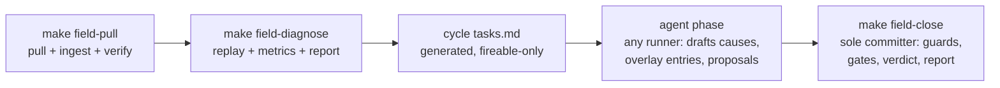

# Design: ML Feedback Loop

## Overview

Two halves joined by a wired pull: an on-device field-note capture layer compiled only into field-profile builds, and a Mac-side loop — a deterministic Python core plus an agent phase executed by whatever runner the developer points at it — that ingests pulls into the corpus, diagnoses estimation-vs-stated gaps, auto-commits overlay data fixes on a loop branch under weighed-truth guards, and derives training material. **The corpus** is the persistent, single-copy Mac-side library in `medata-corpus/`, a sibling directory of the repo clone (concretely `~/repos/medata-corpus/`; tooling resolves it from the main checkout root via `git rev-parse --git-common-dir`, so every worktree sees the same corpus): every pulled capture bundle, note, screenshot, and device-database snapshot, plus the index that joins them — the accumulating raw material every diagnosis, metric, and derived dataset is computed from (Req 8.1). This spec defines only artifacts and contracts that live in this repo; how agent sessions are launched is outside it. Requirement IDs refer to [requirements.md](requirements.md).

## Architecture

### On-device (field profile only)

All note machinery lives in the App layer as new `App/FieldNote*.swift` files, each gated `#if FIELD_LOOP` at line 1 (the `HARNESS_ENABLED` per-file pattern). Nothing note-related enters MedataCore, so the SwiftPM package needs no profile define — the one MedataCore change (protected outcomes, below) is neutral infrastructure like the bundle recorder. New `App/` files require manual `project.pbxproj` entries (the target is not filesystem-synchronised for `App/`).

**Build profiles (Req 9).** `FIELD_LOOP` joins `SWIFT_ACTIVE_COMPILATION_CONDITIONS` in the project-level Debug block (currently `DEBUG $(inherited)`) and a new Release-block setting — field is the daily default, matching the always-on recorder convention. The product profile is a third build configuration, `ProductRelease`, duplicating Release without `FIELD_LOOP`, selected by `make build-product` / `deploy-product`. A CLI `SWIFT_ACTIVE_COMPILATION_CONDITIONS` override is explicitly ruled out: it replaces the whole value (dropping `DEBUG`) and falsely implies control over the package graph (the `deploy-release-stub` script edits `Package.swift` in place precisely because it has none). SwiftPM maps non-Debug configurations to release semantics, so `DEV_STUB_SEGMENTER` stays Debug-only untouched. Estimation code takes no `FIELD_LOOP` condition anywhere (9.3). Profile verification (9.1/9.4): `MedataApp.logLaunchIdentity()` (`App/App.swift:215`) gains ` profile=field|product`, and the product gate asserts via `strings`-grep that the binary contains no `profile=field` literal (that string exists only inside `#if FIELD_LOOP`) — `nm` is unreliable on a stripped Swift Release binary.

**Affordance (Req 1.1).** Every screen except Home is a `.fullScreenCover`, which presents above any root-level overlay, so the affordance is a separate `UIWindow` at `.alert + 1` level, created on scene connection (not literally at launch) under `#if FIELD_LOOP` (`FieldNoteWindow`). Passthrough is explicit: the window overrides `hitTest(_:with:)` to return `nil` everywhere outside the button, so touches reach the app. It hosts a small draggable button; tapping presents the note sheet in that window. Being a separate window, it is absent from main-window screenshots by construction. The hit region is the button's **reported** frame, not anything derivable UIKit-side: SwiftUI draws the whole overlay into one hosting view (view identity cannot distinguish button from empty space), and `.offset` is a render-only translation invisible to geometry callbacks — so the overlay reports its frame offset-inclusive, on layout changes AND offset changes, and clamps a committed park to the window bounds. Field-verified failure mode: a region reported from layout alone goes stale on the first drag and the button dies, persistently.

**Screen identity (Req 1.4).** No app-wide screen enum exists; `FieldNoteContext` (an `@Observable` singleton) composes one from what does: `AppRoot.ActiveSheet` case + navigation-stack top (`MealRoute`/`CaptureRoute`) + `CaptureState`. Covers and key screens set it with a one-line `.fieldScreen("records")`-style modifier at their roots (~8 mount points); sheets inside covers fall back to the hosting cover's id. The same context carries the meal link when a meal surface is frontmost.

**Meal link + estimate snapshot (Req 2).** Surfaces that set meal context: `MealReviewView` (capture stack), `ResultView`/meal overview (history), the refusal overlay, `EstimationOutcomeDetailView`, and a context-menu item on Records meal rows. The refusal overlay currently has no outcome reference — `CaptureFlowModel.persistAttemptRecord` writes the outcome on a detached task without keeping the id; it will stash `(outcomeID, timestampMs)` on the model after the save so the overlay can link (`timestampMs` is also the bundle-stem join). The stash is not gated on the refusal overlay: the capture surface carries it in every state (Req 2.6), because an attempt can fail without rendering a results surface or the refusal overlay, and the stash is the only join key such a failure has. The sheet states the link outright — linked: attempt short id plus relative age; unlinked: `none linked` — because whether a capture-screen note is tied to an attempt must be readable at a glance (first field session: it was not). The snapshot (2.4) is a new `Codable` `EstimateSnapshot` — `[{classId, displayName, massG, carbsG}]` + displayed totals — built from whichever surface is frontmost (`ReviewFood` on review, `FoodRow`/`DisplayMeal` on history), following the `quickPresetDraft` freeze-the-displayed-value precedent. The snapshot captures displayed (corrected) values, not raw `record.macros`.

**Speech (Req 1.3, 1.5).** iOS 26 `SpeechAnalyzer`/`SpeechTranscriber` with `AssetInventory`. Transcription is on-device with no server fallback path (unlike legacy `SFSpeechRecognizer`); the locale *asset download* is a one-time OS-mediated network fetch of the model at first field-profile launch — no audio ever leaves the device, which is what Req 1.3 constrains. Implementation notes the API imposes: check `SpeechTranscriber.supportedLocales` for `en_IE` (or its `supportedLocale(equivalentTo:)` mapping), reserve via `AssetInventory` (a `maximumReservedLocales` cap exists), convert microphone audio to `bestAvailableAudioFormat` explicitly, and treat only post-`finalizeAndFinish` results as the editable transcript — volatile results may never be reissued as final. Asset-absent, permission-denied, and unsupported-locale all route to the 1.5 degraded state. `NSMicrophoneUsageDescription` + `NSSpeechRecognitionUsageDescription` go into both `INFOPLIST_KEY_*` blocks.

**Screenshot (Req 1.4).** `FieldScreenshot` fires **at button tap, before the sheet presents**, against an explicitly retained reference to the main scene window — never "the key window", which becomes the note window once the sheet is up. Generic screens: `UIGraphicsImageRenderer` + `drawHierarchy(afterScreenUpdates: false)` on that window. Capture screen: composite RealityKit's `ARView.snapshot` (which includes the camera feed) beneath an `ImageRenderer` pass of the SwiftUI chrome, because `drawHierarchy` renders the Metal-backed camera layer black. Async with a one-frame tolerance; on failure the note saves without a screenshot and records the reason (1.6 — the note path never blocks or fails anything).

**Note storage (Req 3.1).** One JSON file + one PNG per note in `Documents/notes/` — the `CaptureBundleRecorder` pattern, not a `meals.sqlite` table. Exemption from every delete path is by construction (`deleteAllData` touches `events`/`meals/` only), the directory is Files-app visible and wire-pullable via the same `UIFileSharingEnabled` keys, and pull-side dedup is filename-keyed. No schema migration for notes themselves.

**Protected outcomes (Req 3.2).** `meals.sqlite` schema v11: `CREATE TABLE IF NOT EXISTS protected_outcomes(outcome_id TEXT PRIMARY KEY)` (retrofit needs no ALTER; bump the stamped version), plus `PersistenceStore.markOutcomeProtected(id:)`. **All three** eviction branches in `saveEstimationOutcome` — non-benchmark and both benchmark per-meal-per-lineage branches — add `AND id NOT IN (SELECT outcome_id FROM protected_outcomes)`: a note on a weighed benchmark attempt is the highest-value capture in the corpus and must not be evictable. Protected rows sit outside the bounds, so the population may exceed them by the protected count — accepted. The App note-save calls the API when meal-linked; it is profile-neutral (product builds never call it). Protection rows for pulled notes are pruned by the manifest pass below, so protection does not grow monotonically after its reason has left the device.

**Device cleanup after pull (Decision 14).** `devicectl` has no remote delete, so pruning is app-side and two-phase against races: the pull tool copies `pulled_manifest.json` (stems, note ids, per-file SHA-256) to `Documents/` under a temporary name, then writes a small ready-sentinel carrying the manifest's hash and length; `FieldMaintenance` acts only on a sentinel-verified manifest. It runs at launch, on foreground, and post-capture — deleting listed bundle/note files whose hashes still match, pruning their `protected_outcomes` rows, then deleting manifest + sentinel. Hash mismatch leaves the file and is reported in the next pull. Bundles still being written are protected by the recorder's finalise-then-rename convention.

**Device storage budget and slimming (Req 3.6).** At measured sizes (~390 MB two-view success, ~199 MB refusal) and the observed 49-attempts-in-11-minutes rate, a 3-day session can exceed 50 GB. `FieldMaintenance` checks the `captures/` footprint post-capture and via a `BGProcessingTask`; above the budget (default 25 GB) it rewrites oldest-first bundles without the probability-tensor fields, down to a low-watermark (default 20 GB), deferring under thermal pressure or low battery. The rewrite is a **wire-level field skip** — a Swift equivalent of `fixture_slice.py`'s varint scanner (new work; a full 390 MB SwiftProtobuf decode per bundle is explicitly not the mechanism) — writing to a temp file with atomic replace. Slimmed bundles keep image, depth, argmax, intrinsics, gravity, and masks: replayable for geometry and class identity, not re-scorable. Slimming is marked by a sidecar `<stem>.slimmed` marker (not by mutating `fixture_revision`, which versions the schema, not content state). Ordering contract: manifest processing runs **before** slimming, and slimming skips stems listed in a pending manifest — otherwise a bundle slimmed after being pulled would fail its hash check forever. If slimming cannot keep up (budget still exceeded with all bundles slimmed), the recorder keeps recording and the condition is surfaced in the next pull summary rather than silently dropping captures.

### Transport and ingest (Req 3)

`tools/field_loop/field_pull.py` (stdlib-only): enumerates `Documents/` via `devicectl device info files`, copies `notes/*`, `captures/*.fixture` (+ `.slimmed` markers), and `meals.sqlite` **with its `-wal`/`-shm`/`-journal` siblings when present** one `copy from` per file (no recursive pull exists; per-file pulls over a 50 GB backlog are the loop's wall-clock bottleneck — acknowledged; slimming is the mitigation, an app-side session archive the named future option) into `<repo-parent>/medata-corpus/pulls/<UTC-date>-<n>/`, SHA-256s everything, runs `PRAGMA integrity_check` on the DB snapshot before trusting it, then ingests. The copy phase is observable and resumable, because a multi-hour silent backlog copy is indistinguishable from a hang (first field pull: interrupted twice, the whole backlog re-copied each time): one key=value line per wire copy; every copy lands as `.partial` and is renamed only on success, so a final-name file is always complete; the newest same-day pull dir without a `pull_complete.json` marker is resumed, skipping files already present at their listed size; and every `devicectl` call carries a timeout scaled to the listed size, so a wedged copy fails one file — retried on the next run, since failures leave the marker unwritten — rather than stalling the pull. Progress is measured in **bytes, not files** (Req 3.8): bundles run 2–400 MB, so a file count says nothing about how far along a pull is; the listed total is printed before the first copy and every copy line carries the fraction complete, the measured throughput, and — once three copies have set a rate worth trusting — an ETA. Measured: 10.6 GB over 100 bundles pulled in 12 minutes at ~14.5 MB/s, which is the honest cost of a three-week backlog rather than a fault to fix. `meals.sqlite` is **required**, its WAL siblings are not (Req 3.10) — a missing sibling is ordinary, a missing database means no outcome rows and therefore no resolved join, so it fails the pull and leaves it resumable rather than passing silently. `--notes-only` (`make field-notes`, Req 3.9) pulls the notes and the database and leaves the bundles on the phone: seconds rather than hours, which is what makes the affordance usable for work still in flight. Its pull dirs are a separate `<UTC-date>-notes-<n>` series so a quick notes pull cannot be mistaken for — or renumber — an interrupted backlog pull, and it refuses `--prune`, because retiring an outcome's protection before its bundle is ashore would cost the note its join route. Notes whose bundles are still on the phone are not a permanent miss: `_resolve_joins` re-runs over every note in the corpus on each ingest, so the join lands with the bundle.

```
<repo-parent>/medata-corpus/     # sibling of the repo clone, e.g. ~/repos/medata-corpus/
  captures/<stem>.fixture        # accreted, keyed by stem (Req 8.1)
  notes/<note-id>.json|.png
  db/<pull-id>.meals.sqlite      # each pull's DB snapshot, kept whole
  index.sqlite                   # corpus index: see Data Models
  reports/…  cycles/…            # alignment reports, run verdicts
```

Ingest is idempotent by key (stem / note id / outcome UUID); re-running over the same pull is a no-op diff (3.4). The ingest summary prints the Req 3.4 counts verbatim: notes, bundles, outcome rows, correction rows ingested, and joins resolved. Join resolution follows `shortlist_hit_rate.py`: note → outcome id → `(timestampMs, outcome)` → bundle stem, with the timestamp-window + detected-class verification fallback; unmatched notes land in the index with a reason (3.5), decided by procedure: outcome id present in no pulled DB but a `protected_outcomes` row existed ⇒ `deleted`; never present in any pull ⇒ `never_present`; `evicted` should be structurally impossible under Req 3.2 — its occurrence is itself a defect signal and is reported as such. The single command is `make field-pull` (pull + ingest + prune-manifest push).

### Mac-side loop (Reqs 4–6)

One cycle = deterministic core, then an agent phase, then a deterministic close:



**Deterministic diagnosis (`tools/field_loop/field_diagnose.py` + a new `HarnessCLI diagnose` subcommand).** Replay per annotated capture stages the single fixture into a temp dir (FixtureLoader is directory-oriented) and runs `HarnessCLI diagnose`, which emits what `accuracy` computes but discards: per-fixture JSON of `MealCalibrationInput` — `predictedCarbsPerClass`, `perClassVolumesCm3`, `dominantClass`, `supportPlaneReference`, residuals — plus totals. Replay status per Req 4.2 (`replayed` / `missing_bundle` / `not_replayable` / `replay_zero_meals`); the fallback for the last two reads the proto directly via the `candidate_probe` reader (import, don't fork). **Version-skew contract (Req 4.3):** every diagnosis records the replaying binary's checkpoint SHA and DB hash beside the capture's recorded `model_version` and build stamp; when they differ the diagnosis is stamped `replay_version_skew` and its device-vs-replay delta is **excluded from the 4.3 attribution floor** — otherwise, once the loop lands fixes, HEAD-vs-device drift would absorb the loop's own effect and report it as replay noise. The floor is computed only from skew-free pairs; where a clean build stamp names a commit, replay against that commit's artifacts is the preferred route to a skew-free pair.

**Agent phase.** `field_diagnose.py` generates `specs/estimation/ml-feedback-loop/cycles/cycle-<n>/tasks.md` (rune-parseable) with one task per gap needing interpretation and one per candidate fix — **only tasks fireable from data already in the corpus**; anything needing the device or a human is emitted as a STOP line, not a task. The cycle file and the cycle directory are the entire interface: the generator, not any agent, decides fireability, and every cycle file ends in a terminal close-the-cycle task, so a run over the file terminates by construction — an autonomous runner over a ledger holding tasks it can never fire loops, which is why unfireable work is a STOP line rather than a task. How agents are launched (an external orchestrator, plain Claude or Codex sessions, by hand) is deliberately outside this repo's knowledge; the repo defines only the contract. Agents classify causes (4.4 taxonomy), draft overlay entries or proposals, and write per-task results into the cycle directory.

**Injection containment (Req 4.7).** Text recovered from imagery (screenshots, packaging, menus) enters agent context only as fenced, JSON-escaped evidence fields, never as task bodies or instructions; `triage.md` items quarantine note/screenshot text the same way, so a committed triage file never contains executable task instructions derived from imagery. Structurally: **agents never run git** — sessions executing cycle tasks run without git write permission — and the deterministic `field_close.py` is the sole committer, enforcing every guard in code rather than in prompts. An injected instruction can at worst corrupt a draft, which the validators then bounds-check, evidence-check, and benchmark-guard.

**Reference model (Req 4.6).** `tools/field_loop/refmodel/` — a provider-agnostic adapter interface, because the app is deliberately not dependent on any one ML provider:

```python
class RefModel(Protocol):
    ident: str            # e.g. "anthropic:claude-opus-5:2026-06"
    def read(self, image_path: Path) -> RefReading: ...
# RefReading = {foods: [{name, confidence, region: mask|polygon|box|none}], raw, ident, read_at}
```

Adapters: `anthropic` (pinned model id), `openai` (configurable base URL, so any OpenAI-compatible local server — LM Studio — serves local models through the same adapter), `google`, `local_torch` (segmenter venv). **One adapter is active at a time; all four are maintained at working parity** so any can seamlessly take over when the active one stops — parity is verified, not assumed: the stub-transport test suite covers every adapter equally, and each cycle runs a one-image health probe against every enabled adapter so a broken standby is discovered before it is needed, its result recorded in the cycle verdict. `refmodel.json` at `<repo-parent>/medata-corpus/` holds the enabled set (each entry pinning its model/version) and names the active one; switching is a config edit that loses nothing — readings are cached permanently by `(image sha256, ident)`, each `ident` forms its own comparison series, and the report refuses to pool across idents within one series, so a handover starts a new series rather than corrupting an old one. Per-adapter mask contract: mask-capable adapters (`local_torch`) return real masks; VLM adapters return polygon/box region hints or `none`, recorded as such — the mask-axis comparison only uses mask-capable readings, and the report says which axis each ident can serve. Economics: the active adapter reads once per **cluster representative** (not per attempt — the 49-attempts-in-11-minutes habit makes per-attempt reads the wrong unit); disagreements and outliers earn a second read.

**Metrics (`tools/field_loop/field_report.py`).** Repeat groups (6.1) are structural: attempts chain into a same-scene cluster at ≤ 120 s gaps, **split when the dominant class changes or the argmax food-class sets are disjoint between adjacent attempts** (transitive chaining would otherwise merge dish A and dish B captured 90 s apart, and the false inconsistency would feed the regression flag and denylist); cluster sizes are always reported. Cross-day same-stated-food grouping is a secondary view flagged interpretation-dependent. Mask consistency is pinned as: within-cluster dominant-class agreement rate, mean pairwise IoU of food-mask argmax across cluster attempts, and total-carbs coefficient of variation. Segmentation keys: capture mode (LiDAR/two-view × card) from `capture_path_canonical` (6.6), and `(build stamp, model version, DB content hash)` (6.2) — DB hash = SHA-256 of the two committed sqlite artifacts at the commit the stamp names; per-build loop-fix containment derived with `git merge-base --is-ancestor` over the loop branch. A `…-dirty` stamp names no commit: those captures are bucketed `unattributable`, and field deploy targets warn loudly on a dirty tree and archive the working-tree diff beside the stamp so a dirty build remains reconstructable (refusing dirty deploys would fight daily development; warning + archive keeps the corpus attributable without the fight). Train/eval exclusion (6.4): `index.sqlite` marks each capture `training_used`; the report drops those rows from alignment metrics and prints both set sizes. **Evaluation-floor guard:** derivation refuses to consume captures when doing so would drop any class/capture-mode evaluation cell below a stated floor (`loop_config.json`), so the metric cannot quietly go `insufficient` through its own training appetite. Per-food trends carry the 6.3 non-decrease flag into the verdict, stated values are labelled developer-stated everywhere (6.5), and corpus growth (8.7) reports capture count, annotated share, and per-class real-world coverage. Output follows `shortlist_hit_rate.py` conventions — `key=value` lines, every figure beside its cell count, `insufficient` below `--min-cell`.

### Fix application (Req 5)

**Overlay.** `tools/food_db/loop_overlay.json` at a fixed committed path, read by `generate.py` **by default** — not behind an opt-in flag, because an opt-in overlay silently regenerates without landed fixes on any plain invocation. Fail-closed inverse guard: if the prior DB carries `LOOP_OVERLAY` provenance and no overlay file is present, the bake aborts. `_load_overlay()` mirrors `_apply_calibration`'s fail-before-write contract, but the overlay applies to the in-memory `FOOD_DATA`/side-table rows **before INSERT and before `_apply_calibration`** — order matters: β is fitted against the source densities, so any class whose `density` or composition the overlay touches gets its `beta_status`/`beta_provenance` invalidated to `uncalibrated_overlay_base` until refit, and the density spot-check reads the post-overlay value. Entry shape:

```json
{"class_id": "bread_white", "column": "density", "value": 0.27,
 "basis": {"notes": ["…"], "captures": ["…"], "cause": "wrong_density", "rationale": "…"},
 "fix_id": "cycle3-density-bread_white", "applied_at": "2026-08-30"}
```

`liquid_servings` is keyed `(class_id, region, vessel)`, so an entry targeting `liquid_servings.serving_ml` carries `region` and `vessel` beside `class_id`; naming a row that does not exist aborts, as does targeting the same cell twice.

Allowlisted columns with declared physical bounds: `density` (0.05–2.0 g/cm³), `solid_servings.grams_per_unit` (5–500, `< 100` precision rule respected), `liquid_servings.serving_ml`, and composition columns (0–100 g) — an overridden value rewrites the row's `density_source`/`composition_source` to `LOOP_OVERLAY`, so no row ever claims CoFID/AFCD for a value it no longer carries. β, the palette, and the class set are outside the overlay by construction. Overlay entries and lineage are also written to `meta` (`overlay_json`, `overlay_fix_ids`, `overlay_beta_invalidated_classes`), following the `calibration_*` keys precedent. The invalidation is enforced by `_apply_calibration` skipping every overlay-touched class and recording them in `calibration_overlay_invalidated_classes` — without the skip the calibration pass would simply overwrite the invalidation it exists to respect.

**Guards on every auto-commit (5.2–5.3), enforced in `field_close.py` code, in order:**

1. *Cause-specific evidence*: density, scale, mask, and class errors all explain the same carb delta; a fix draft must cite evidence specific to its claimed cause (e.g. a density fix needs volume agreement + class agreement + mass disagreement). Underdetermined attribution ⇒ proposal, optionally emitting a STOP line requesting a weighed benchmark capture.
2. *Evidence floor*: ≥ 5 distinct captures across ≥ 2 clusters supporting the same direction.
3. *Bounds*: per-column physical bounds; per-cycle symmetric drift ceiling |Δ| ≤ 15 % of the prior value; **and a lifetime absolute bound anchored to the original CoFID/AFCD source value (default total |Δ| ≤ 30 %)** — the per-cycle ceiling alone is a rate limiter, not a bound (1.15¹⁰ ≈ 4×). Beyond any bound ⇒ proposal.
4. *One degree of freedom per class per cycle*, plus a touched-column cooldown (a class whose `density` moved this cycle cannot have `grams_per_unit` moved next cycle) — `fix_id`-keyed denylisting cannot see cross-column oscillation on the same class.
5. *Weighed-truth guard*: `benchmark_meals` captures (SNAQ Parity) whose classes a fix touches are replayed before/after the overlay change; any worsening of weighed-carb error ⇒ demoted, recorded in the verdict. Stated values steer, weighed values veto — this is what keeps a loop trained on human estimates falsifiable.
6. *Build gates*: `make food-db` (new target: `python3 tools/food_db/generate.py && python3 -m pytest tools/food_db/tests/ -q` — closes the existing gap that generation has no make entry) and `make test` (both totals). Any failure ⇒ proposal. The target takes `CALIBRATION=<artifact>`, and a bare re-bake over a database that carries calibration lineage aborts: the calibrate artifact is fitted from the N5k corpus and is not in this repo, so regenerating without it would strip every `calibration_*` meta row — the same fail-closed shape as the overlay's inverse guard, on the other input the bake cannot reconstruct. `field_close` therefore carries the artifact path in `loop_config.json`; with no artifact configured the gate fails and every fix demotes to a proposal, which is the safe direction.

Regression judgement feeding the denylist uses weighed benchmarks first and fresh post-change captures second — never the captures the fix was derived from (the derivation corpus would judge its own fix).

Constants (floors, ceilings, budgets, eval floors, denylist) live in `tools/field_loop/loop_config.json`.

**Git mechanics (5.5–5.7).** `field_close.py` runs in a dedicated worktree (`make worktree name=field-loop branch=field-loop`); refuses on dirty tree; one commit per fix pairing the overlay edit with the regenerated sqlite artifacts and a before/after table in the body; subject `[ml-feedback-loop]: …`; `Co-Authored-By` plus `Loop-Fix-Id:` trailers; ≤ 5 auto-commits per cycle. Proposals (code, anything off-allowlist, anything demoted) are plain `git diff`-style patch files in the cycle directory — not `format-patch`, which would require commits nothing is allowed to make — referenced from the verdict.

### Triage and corpus derivation (Reqs 7–8)

Non-meal notes are triaged by the agent phase into `cycles/cycle-<n>/triage.md` — a committed, rune-parseable task list grouped by `screen_id`, each item linking its note JSON and screenshot (7.2, 7.4) with note/screenshot text quarantined as quoted evidence fields (4.7); routing into a spec is a human step (7.3).

Training derivation (8.4–8.5) follows the merged-corpus precedent exactly: field captures become a third source with stem prefix `fld_`, contributing to train/val only — never the frozen anchor heldout — via `tools/field_loop/derive_dataset.py` emitting the `prepare_dataset.py` layout (`<split>/images`, `<split>/masks`, `splits.json`, `co_stats.json`) with the field-mapping SHA recorded alongside, and mixing policy (initial cap: field ≤ 10 % of train images) recorded in `splits.json`. Labels: relabels/confirmed classes from correction records; masks are the model's own predictions flagged `self_training: true` in per-label provenance JSON; note-derived labels record note id + interpreting model ident. Derivation respects the evaluation-floor guard (above). Calibration derivation emits `.fixture` + `run_summary.json` per the canonical contract. Retraining/recalibration commands are written into the cycle verdict; launching them stays human-gated (8.6).

Corpus durability (8.3): single-copy on the internal SSD, accepted and recorded (Decision 14); `field_pull.py` prints corpus size and the acceptance line in every run summary. Slimming (8.2): probability tensors are dropped from corpus bundle copies once diagnosis and any derivation completed; the index records `slimmed`.

## Data Models

**Note file** (`Documents/notes/<createdAtMs>-<uuid>.json`, schema-versioned):

```json
{"v": 1, "id": "…", "created_at_ms": 0, "screen_id": "capture.result",
 "text": "two slices toast with marmalade, ~30g",
 "carbs_g": 30.0,
 "meal": {"meal_id": "…", "outcome_id": "…", "timestamp_ms": 0},
 "estimate_snapshot": {"foods": [{"class_id": "toast", "display_name": "Toast",
   "mass_g": 92.1, "carbs_g": 41.3}], "displayed_total_carbs_g": 41.3,
   "displayed_total_mass_g": 92.1},
 "screenshot": "<same-stem>.png", "speech_used": true,
 "build_stamp": "…", "model_version": "coreml_ab812dc3aa9d", "profile": "field"}
```

`carbs_g`, `meal`, `estimate_snapshot`, `screenshot` are optional; multiple notes per capture are distinct files (2.5).

**Corpus index** (`<repo-parent>/medata-corpus/index.sqlite`): `captures(stem PK, pull_id, capture_mode, build_stamp, model_version, db_hash, slimmed, training_used, sha256)`; `notes(id PK, stem?, outcome_id?, unmatched_reason?, …)`; `diagnoses(stem, note_id, replay_status, replay_version_skew, replay_delta_g, cause, evidence_json, cycle)`; `ref_readings(image_sha256, ident, reading_json, series)` (cache key = image sha + ident); `pulls(id, date, counts…)`. Idempotence contract: every writer is `INSERT OR REPLACE` keyed on the natural key; re-ingesting an unchanged pull produces zero row-count change.

## Error Handling

| Failure | Behaviour |
|---|---|
| Speech asset absent / permission denied / locale unsupported | Sheet shows typed-only state with reason (1.5); never blocks save |
| Screenshot render fails | Note saves without screenshot, reason recorded in note JSON |
| Note save fails (disk) | Log-and-swallow, matching recorder; capture flow never affected (1.6) |
| Pull interrupted | Re-run resumes the same pull dir, skipping files present at listed size; ingest stays idempotent by key |
| Torn DB snapshot | `PRAGMA integrity_check` fails ⇒ pull retried with WAL siblings; snapshot never ingested unverified |
| Manifest hash mismatch on device | File retained, mismatch reported in next pull |
| Manifest partially written | Ready-sentinel hash/length check fails ⇒ manifest ignored until re-pushed |
| Bundle `not_replayable` / zero meals | Direct-proto fallback, diagnosis marked non-replayed (4.2) |
| Replay artifacts ≠ capture stamp | Diagnosis stamped `replay_version_skew`, delta excluded from the 4.3 floor |
| Overlay validation failure (bounds, unknown class, palette drift, missing overlay with `LOOP_OVERLAY` provenance present) | `SystemExit` before any write; fix demoted to proposal |
| Any auto-commit guard fails (evidence, floors, bounds, DOF, weighed guard, build gates) | Commit aborted, demoted to proposal, verdict records which guard fired |
| Agent phase finds nothing fireable | The cycle file's terminal task closes the cycle; an empty cycle ends cleanly rather than idling |
| Slimming cannot reach watermark | Recording continues; condition surfaced in next pull summary |

## Testing Strategy

- **MedataCore (`make test`, both totals):** protected-outcomes migration + all-three-branch eviction exemption (XCTest beside the existing eviction tests); `HarnessCLI diagnose` output shape incl. version-skew stamping (HarnessCLITests, `HARNESS_ENABLED`); the Swift wire-level slimmer against a committed miniature fixture (slim → still loads, geometry fields intact, probs absent).
- **Python (`python3 -m pytest`):** `tools/food_db/tests/` extended for `_load_overlay` — bounds, provenance rewrite, β invalidation on touched classes, pre-INSERT ordering, default-path + fail-closed inverse guard, palette-lock interaction, idempotent re-bake; new `tools/field_loop/tests/` (stdlib-only, lazy heavy imports) for ingest idempotence (ingest twice → identical index dump), join resolution incl. the unmatched-reason procedure, cluster chaining + split rules determinism, every `field_close` guard in order (cause-evidence, floors, per-cycle + lifetime bounds, DOF/cooldown, denylist, weighed-guard demotion), and report cell-count discipline.
- **App layer:** per the repo test gate, no new UI test scaffolding — the gate is build + on-device look. The note sheet, affordance passthrough (hitTest), speech degraded state, screenshot-at-invocation (not capturing the note UI), and manifest maintenance are device-verified via the checklist in `prerequisites.md`; both build profiles must build, and the product profile's gate is the `strings`-grep absence of the `profile=field` literal plus the `profile=` launch-log field on device.
- **Loop rehearsal (dry run):** a pytest-driven execution of one full cycle with everything external stubbed out — no device (ingest reads committed miniature fixtures: a slimmed bundle + two synthetic notes + one synthetic benchmark meal), no agents (the drafts a runner would produce are committed test fixtures), and no real commits (`field_close.py` targets a throwaway git repo created by the test). It asserts the pipeline end to end: ingest → diagnose → task generation (terminal task present, unfireable work emitted as STOP lines) → close (guard chain fires, a weighed-guard demotion happens, the commit cap holds). This is the regression net for the cycle-termination contract and the guard chain.
