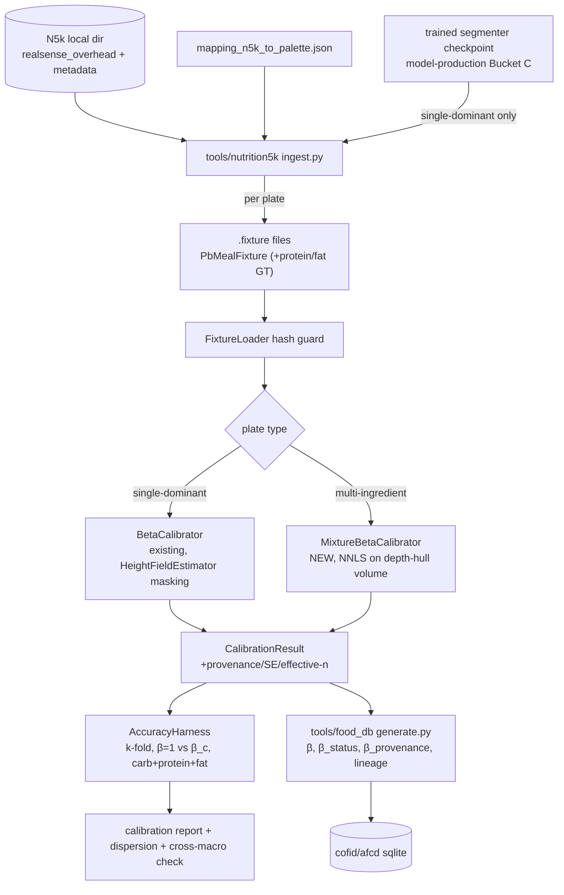

# Design: nutrition5k-calibration

## Overview

Bridge Google Nutrition5k overhead RGB-D + per-ingredient gravimetric labels into MeData's existing `.fixture` / `HarnessCLI calibrate` pipeline to fit per-class β bulk-correction factors, bake them into the food DB with lineage and provenance, report carb/protein/fat accuracy against a β=1.0 baseline, and add standalone-liquid classes to a redefined palette v1 — no version bump; the app has never shipped (Decision 23) — with DB-sourced carb/density values.

The **calibration machinery** (ingestion, mixture solver, reporting, bake) is offline harness + build tooling (`#if HARNESS_ENABLED`, `tools/`) and never ships on-device — so a Swift calibrator has no Android-integration cost (Decision 14). The feature also makes **on-device changes**: the liquid subsystem (the redefined `ClassPalette` v1, `LiquidResolver`, `HeightFieldEstimator` liquid integration), the protein/fat pipeline fields (`PerClassMacros`), and the ResultView banner clause. Those are consumed identically on any target OS. The β values the calibrator produces reach the device only as portable DB rows.

## Architecture

### Data flow



### The two calibration paths and the gating reality

Per Decision 7, β transfers only if the volume it corrects is computed the way inference computes it. **Single-dominant** fixtures therefore carry **real segmenter probabilities** stamped with the checkpoint SHA, and ingestion runs the trained checkpoint over N5k RGB exactly as `make_fixtures.py` does — tying the **single-dominant** bake to model-production Bucket C (Decision 2/6). **Mixture** fixtures carry a sentinel SHA and bake without the checkpoint (Decision 17). The calibrator, mixture solver, liquid geometry, and reporting are built and unit-tested now against synthetic fixtures.

| Path | Volume input | Masking-transfer guarantee (Req 5.1) | β provenance | Runnable pre-checkpoint |
|---|---|---|---|---|
| Single-dominant | `HeightFieldEstimator` per-class volume, real segmenter argmax | Yes | `n5k_single_dominant` | No (needs checkpoint) |
| Mixture (NNLS) | Depth-silhouette **total** above-plane hull volume | No (recorded gap) | `n5k_mixture` | **Yes** — sentinel SHA, bakeable pre-checkpoint (Decision 17) |

Each plate feeds **exactly one** path (Req 5.2): single-dominant if the dominant class clears the purity threshold (Req 4.2), else mixture.

**Checkpoint gating is per-path, not uniform (Decision 17, Req 3.7).** Each fixture carries an `estimator_path` field (`single_dominant` | `mixture`) that **authoritatively** selects the load path — the sentinel string alone must not select it, or any fixture could bypass the hash guard by writing the magic value. Single-dominant fixtures carry real segmenter probabilities and the real checkpoint SHA (the hash guard is unchanged); the single-dominant path rejects a missing, empty, or sentinel SHA. Mixture fixtures carry the sentinel `segmenter_checkpoint_sha256 = "no_segmenter"` and **no** probabilities; the mixture path rejects any fixture carrying segmentation probabilities. A missing or empty SHA is malformed — loader-rejected, and skipped at ingestion (Req 3.8) — never coerced to the sentinel. This lets the mixture β — the bulk of N5k's multi-ingredient plates — be **fitted and baked before** model-production Bucket C exists; single-dominant β stays gated on the real checkpoint (its Req 5.1 masking guarantee requires it). The mixture solver is still unit-tested against synthetic `PlateObservation`s; single-dominant against synthetic single-class fixtures.

### Support plane (Req 3.6)

N5k's overhead RealSense is a downward depth camera, so the plate-top surface is measured directly in the depth frame. **Caveat (review):** `FixtureRunner.fitPlaneFromDepth` currently passes an **all-ones** food-region mask, so its RANSAC selects the largest planar region in the whole frame — which is the **table**, not the plate, when the plate does not fill the frame. Integrating above the table would include plate thickness and violate Req 3.6. So the support plane for N5k is fit **restricted to the plate region**, derived entirely in the **Swift harness** from the fixture's depth (no Python-side geometry, no proto field): a flood-fill on depth continuity — |Δz| between 4-neighbours below a documented threshold — seeded at the frame centre (the N5k rig centres the plate under the camera) stops at the plate-rim discontinuity; the resulting region is passed as the mask to the existing `fitPlaneFromDepth`, which RANSACs the plane over the plate-surface annulus rather than the full frame. Empirically confirmed on real captures (integration run, 60-dish sample): the plate never fills the N5k overhead frame — every frame has a table border ~40–60 mm deeper than the plate centre — so the plate-region restriction is required, not merely precautionary (updates Decision 15). The N5k side-angle RGB videos (4 rotating angles, no depth) are **not used** in this spec; they are recorded as an available resource for the deferred pseudo-label loop (Decision 3 future work). Ingestion records `supportPlane.residualMm` per plate; plates with a poor plate-plane fit are skipped (Req 3.4/3.8).

### Integration-point / pattern-extension audit

β currently has three states (`calibrated`/`uncalibrated_pooled`/`uncalibrated_unity`) and is written by `generate.py`, read by `GRDBFoodDatabase`, surfaced by `PerClassMacros.betaStatus`, and gated by the ResultView banner. Adding a **provenance** dimension and **protein/fat** and **liquid classes** touches every consumer of those patterns:

| Call site | Change | Needs equivalent |
|---|---|---|
| `tools/food_db/generate.py` schema + FOOD_DATA | add `beta_provenance` + `device_verified` columns; write β/status/provenance from calibration; add coarse liquid rows + `liquid_servings` + `liquid_subclasses` tables | Yes |
| `MealFixture.proto` | add `ground_truth_protein_g`, `ground_truth_fat_g`, `source_dataset`, `estimator_path` | Yes |
| `FoodEntry` / `GRDBFoodDatabase.rowToEntry` | read `beta_provenance` + `device_verified` | Yes |
| `PerClassMacros` (+ `.pb`) | add `proteinG`, `fatG` (Req 10), `deviceVerified`, `isLiquid` (banner inputs, Req 8.1) | Yes |
| Pipeline estimate result (+ `.pb`) | add `liquidOverEstimate` flag, set by `LiquidResolver` (Req 8.2) | Yes |
| `Macros.compute` | already computes protein/fat totals; populate per-class fields | Yes |
| `ClassPalette.v1Standard` (redefined in place) | append coarse liquid classes as a `liquidClasses` array; keep `version: "v1"` (Decision 23); sentinel indices shift; `isFoodClass` semantics unchanged (solids only), new `isLiquidClass`; `PbClassPalette` gains `liquid_classes` + bridge | Yes |
| `tools/segmenter/build_class_mapping.py` | route wine/coffee/tea/milk/juice/soup/beer to new liquid classes instead of `unsupported_liquid` (Req 7.2) | Yes |
| `HeightFieldEstimator` liquid skip (`if labelC == liquidId { continue }`) | recognised liquid classes now integrate surface-to-plane; `unsupported_liquid` still skipped | Yes |
| `ResultView.showsUncalibratedBanner` | three-state calibration banner over solid classes only + separate additive liquid flag (Decisions 18–19) | Yes |
| `BetaCalibrator` clamp warning | emit calibration-quality warning on clamp (Req 5.6) | Yes |
| Palette-lock (`verify_palette_lock`) | gains a **content check** — ordered class list parsed from `ClassPalette.swift` must match FOOD_DATA — because the `"v1"` label no longer changes when the palette does (Req 5.7/7.2, Decision 23) | Yes |
| `App/SettingsView.swift` "About macronutrient sources" | add a Nutrition5k row matching the existing CoFID/OGL line: Google Research, CC BY 4.0, values adapted — derived β factors (Req 1.5) | Yes |

### Parallel execution and sequencing (worktrees)

The tasks phase decomposes along these seams so independent worktrees can run `/make-it-so` without impeding one another (PROCESS §7 rune streams / §9 disjoint folders):

- **Independent streams, disjoint files:** (A) Python ingestion + mapping (`tools/nutrition5k/`); (B) Swift calibrators + merge + reporting + `TotalHullVolume` (`HarnessCore/`); (C) liquid subsystem + palette redefinition + bake (`ClassPalette.swift`, `LiquidResolver`, `HeightFieldEstimator`, `generate.py` schema/tables/lock, remap); (D) banner + protein/fat + DB-read plumbing + attribution (`ResultView`, `PerClassMacros`, `Macros.compute`, `FoodEntry`/`GRDBFoodDatabase.rowToEntry`, `SettingsView`); (E) spec alignment docs. A and B meet only at the `.proto` contract, and B and C only at the calibrate-output JSON (§DB bake) — land the proto extensions (`MealFixture` fields, `PerClassMacros.protein_g/fat_g`, `PbClassPalette.liquid_classes`) first as one small contract task; D additionally depends on C's `device_verified` column existing in the DB schema, nothing else. `generate.py` is owned **end-to-end by stream C** — both the liquid rows/tables and the JSON-consuming bake logic; stream B only writes the JSON, never touches the file.
- **Cross-spec conflict surface with model-production:** `ClassPalette.swift`, `tools/food_db/generate.py`, `tools/segmenter/build_class_mapping.py`, `ResultView`. Ordering constraint (Req 9.4, Decisions 22–23): stream C — the final v1 class list — must land on the shared branch **before** model-production's Stage 3 training run starts; model-production's remaining Bucket C work does not otherwise touch these files.
- **Agent-executable to the maximum (prerequisites.md):** the N5k partial fetch and the FoodSeg103 download are performed by implementation agents into gitignored directories; ingestion → mixture fit → bake → report then runs end-to-end **pre-checkpoint** (Decision 17). Only the GPU training run and on-device verification remain human/hardware-gated.
- **Dataset-swap seam (Decision 2):** everything N5k-specific lives in `tools/nutrition5k/` (ingestion + mapping artifact); the calibrators, merge, bake, and report consume dataset-agnostic fixtures (`source_dataset`-stamped) and the calibrate JSON. A better gravimetric dataset later means a new `tools/<dataset>/` ingestion + mapping — not a re-run of this spec's Swift/DB machinery or its requirements.

## Components and Interfaces

### N5k ingestion — `tools/nutrition5k/ingest.py` (Python)

Mirrors `make_fixtures.py`: reuses `export.load_checkpoint` / `reference_input` for segmenter parity (post-checkpoint mode) and `build_fixture_bytes` (extended, below) to serialise. New responsibilities:

- Resolve the N5k dir from an env var / `--n5k-dir`; **exit non-zero naming the missing artifact** if absent (Req 1.2). Record the release identifier — a SHA-256 manifest of the fetched metadata + split files plus the download date, since the GCS bucket is unversioned (Req 1.4) — the ingredient-metadata version, and the count of plates actually ingested.
- **Depth conversion (Req 3.1):** N5k raw depth is 16-bit, 10,000 units/metre → `mm = raw / 10.0`, written as Float32 LE into `DepthMap.depthBytesMm`. Sentinel `0` (invalid) and at-cap (dataset max) pixels are written as `0` so the estimator's `zt > 0` guard excludes them (Req 3.2). The run verifies the conversion against **two documented reference depths strictly below the 0.4 m saturation cap** (the fixed rig camera-to-plate distance and a known plate-height feature) and **aborts** when either falls outside the documented tolerance band — a 10× unit error must fail loudly, not bake.
- **Intrinsics (Req 3.3/3.4):** N5k publishes **no** per-capture RealSense calibration (verified against the bucket and repo), so `nadir_intrinsics` come from **one documented pinned nominal camera model** — RealSense D435 factory intrinsics at the captured resolution — identical for every plate and recorded in lineage; the systematic volume-scale risk folds into the Req 9.3 population-transfer caveat. The Req 3.4 "unregistrable" check is **dimensional, not geometric** (no alignment-residual machinery is built): `rgb.png` and `depth_raw.png` must match each other and the pinned model's resolution, else skip and record; whether N5k depth is pre-registered to RGB is confirmed on real captures at implementation time and the assumption noted in lineage. There are no per-plate ad-hoc intrinsics.
- **Per-plate emission (Req 3.3/3.5/3.6/3.7):** overhead RGB (PNG), converted depth, pinned `nadir_intrinsics`, `gravity` (nadir → straight down), `ground_truth_class_mass_g` (mapped per §mapping), per-dish carb/protein/fat GT, per-class GT macro maps summed from the per-ingredient values (Decision 27 — the eval's Req 6.2/6.6 GT basis), `capture_path_canonical = "single_view_lidar"`, and the `estimator_path` stamp (routing below). Single-dominant fixtures additionally carry segmenter probs + the real checkpoint SHA (`nadir_argmax` stays empty — the purity gate derives the argmax from the probs, §Routing).
- **Skip + record (Req 3.4/3.8):** malformed/missing depth·RGB·mass, or unregistrable under the pinned model → skip, log to a run summary, continue.

**Routing (Req 3.7 / 4.2 / 5.2).** Each ingestion run emits **exactly one fixture per plate**, stamped with the authoritative `estimator_path`. Without `--checkpoint` (pre-Bucket C), every plate is a mixture fixture (sentinel SHA, no probabilities). With `--checkpoint`, a plate routes to `single_dominant` when its dominant mapped solid **class**'s **mass** fraction (ingredient masses aggregated per class — β is per class) — of total plate mass, unmapped ingredients included, so an unmapped-heavy plate cannot be stamped single-dominant — is ≥ `τ_route`; the segmenter runs over its RGB and the probs + SHA are embedded. The **liquid check runs first**: a plate whose liquid-mapped ingredients reach the documented significant fraction is always stamped `mixture`, never `single_dominant` — the observation builder then excludes it from the fit (Req 4.7), and eval treats its liquid-mapped ingredients like unmapped ones (zero estimate, full GT carbs). Req 4.2's purity gate is a **volume** fraction, which only the Swift estimator can compute — so the harness applies `τ_purity` after the estimate: purity = above-plane volume of pixels whose segmenter argmax equals the **mass-dominant** class (identified from `ground_truth_class_mass_g`) ÷ total above-plane food-region volume (sentinel/at-cap excluded). A segmentation that disagrees with the mass-dominant class yields a low fraction and the plate is **dropped**, recorded in the run summary — no separate disagreement rule is needed. Dropping (rather than recovering the narrow mass-dominant/volume-impure/all-mapped slice as mixture fixtures in a later regeneration) is a deliberate simplicity choice: the run summary counts the drops, and the choice is revisited only if that count is material against the Req 4.5 pool. A failed plate is **not re-routed**: the mixture path forbids probability-carrying fixtures (Req 3.7), and dropping preserves Req 5.2's exactly-one-estimator invariant (the plate contributes to neither; the waste is bounded — mass-dominant plates that fail volume purity — and counted). When the checkpoint lands, ingestion **regenerates the full fixture set** and the calibrate run re-fits both paths; `CalibrationMerge` applies the Req 5.2 supersession (qualifying single-dominant β over baked mixture β), recorded in lineage.

### Mapping artifact — `tools/nutrition5k/mapping_n5k_to_palette.json`

N5k ingredient id → palette food-class id, preserving `generate.py` FOOD_DATA channel order but keyed against the **current** `ClassPalette`, not a fixed count (Req 2.1). Req 2.2's eight staples are the **floor**, not the cap: the mapping covers **as many of the 24 food classes as N5k ingredients allow** — mapping only the 8 staples would starve the mixture path, because a multi-ingredient plate qualifies only when *all* its significant ingredients map (Req 4.1), and real N5k plates carry proteins and vegetables. Broad coverage is what makes Decision 11's "most of N5k becomes signal" true; the ingestion run **reports how many plates survive the all-significant-ingredients-map filter** as a feasibility output, so the mixture path's actual yield is a measured number, not an assumption. Unmapped ingredients are **excluded**, not reassigned (Req 2.3). Ambiguous N5k ingredients that don't distinguish a MeData pair (white/brown rice, boiled/mashed potato, white/wholemeal bread) are recorded as `ambiguous` and excluded from both sides, never silently assigned (Req 2.4). Header carries `palette_class_list` (the palette content, not the static `"v1"` label — Decision 23) and `n5k_metadata_version`; a loader **fails loudly** if either mismatches (Req 2.5).

**Unmapped-volume bias (Req 4.1/4.3).** `V_p` is the total above-plane hull, so it also contains the volume of any unmapped/insignificant item still on the plate. The mixture solve attributes `V_p` only across mapped classes, so leftover unmapped volume biases co-occurring mapped β's **downward**. Two guards bound it: (a) a plate enters the mixture fit only when unmapped ingredients are below a documented **significant-mass fraction** of plate mass (the "all significant ingredients map" filter), so residual unmapped volume is small; (b) the stacking guard (Req 4.3) drops plates whose hull is anomalous. The residual is recorded as an accepted systematic bias in the dispersion report.

### Fixture bridge extensions — `build_fixture_bytes` / `FixtureLoader`

Extend the Python writer and the `.proto` (see Data Models). `FixtureLoader` gains per-path guards keyed off `estimator_path` (Req 3.7): the single-dominant path keeps the existing checkpoint-SHA hash guard and rejects missing/empty/sentinel SHAs; the mixture path accepts only the sentinel and rejects fixtures carrying segmentation probabilities; a missing/empty SHA is malformed — rejected, never coerced.

### `MixtureBetaCalibrator` — `HarnessCore/MixtureBetaCalibrator.swift` (NEW, Swift)

Solves, over multi-ingredient plates, `V_p ≈ Σ_c (m_{p,c}/ρ_c)·x_c` with `x_c = 1/β_c ≥ 0` (Decision 11). Total hull volume `V_p` comes from a new `TotalHullVolume.integrate` that reuses the `VolumeTypes` geometry (`readDepthMm`, off-axis pixel area, ray-plane height) with a **depth-threshold silhouette** (height above the plate plane > ε, sentinel/at-cap excluded) instead of an argmax mask. It lives in `HarnessCore` (stream B), not `MedataCore/Sources/Volume` — it is harness-only and this keeps stream B's folders disjoint from stream C's estimator edits.

```swift
public enum MixtureBetaCalibrator {
    public struct PlateObservation: Sendable {
        public let fixtureID: String
        public let totalHullVolumeCm3: Float          // depth-derived
        public let massByClassG: [String: Float]      // mapped N5k masses
    }
    public struct Result: Sendable {
        public let betaPerClass: [String: Float]
        public let standardErrorPerClass: [String: Float]   // regression SE → dispersion (Req 6.4)
        public let effectiveSamplePerClass: [String: Int]   // plates where class mass-fraction ≥ τ_eff (Req 4.5)
        public let identifiablePerClass: [String: Bool]     // SE ≤ bound AND well-conditioned
        public let conditionNumber: Float                   // Req 5.5 diagnostic
        public let excludedPlates: [String]                 // stacking/occlusion guard (Req 4.3)
        public let fixedOffsetClasses: Set<String>          // Req 4.6
    }
    public static func fit(_ obs: [PlateObservation],
                           densityByClass: [String: Float]) -> Result
}
```

- **Bounded solve:** the fit is a **bounded-variable least squares** (BVLS, active-set) of `A_{p,c} = m_{p,c}/ρ_c` against `V`, with each `x_c = 1/β_c` constrained to `[1/1.5, 1/0.05]` — the same β bounds as the single-dominant path, enforced *inside* the solve so a bounded variable's excess volume is re-attributed by the least-squares rather than leaking into co-occurring classes (a post-hoc clamp would break the joint solve). A class whose solution rests on a bound is marked `clamped` for the Req 5.6 warning. Per-class SE from residual variance × diagonal of `(AᵀA)⁻¹` over the free set; the per-class conditioning (diagonal of the inverse, not just the global condition number) drives `identifiablePerClass`. `conditionNumber` is retained as a whole-system diagnostic (Req 5.5).
- **Fixed offset (Req 4.6):** classes below effective-sample min or not individually identifiable are held at β=1 and their `A_{p,c}·1` moved to the RHS (`V'_p = V_p − Σ_{fixed} m_{p,c}/ρ_c`) so their volume is not misattributed to identifiable classes.
- **Stacking guard (Req 4.3):** exclude plate `p` where `V_p < κ · Σ_c m_{p,c}/ρ_c` (expected minimum volume at β≈1) — a computable hull-vs-expected check, not sauce detection. `κ` documented in the report.
- **Liquid-bearing exclusion (Req 4.7):** the observation builder drops any plate carrying a significant liquid-mapped ingredient (e.g. soup) from the mixture fit **entirely** — the vessel-plus-liquid volume stays in the measured hull and would be misattributed to co-occurring solid classes' β, and vessel geometry breaks the additive-volume assumption. Liquid classes never enter the β fit (their values are DB-sourced, Decision 9). These exclusions are counted in the Req 4.5 pool report.
- **ρ coupling (Req 5.3):** a ρ error in one class biases co-occurring classes' β in the joint solve; noted in the dispersion report.

Three distinct thresholds, not to be conflated: **`τ_route`** (ingestion routing, Req 3.7) — the dominant mapped solid class's **mass** fraction (per-class aggregate) a plate must clear to be stamped `single_dominant`; **`τ_purity`** (harness admission, Req 4.2) — the dominant class's above-plane-**volume** fraction a stamped plate must clear to enter the single-dominant fit (failures are dropped and recorded, not re-routed); and **`τ_eff`** (effective-sample, Req 4.5) — the mass-fraction a class must exceed *on a plate* for that plate to count toward the class's effective-sample total. All are documented in the calibration report.

Single-dominant plates keep the **existing** `BetaCalibrator` unchanged (see `CalibrationMerge` below for how the extra gate fields are attached).

### Extended `CalibrationResult` + provenance

`BetaCalibrationStatus` stays a three-value enum (calibrated/pooled/unity). Provenance is a **separate** dimension so the calibrated gate can tighten without breaking existing consumers:

```swift
public enum BetaProvenance: String, Codable, Sendable {
    case n5kSingleDominant = "n5k_single_dominant"
    case n5kMixture        = "n5k_mixture"
    case gravimetric       = "gravimetric"    // hand-measured
    case none                                  // pooled/unity, no fit
}
```

**`CalibrationMerge` — `HarnessCore/CalibrationMerge.swift` (NEW).** Owns the per-class β/status/provenance decision. Interface:

```swift
public enum CalibrationMerge {
    public struct ClassCalibration: Sendable {
        public let className: String
        public let beta: Float
        public let status: BetaCalibrationStatus   // calibrated | pooled | unity
        public let provenance: BetaProvenance
        public let standardError: Float?
        public let effectiveSample: Int
        public let clamped: Bool                    // Req 5.6 warning
    }
    public static func merge(singleDominant: BetaCalibrator.PerClassFit,
                             mixture: MixtureBetaCalibrator.Result) -> [String: ClassCalibration]
}
```

**BetaCalibrator changes (minimal, not "none").** The closed-form β = `exp(mean(log(actual/predicted)))` is unchanged, but the SE-bound half of the tightened gate (Req 5.4) needs the per-class log-residual spread, which the current `CalibrationResult` discards. `BetaCalibrator` is extended to also return, per class, the log-residual standard error and the effective-sample count (`PerClassFit`). No change to the fit value or the clamp — only new outputs.

**Per-class arbitration (Req 5.2).** A class receives exactly one β by this rule, applied by `CalibrationMerge`:
1. If the class clears the effective-sample min AND is individually identifiable (SE ≤ bound) on the **single-dominant** fit → take that β, provenance `n5k_single_dominant` (carries the Req 5.1 masking guarantee).
2. Else if it clears the min AND is identifiable on the **mixture** fit → take that β, provenance `n5k_mixture` (masking-transfer gap recorded).
3. Else → pooled/unity, provenance `none`.

This prefers the stronger guarantee but does **not** discard a strong mixture fit when the single-dominant path is merely under-sampled — resolving the "perverse discard" the single-dominant-always-wins rule would cause.

**Provisional gate values** (recorded in the report, tunable once real N5k counts are known — pinned here so the gate's strictness is reviewable, not deferred): effective-sample min = **30** (inherits the pipeline floor); SE bound for `identifiable` = **relative SE ≤ 0.15** on β; `τ_route` = **0.90** (dominant mapped solid class's mass fraction for the single-dominant stamp); `τ_purity` = **0.90** (dominant-class above-plane volume fraction for single-dominant admission); `τ_eff` = **0.15** (per-plate mass fraction for a plate to count toward a class's effective sample); stacking-guard `κ` = **0.6** (drop a mixture plate whose hull < 0.6× expected min volume); cross-macro tolerance = **protein/fat MAPE within 1.5× the class carb MAPE** before flagging (Req 6.7); unmapped-significant fraction = **0.10** (a plate enters the mixture fit only when unmapped ingredients are < 10% of plate mass, Req 4.1); liquid-significant fraction = **0.05** (a plate whose liquid-mapped mass ≥ 5% is excluded from the fit and stamped `mixture`, Req 4.7).

**Calibration pool (Req 4.4/4.5).** Calibration excludes every dish in N5k's official depth test split (`dish_ids/splits/depth_test_ids.txt` — the RGB-D split; the `rgb_*` files split the video-derived imagery) before anything else. The feasibility report states the pool arithmetic explicitly: ~3.5k RGB-D dishes − official depth test split − ingestion skips (Req 3.4/3.8) − liquid-bearing exclusions (Req 4.7), with effective-sample counts broken out per estimator path. "Insufficient" and "not individually identifiable" are documented, accepted outcomes (Req 4.5) — the ≥30 floor has not been pre-verified against this doubly-shrunk pool; this report is where that arithmetic lands.

**Split reconciliation.** The **bake** fits each single-dominant class on **all** its qualifying plates (no internal holdout) — the 60/40 stratified split is used only when `BetaCalibrator` is asked to self-evaluate, not for the baked β, so a single-dominant staple needs the 30-plate effective-sample floor, not ~50. The **report's** held-out accuracy (Req 6.1/6.3) comes from **k-fold cross-validation** over the full calibration set (`AccuracyHarness`), so no staple is stranded below the floor by a single holdout. The mixture fit likewise uses all qualifying plates; its held-out accuracy uses the same k-fold wrapper on the **same hull-volume basis it was fit on** — pre-checkpoint there are no segmenter masks to measure against (Req 3.7 forbids them on mixture fixtures), so the masking-transfer gap stays a **recorded caveat** (Req 5.1), not a measured quantity; the device-basis comparison lands with the post-checkpoint re-fit, when regenerated single-dominant fixtures carry real masks. For a multi-class eval plate the carb estimate attributes the measured hull volume across mapped classes by **ground-truth mass proportions** (oracle composition, a recorded caveat), each share × ρ_c × β_c × carb-fraction. The k-fold seed and selection seed are one recorded seed, and the official depth-test-split exclusion happens before any of this (Req 4.4; see **Calibration pool**).

### DB bake — `tools/food_db/generate.py`

**Handoff contract:** `HarnessCLI calibrate` writes a single JSON artifact — per-class `{beta, status, provenance, standard_error, effective_sample, clamped}` plus the lineage block (Req 5.5) — which `generate.py` consumes; this file is the entire interface between the Swift harness (stream B) and the Python bake (stream C), so the two streams never share source files. Before writing, `generate.py` reads the prior DB's per-class β/status/provenance and records any supersession (mixture → single-dominant) in lineage (Req 5.2) — the JSON does not need to carry prior-bake state.

- Add `beta_provenance TEXT NOT NULL DEFAULT 'none'` and `device_verified INTEGER NOT NULL DEFAULT 0` to the `foods` schema and the FOOD_DATA tuple.
- **Count-guard updates:** `generate.py`'s `assert len(FOOD_DATA) == 24` and `build_class_mapping.py`'s `parse_palette` 24-class assert move to the redefined v1 count (24 solid + 8 liquid). Liquid rows are appended to `FOOD_DATA` (CoFID-primary), with AFCD/USDA-sourced values going in `AFCD_DATA` per the existing CoFID-wins merge.
- **Palette lock gains a content check (Req 5.7/7.2, Decision 23):** `verify_palette_lock` keeps the label comparison and additionally parses the ordered class list from `ClassPalette.swift` (extending the existing regex-read pattern) and asserts it matches FOOD_DATA's class ids and order. The canonical list is **`foodClasses` then `liquidClasses`, in declaration order, sentinels excluded** — FOOD_DATA's class ids must equal it exactly. The `"v1"` label no longer changes when the palette does, so a stale pre-liquid artifact must fail on content, not label; this also obliges regenerating every palette-locked artifact (both sqlite DBs, the FoodSeg103 remap, the N5k mapping) in the same change. Enforcement for the remap and mapping artifacts is their own fail-loud loaders (the mapping header check, `parse_palette`'s count assert moved to the new total) — deliberately no CI hook, per PROCESS §8.
- **Basis check (Req 5.3): the density spot-check IS the assert.** N5k masses are as-served by construction (weighed at serve time — constant, no per-dish basis metadata exists), and FOOD_DATA deliberately gains no `basis` column (less schema for a check with a constant left-hand side; the as-served convention is recorded in a `generate.py` comment). The Req 5.3 assert is therefore implemented as the computable spot-check: for staples where cooked-vs-dry densities differ 2–3× (rice, pasta), the N5k-implied density (mass ÷ measured volume) must fall within tolerance of the DB ρ, else the bake aborts. Rationale: a silent cooked/dry mismatch would scale every β by a constant the internally-consistent N5k eval could not catch.
- Record lineage in `meta`: N5k release/metadata version, mapping-artifact version, routing/purity/mass-fraction thresholds, selection seed, per-class effective-sample counts, mixture conditioning/identifiability diagnostics (Req 5.5), the pinned nominal intrinsics model (Req 3.3), and the dataset licence `CC BY 4.0` (Req 1.5).
- Emit a **calibration-quality warning** for any class whose fitted β was clamped to `[0.05, 1.5]` rather than silently accepting it (Req 5.6).
- Run the existing palette-lock verification; abort on `ClassPalette.version` mismatch (Req 5.7).

### Accuracy reporting — `HarnessCore/AccuracyHarness.swift`

- **Split policy (Req 6.1):** k-fold cross-validation over the calibration set (not a single holdout) so no staple drops below the 30-sample floor; seeded (Req 4.4).
- Ground truth = carb/protein/fat of **mapped classes only** (Req 6.2/6.6), so unmapped ingredients don't inflate error.
- Report per carb-priority staple and overall: MAPE + MAE for **both** β=1.0 and β_c (Req 6.3), per-class β dispersion (mixture = regression SE) (Req 6.4), and the same for protein and fat (Req 6.6).
- State the MAPE < 20% target and per-staple pass/fail as a **reported result, not a bake gate** (Req 6.5, Decision 6).
- **Cross-macro consistency (Req 6.7):** flag any class whose carb estimate matches N5k but whose protein or fat diverges beyond a documented tolerance as a likely mapping/composition-source error.
- **Official-split report (Req 6.8, Decision 21):** ingestion emits fixtures for depth-test-split dishes like any others — only calibration *selection* excludes them. On those held-out dishes, the whole-dish estimate attributes the measured above-plane hull volume across mapped classes by ground-truth mass proportions (the same oracle-composition mechanism as the k-fold eval; post-checkpoint, single-dominant-stamped test dishes use masked per-class volumes directly); unmapped **and liquid-mapped** ingredients contribute zero estimate but full GT carbs. Report **whole-dish** carbohydrate MAE and MAE÷mean-actual — the basis and normalisation of the N5k paper's Table 3 RGB-D baseline (carb MAE 23.8% of mean) — for both β=1.0 and β_c. Basis differs from the mapped-only figures: unmapped ingredients contribute **zero to the estimate but their full carbohydrate to the ground truth**, and the MAE÷mean denominator is computed over the evaluated dishes. The report states the evaluated-dish count against the split total (enumerating Req 3.4/3.8 skips), the mapped-carb coverage fraction, and the oracle caveat — the pipeline consumes ground-truth class identity via the mapping, so these figures are *reported alongside*, not claimed comparable with, the paper's image-only baseline. The β_c-vs-baseline judgement stays with the mapped-only figures (Req 6.3), since the whole-dish numbers conflate mapping coverage with calibration quality.

### Liquid subsystem

- **Palette (v1 redefined, Decisions 22–24):** append **coarse** liquid classes to `ClassPalette` — `water`, `coffee`, `tea`, `milk`, `fruit_juice`, `soup`, `beer`, `wine` — as a separate `liquidClasses` array; the sentinel indices (background / unknown_food / unsupported_liquid) shift after the liquids. **Predicate contract (load-bearing):** the existing `isFoodClass(_:)` keeps its current meaning — *solid* food classes only, indices `0..<foodClasses.count` — so every existing consumer (β fit, banner evaluation, estimator solid loop) is untouched by default; a new `isLiquidClass(_:)` covers the liquid index range, and liquid handling is strictly opt-in through it. This is a `ClassPalette` struct change (new stored field, `init`, `totalClasses = foodClasses.count + liquidClasses.count + 3`) plus a `PbClassPalette` proto field (`repeated string liquid_classes`) and bridge update — part of the proto-first contract task. `version` stays `"v1"`: the app has never shipped and nothing was trained against the 24-class layout, so there is no v2 (Decision 23); the bake's palette lock gains the content check (§DB bake) because the label alone can no longer detect the change. FoodSeg103 carries no sub-class supervision, so sub-classes are **not** palette channels (Decision 22): `beer_lager`/`beer_stout` from the earlier class-list answer become DB **sub-class rows** (`liquid_subclasses`) applied best-effort by `LiquidResolver` with fallback to the coarse `beer` row (Req 7.5, Decision 24). Each coarse class gets a FOOD_DATA row with carb, density, and per-row source (CoFID/AFCD/USDA) (Req 7.1). Canonical serving volumes are **not** a column on `foods` — they are region-dependent (UK vs US pint, Req 7.7), so a separate table `liquid_servings(class_id, region, vessel, serving_ml, source)` holds them, keyed by (class, region, vessel).
- **`LiquidResolver` — `MedataCore/Sources/Volume/LiquidResolver.swift` (NEW):** owns the precedence rule (Req 7.6) and the canonical-serving pure mapping (Req 7.4). It sits after segmentation in the pipeline where liquid classes are detected, and returns either a carb value (with an over-estimate flag for the fill-assumption path) or an exclusion+flag. The vessel mapping `(vessel_label, sub_class, region) → liquid_servings.serving_ml × DB carb-density` is a pure function unit-testable without the recognition step. `region` comes from a Settings value defaulting to `UK`; vessel and sub-class recognition remain the Req 7.7 deferred dependency.
- **Remap (Req 7.2):** `build_class_mapping.py` routes those FoodSeg103 categories to the new coarse classes instead of `unsupported_liquid`; palette-lock runs against the redefined v1 with the content check.
- **Depth-integrated liquid volume (Req 7.3):** recognised liquid classes integrate the liquid surface depth to the support plane (reusing the height-field geometry), then carb = volume · density · carb-fraction. Unit-tested against a known synthetic surface. `unsupported_liquid` remains skipped. **Known over-read (Decision 5 caveat, unresolved by geometry):** integrating the surface column to the support plane includes the vessel base/walls, so this path over-reads volume and **raises the liquid over-estimate flag**, same as the vessel path (Req 7.3, Decision 19).
- **Canonical-serving path (Req 7.4, Decision 12):** the `LiquidResolver` pure mapping above. Assumes a full vessel; **raises the liquid over-estimate flag**. Serving volumes live in `liquid_servings` with provenance (Req 7.7).
- **Sub-classification (Req 7.5):** apply the sub-class density best-effort (lager vs stout by colour), fall back to the generic class when uncertain; densities come from the DB, with no assumed lager<stout ordering.
- **Precedence (Req 7.6):** the `LiquidResolver` single rule — recognised standard vessel → canonical-volume; else recognised liquid class with usable surface depth → depth-integrated; else exclude + flag (existing behaviour). Never emit an unbacked carb number.
- **Deferred dependency (Req 7.7):** recognising liquid class/vessel/sub-class at inference needs segmenter/classifier retraining owned by model-production; liquid carb output is unvalidated in this spec (Decision 9).

### Protein/fat pipeline outputs (Req 10)

`Macros.compute` already computes total protein/fat from mass × DB fraction. Populate new `PerClassMacros.proteinG`/`fatG` from the same β-corrected mass (Req 10.1); carbs stay primary and protein/fat are additive (Req 10.2). No UI change — display is deferred to a future `ui/` spec (Req 10.3, Decision 13).

### Banner (Req 8)

`ResultView.showsUncalibratedBanner` currently returns one boolean. It becomes **one three-state calibration-confidence signal plus one independent additive flag** (Decisions 18–19):

- **Calibration banner (Req 8.1)** — evaluated over the result's contributing **solid-food classes only**; liquid classes carry no β and never enter this evaluation:
  - **suppressed** — every class `calibrated` AND every class device-verified;
  - **softened** ("population-calibrated — not yet verified on this device") — every class `calibrated`, any class not device-verified;
  - **full** (existing banner) — any class pooled/unity.

  `device_verified` is a **per-class** DB column baked alongside `beta_status`/`beta_provenance` (default 0; flipped only by the future device-spot-check spec — Decision 18 refinement). Within this spec the suppressed state is unreachable for any result with a solid-food class, and is covered by flag-injection tests (Req 8.1).

  **Plumbing:** `rowToEntry` reads `device_verified` into `FoodEntry`; `Macros.compute` copies it (and the class kind) onto each `PerClassMacros` (`deviceVerified`, `isLiquid`); `LiquidResolver` sets a result-level `liquidOverEstimate` flag. `ResultView` computes the three states from the per-class fields and renders the additive flag from the result field — no new lookups in the view layer.
- **Liquid over-estimate flag (Req 8.2)** — raised when the result includes a liquid estimate from either path (fill-assumption vessel, Req 7.4, or depth-integrated, Req 7.3 — both over-read, Decision 19). It renders **additively alongside** whichever calibration-banner state 8.1 selected and never replaces, upgrades, or suppresses it.
- **Standalone drink (no contributing solid-food class):** no calibration banner is shown and the liquid flag stands alone — a stated rule, not the suppressed state reached by vacuous truth (Req 8.1).

The banner's visual presentation stays owned by model-production (Req 8.3); the softened tier reuses the existing banner styling with the softened copy.

### Spec alignment (Req 9)

- Add Nutrition5k to the estimation/pipeline dataset-overlap section (§20.2) noting its β_c calibration use (Req 9.1).
- The v1 standalone-liquid reversal is recorded in this decision log (Decision 5) and cross-referenced from Req 7 (Req 9.2).
- The population-transfer assumption (β fit on N5k overhead RealSense applied to device LiDAR, compounded by the pinned nominal intrinsics of Req 3.3) is documented as a known risk for a later device spot-check (Req 9.3) — recorded in the intrinsics note of §N5k ingestion above, in Decision 18's context (it motivates the softened banner tier), and beside `PINNED_INTRINSICS` in `tools/nutrition5k/ingest.py`.
- Update model-production's stage ordering to record the palette class-list lock — the final v1 including the liquid classes — as a prerequisite of its training stage (Req 9.4, Decisions 22–23).
- Add the Nutrition5k attribution row to `SettingsView`'s "About macronutrient sources" section, matching the existing CoFID/OGL line and indicating adaptation (derived β factors), and record the licence in calibration lineage (Req 1.5).
- Document the N5k directory layout + acquisition steps in **both** this spec's prerequisites and the ML-training docs under `tools/segmenter/README.md` (Req 1.3).

## Data Models

**`MealFixture.proto`** (new fields, back-compatible):
```proto
float  ground_truth_protein_g = 20;   // added alongside the retained ground_truth_total_carbs_g (Req 3.5)
float  ground_truth_fat_g     = 21;
string source_dataset         = 22;   // e.g. "nutrition5k@<release>/<metaver>" (Req 1.4)
string estimator_path         = 23;   // "single_dominant" | "mixture" — authoritative load-path selector (Req 3.7)
```
The existing `ground_truth_total_carbs_g` (field 18) is retained, not replaced — protein/fat are additive. `estimator_path` is a string with a closed, loader-validated vocabulary (matching the `capture_path_canonical` convention); any other value is malformed.

**`foods` schema** (`generate.py`): add `beta_provenance TEXT NOT NULL DEFAULT 'none'` and `device_verified INTEGER NOT NULL DEFAULT 0`; liquid rows use the same FOOD_DATA tuple as solids (now 14 columns with the two additions; `density`/`carbs_mono_100`/`composition_source` etc.). New table `liquid_servings(class_id, region, vessel, serving_ml, source)` with `PRIMARY KEY (class_id, region, vessel)` and a closed vocabulary for `region`/`vessel` (enforced enum, not free text) so a lookup miss is a hard error, not a silent zero (Req 7.4/7.7). New table `liquid_subclasses(class_id, sub_class, carbs_mono_100, density, source)` with `PRIMARY KEY (class_id, sub_class)` for best-effort sub-class densities (e.g. `beer` → `lager`/`stout`), falling back to the coarse `foods` row when the sub-class is uncertain (Req 7.5, Decision 24).

**`PerClassMacros`** (`.proto` + Swift): add `float protein_g`, `float fat_g`.

**Mapping artifact**: `{ palette_class_list, n5k_metadata_version, mappings: [{ n5k_ingredient_id, class_id | null, status: "mapped"|"unmapped"|"ambiguous" }] }` — keyed to the palette **content** (its ordered class list), not the `"v1"` label, since the label no longer changes when the palette does (Req 2.5, Decision 23).

## Error Handling

| Failure | Handling | Req |
|---|---|---|
| N5k dir/artifact missing | ingest exits non-zero naming path + artifact | 1.2 |
| Mapping palette-content/metadata mismatch | loader fails loudly | 2.5 |
| Depth-conversion reference check outside tolerance | abort the ingestion run | 3.1 |
| Plate depth/RGB/mass malformed, or unregistrable under the pinned intrinsics | skip, record in run summary, continue | 3.4, 3.8 |
| Single-dominant fixture with missing/empty/sentinel SHA | loader rejects; ingestion skips as malformed, never coerces to sentinel | 3.7 |
| Mixture fixture carrying segmentation probabilities | loader rejects | 3.7 |
| Single-dominant plate failing `τ_purity` in the harness | dropped from calibration and recorded — not re-routed | 4.2, 5.2 |
| Plate with a significant liquid-mapped ingredient | excluded from the mixture fit entirely; counted in pool report | 4.7 |
| Poor plate-plane fit (high residual) | skip plate, record | 3.6 |
| Class under-sampled / not identifiable | leave pooled/unity, subtract as fixed offset | 4.5, 4.6 |
| Stacked/occluded plate (hull ≪ expected) | exclude from mixture, record | 4.3 |
| Fitted β clamped to bounds | emit calibration-quality warning | 5.6 |
| Palette version ≠ DB build version | abort bake | 5.7 |
| Palette content (class list) ≠ FOOD_DATA, label unchanged | abort bake | 7.2 |
| Liquid with no vessel and no usable surface depth | exclude + flag, no carb number | 7.6 |

## Testing Strategy

Keep it minimal per project convention (offline harness + Python tooling; no new app/UI test targets). Focus on the numerically load-bearing pieces.

**Property-based tests** (the calculators express universal guarantees):
- **Mixture BVLS recovery:** generate synthetic plates from known β_c and ρ, form `V_p = Σ m_{p,c}/(ρ_c β_c)`, add bounded noise → the solver recovers β_c within tolerance, respects the `[0.05, 1.5]` bounds, marks a bound-resting class `clamped`, and flags a deliberately collinear class as high-SE/unidentifiable. Framework: synthetic generators in Swift Testing (matches existing `HarnessCore` tests).
- **Depth→mm round-trip:** `raw → mm = raw/10 → raw` is exact for the integer grid; sentinel/at-cap map to excluded.
- **Liquid surface-to-plane volume:** a known synthetic surface (flat/tilted) integrates to its analytic volume within tolerance (Req 7.3).
- **Vessel canonical mapping:** `(vessel, sub_class, region) → volume × density` is a pure table lookup — parameterised table covering each vessel/sub-class, the generic fallback, and a closed-vocabulary miss raising an error (Req 7.4/7.5).

**Example-based tests:**
- Mapping artifact: ambiguous ingredients excluded from both sides; unmapped excluded (Req 2.3/2.4); version-mismatch fails loudly (Req 2.5).
- Ingestion skip/record on malformed plates (Req 3.4/3.8) via a tiny fixture N5k dir.
- `CalibrationMerge` arbitration: single-dominant wins when identifiable; a strong mixture fit is kept when single-dominant is under-sampled; a class with enough plates but large SE stays pooled, not calibrated (Req 5.2/5.4).
- Estimator-path load guards (Req 3.7): a `mixture` fixture with the sentinel SHA loads on the mixture path; a `mixture` fixture carrying probabilities is rejected; a `single_dominant` fixture with a wrong, missing, empty, or sentinel SHA is rejected; an unknown `estimator_path` value is malformed (Decision 17).
- Banner states (Req 8.1/8.2, flag-injection): any pooled/unity solid class → full; all-`calibrated`, any not device-verified → softened; all-`calibrated` + all device-verified (injected) → suppressed; liquid flag renders additively with each of the three states and alone for a standalone drink (no solid classes → no calibration banner). Extend the existing `ResultFormat.showsUncalibratedBanner` test.
- β=1 vs β_c report includes both rows per staple and both include protein/fat (Req 6.3/6.6); the official-split whole-dish section states evaluated-dish count, coverage fraction, and the oracle caveat (Req 6.8) — asserted on a synthetic mini-split.

The end-to-end N5k bake is **not** a test target — it is gated on the model-production checkpoint and is a documented manual run.
