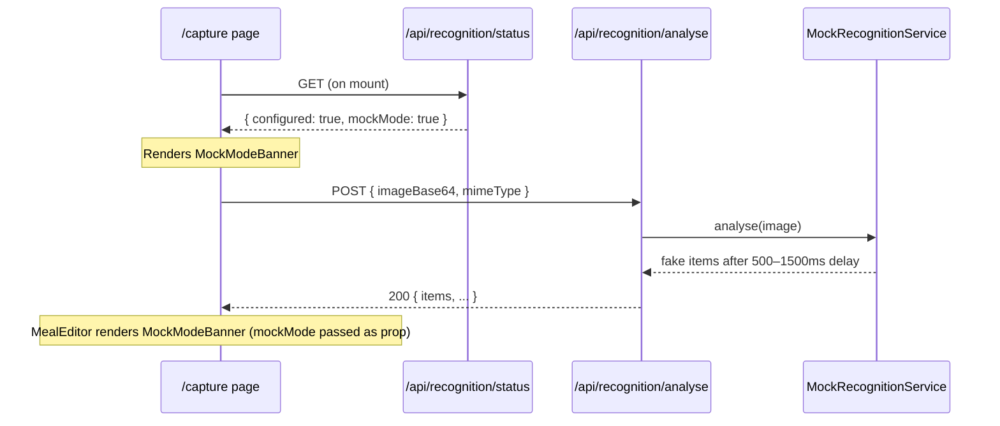
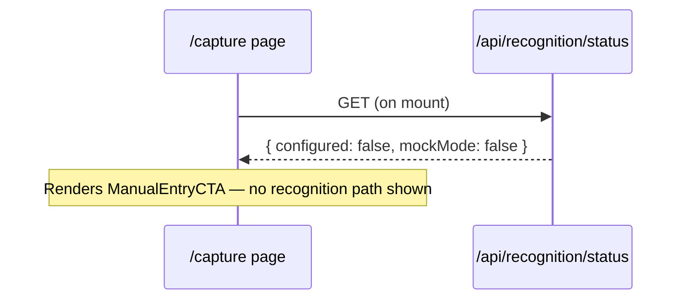
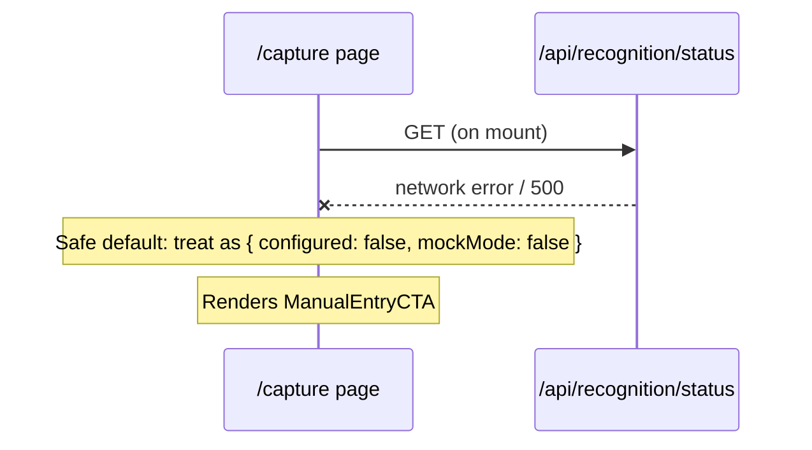
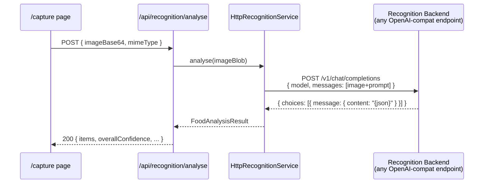

# MVP Refinement — Design

**Version:** 1.2
**Date:** 2026-03-13
**Status:** Draft
**Branch:** mvp-refinement

---

## Overview

The MeData MVP (Phases 1–7) is code-complete but has never been validated end-to-end with real data. This design covers the concrete changes required to make every feature actually function: HTTPS for mobile camera access, a mock recognition mode for dev testing, and wiring validation across all flows (capture → recognise → edit → save → view).

**Provider independence (added v1.2):** The food recognition backend is decoupled from any specific vendor or AI paradigm. All recognition backends — whether a hosted cloud model, a locally-served open-source model, or a future on-device inference engine — are accessed through the same REST interface. No vendor SDK is used. Configuration is purely via environment variables (base URL, model, credentials). This enables:
- Swapping from a large cloud model to a lightweight local model with a config change only
- A future custom SLM fine-tuned specifically for food recognition (the request/response contract is fixed and narrow, making fine-tuning practical)
- On-device inference once model size and runtime support permit (WebNN, WASM-based runtimes)

The approach is surgical — existing architecture is sound. Changes are additive (new HTTP recognition service, SSL plugin, status endpoint) or corrective (cleanup bugs, wiring gaps, missing env vars). Validation of existing flows (logbook, presets, manual entry) is explicitly included.

---

## Architecture

### Current State

```
Browser (SvelteKit)
  └── /capture/+page.svelte
        └── CameraCapture.svelte → ImagePreview.svelte
              └── performRecognition()
                    └── POST /api/ai/recognise
                          └── ClaudeFoodRecognitionService
                                └── Anthropic SDK → Claude API  ← vendor-locked

  └── /manual/+page.svelte
        └── ManualEntryForm.svelte → MealEditor.svelte
              └── POST /api/meals

  └── /presets/+page.svelte
        └── PresetList.svelte → MealEditor.svelte
              └── POST /api/meals (apply preset)

  └── /+page.svelte (logbook)
        └── LogbookList.svelte
              └── GET /api/meals/day/[date]
```

### Target State (v1.2 — Provider-Agnostic Recognition)

```
Browser (SvelteKit)
  └── /capture/+page.svelte
        └── CameraCapture.svelte → ImagePreview.svelte
              └── performRecognition()
                    └── POST /api/recognition/analyse
                          └── createRecognitionService() factory
                                ├── HttpRecognitionService  ← any REST backend
                                │     POST {RECOGNITION_BASE_URL}/v1/chat/completions
                                │     (OpenAI-compat; works with Ollama, DeepSeek,
                                │      Claude, custom SLM, any compatible endpoint)
                                └── MockRecognitionService  ← dev only
```

The `HttpRecognitionService` is the single production implementation. It holds no vendor-specific logic — it constructs an OpenAI-compatible chat completions request, sends it to the configured base URL, and parses structured JSON from the response. Changing the backend is a config-only operation.

### Changes Required

```
vite.config.ts
  + @vitejs/plugin-basic-ssl (HTTPS; dev moves to https://localhost:5173)
  + server.host = true (LAN access for mobile)

src/lib/services/recognition.ts                         ← renamed from food-recognition.ts
  + IRecognitionService interface (provider-agnostic)
  + createRecognitionService() factory
      → HttpRecognitionService  when RECOGNITION_MOCK_MODE != 'true'
      → MockRecognitionService  when RECOGNITION_MOCK_MODE == 'true'
  - remove ClaudeFoodRecognitionService + Anthropic SDK dependency

src/lib/services/http-recognition.ts                    ← replaces claude-food-recognition.ts
  + HttpRecognitionService implements IRecognitionService
      reads: RECOGNITION_BASE_URL, RECOGNITION_MODEL, RECOGNITION_API_KEY
      wire format: OpenAI-compat /v1/chat/completions with base64 image

src/lib/services/mock-recognition.ts                    ← renamed from mock-food-recognition.ts
  + MockRecognitionService implements IRecognitionService

src/routes/api/recognition/                             ← renamed from /api/ai/
  + analyse/+server.ts     (renamed from recognise/+server.ts)
  + status/+server.ts      (returns { configured, mockMode })

src/routes/capture/+page.svelte
  ~ fetch /api/recognition/status on mount → store result in page state
      → show skeleton/loading state during in-flight fetch (prevents layout shift)
  ~ if !configured && !mockMode: show ManualEntryCTA, hide recognition path
  ~ if mockMode: show MockModeBanner
  ~ pass mockMode flag into MealEditor
  ~ wire handleSave() stub → POST /api/meals + image upload to Blob Storage  ← currently a TODO stub, must be implemented

src/lib/components/CameraCapture.svelte
  ~ add onDestroy + beforeNavigate stream cleanup (Req 2.4)
  ~ replace UA-string detection with enumerateDevices (see §9 for relaxed Req 2.5)
  ~ gallery upload path feeds into same ImagePreview as camera (Req 3.2)

src/lib/components/MealEditor.svelte
  ~ accept mockMode?: boolean prop → conditionally render MockModeBanner
  ~ retain editor state in memory on failed save (Req 11 — Cosmos failure)

src/lib/components/ (components to remove / update)
  - FoodRecognitionResult.svelte → remove or rewrite; no longer displays quantity/unit/provider/processingTimeMs
  ~ AIErrorFallback.svelte → replaced by ManualEntryCTA for the unconfigured case; keep for runtime recognition errors

src/lib/components/ (new components)
  + MockModeBanner.svelte
  + ManualEntryCTA.svelte

src/lib/types/meal.ts (or equivalent)
  ~ AnalysedFoodItem removes quantity, unit fields (not returned by HttpRecognitionService)
  ~ FoodAnalysisResult removes totalMacros, provider, processingTimeMs
  ~ MealDocument.source: remove 'label_scan' value

.env.example
  + RECOGNITION_BASE_URL=      (required; points to any compatible endpoint)
  + RECOGNITION_MODEL=         (required; model name/identifier)
  + RECOGNITION_API_KEY=       (optional; omit for unauthenticated local endpoints)
  + RECOGNITION_MOCK_MODE=false
  + RECOGNITION_TIMEOUT_MS=10000  (optional; default 10s — increase for slow local models)
  - ANTHROPIC_API_KEY          (removed)

Developer docs (README.md or docs/setup.md)
  + provider configuration guide (Req 4.1 — generalised)
  + note: HTTPS change means localhost is now https:// in dev
  + example configs for common backends (cloud model, Ollama local)
  + note: increase RECOGNITION_TIMEOUT_MS if using large local models (Ollama 7B+ may need 30–60s)
```

### Sequence: Mock Mode Active



### Sequence: Backend Not Configured



### Sequence: /api/recognition/status Failure



### Sequence: Real Backend (HttpRecognitionService)



---

## Components and Interfaces

### 1. `IRecognitionService` Interface

**File:** `src/lib/services/recognition.ts`

The interface is deliberately technology-agnostic. It describes what the service does (analyse an image and return structured food data), not how it does it. No vendor-specific types appear anywhere in this contract.

```typescript
export interface IRecognitionService {
  /**
   * Analyse food items in the provided image.
   * @param image - Food photo as a Blob
   */
  analyse(image: Blob): Promise<FoodAnalysisResult>

  /** Returns true if the service is configured and ready to accept requests. */
  isReady(): boolean

  /**
   * Human-readable backend identifier for diagnostics (e.g. 'http', 'mock').
   * Does NOT expose vendor names in production — values are generic.
   */
  getBackendType(): string
}

export interface FoodAnalysisResult {
  items: AnalysedFoodItem[]
  overallConfidence: number
  notes?: string
}

export interface AnalysedFoodItem {
  name: string
  carbs: number
  protein: number
  fat: number
  confidence: number
}
```

Method renames from v1.1: `recognise` → `analyse`, `isConfigured` → `isReady`, `getProviderName` → `getBackendType`. These changes remove AI/vendor connotations from the interface.

### 2. `HttpRecognitionService`

**File:** `src/lib/services/http-recognition.ts`

The single production implementation. Makes a standard HTTP call to any OpenAI-compatible `/v1/chat/completions` endpoint. No vendor SDK. No vendor-specific logic. The prompt instructs the endpoint to return JSON in the `FoodAnalysisResult` schema — this is the only application-level contract beyond the wire format.

```typescript
// Server-side only — imports $env/dynamic/private
import { env } from '$env/dynamic/private'

export class HttpRecognitionService implements IRecognitionService {
  private readonly baseUrl: string
  private readonly model: string
  private readonly apiKey: string | undefined
  private readonly timeoutMs: number

  constructor() {
    this.baseUrl   = env['RECOGNITION_BASE_URL'] ?? ''
    this.model     = env['RECOGNITION_MODEL'] ?? ''
    this.apiKey    = env['RECOGNITION_API_KEY']          // optional for local endpoints
    this.timeoutMs = parseInt(env['RECOGNITION_TIMEOUT_MS'] ?? '10000', 10)
  }

  isReady(): boolean {
    return this.baseUrl.length > 0 && this.model.length > 0
  }

  getBackendType(): string { return 'http' }

  async analyse(image: Blob): Promise<FoodAnalysisResult> {
    const controller = new AbortController()
    const timeout = setTimeout(() => controller.abort(), this.timeoutMs)

    const imageBase64 = await blobToBase64(image)
    const messages = buildMessages(imageBase64, image.type)

    try {
      const response = await fetch(`${this.baseUrl}/v1/chat/completions`, {
        method: 'POST',
        signal: controller.signal,
        headers: {
          'Content-Type': 'application/json',
          ...(this.apiKey ? { Authorization: `Bearer ${this.apiKey}` } : {})
        },
        // response_format is an OpenAI extension; not all backends honour it.
        // parseAnalysisResult() handles backends that ignore it and return prose.
        body: JSON.stringify({ model: this.model, messages, response_format: { type: 'json_object' } })
      })

      if (!response.ok) throw new RecognitionError('BACKEND_ERROR', response.status)

      const data = await response.json()
      return parseAnalysisResult(data)
    } catch (err) {
      if ((err as Error).name === 'AbortError') throw new RecognitionError('TIMEOUT')
      throw err
    } finally {
      clearTimeout(timeout)
    }
  }
}
```

**`parseAnalysisResult(data)` contract:**

Extracts and validates `FoodAnalysisResult` from an OpenAI-compat response envelope. Must handle backends that ignore `response_format` and return freeform text:

```
input:  raw JSON object from backend (choices[0].message.content may be a string or object)
output: FoodAnalysisResult — always the canonical schema

algorithm:
  1. Extract content string from choices[0].message.content
  2. If content starts with ``` (markdown fence), strip the fence
  3. JSON.parse the resulting string
  4. Validate required fields: items (array), overallConfidence (number 0–1)
  5. For each item: validate name (string), carbs/protein/fat (non-negative number), confidence (0–1)
  6. If any required field is missing or invalid → throw RecognitionError('INVALID_RESPONSE')
  7. If items.length === 0 → throw RecognitionError('NO_ITEMS')

never returns partial data — always throws on any schema violation
```

**`RecognitionError` class:**

```typescript
export type RecognitionErrorCode =
  | 'TIMEOUT'           // request exceeded RECOGNITION_TIMEOUT_MS
  | 'NOT_CONFIGURED'    // isReady() is false — missing env vars
  | 'BACKEND_ERROR'     // non-200 HTTP response from backend
  | 'INVALID_RESPONSE'  // backend returned unparseable or non-conformant JSON
  | 'NO_ITEMS'          // backend returned 0 food items (treated as failure)

export class RecognitionError extends Error {
  constructor(
    public readonly code: RecognitionErrorCode,
    public readonly httpStatus?: number   // present for BACKEND_ERROR only
  ) {
    super(`RecognitionError: ${code}${httpStatus ? ` (HTTP ${httpStatus})` : ''}`)
    this.name = 'RecognitionError'
  }
}
```

The `/api/recognition/analyse` route maps `RecognitionErrorCode` to HTTP status and user-facing toast message (see Error Handling table).

**Backend compatibility:** Any endpoint that accepts OpenAI-compatible `/v1/chat/completions` requests and returns JSON-formatted chat completions works without code changes. Examples:

| Backend | `RECOGNITION_BASE_URL` | `RECOGNITION_MODEL` | `RECOGNITION_API_KEY` |
|---------|------------------------|---------------------|-----------------------|
| Ollama (local) | `http://localhost:11434` | `llava` (or any vision model) | omit |
| DeepSeek | `https://api.deepseek.com` | `deepseek-vl2` | required |
| Custom SLM | `http://localhost:8080` | `medata-food-v1` | optional |
| LM Studio | `http://localhost:1234` | (active model) | omit |

**Note:** Anthropic's native REST API (`/v1/messages`) is not OpenAI-compatible and is not directly supported. To use a Claude model, route via a local OpenAI-compat proxy (e.g. LiteLLM, which exposes `POST /v1/chat/completions` and translates to Anthropic's format).

### 3. `MockRecognitionService`

**File:** `src/lib/services/mock-recognition.ts`

```typescript
export class MockRecognitionService implements IRecognitionService {
  isReady(): boolean { return true }
  getBackendType(): string { return 'mock' }

  async analyse(_image: Blob): Promise<FoodAnalysisResult> {
    const delayMs = 500 + Math.random() * 1000
    await new Promise(resolve => setTimeout(resolve, delayMs))
    return MOCK_RESULT
  }
}

const MOCK_RESULT: FoodAnalysisResult = {
  items: [
    { name: 'Grilled chicken breast', carbs: 0,  protein: 31, fat: 3.6, confidence: 0.92 },
    { name: 'Steamed broccoli',        carbs: 7,  protein: 3,  fat: 0.4, confidence: 0.88 },
    { name: 'Brown rice (1 cup)',       carbs: 45, protein: 5,  fat: 1.6, confidence: 0.85 },
  ],
  overallConfidence: 0.88,
  notes: '[MOCK] Simulated response — no backend call was made.'
}
```

### 4. `createRecognitionService()` Factory

**File:** `src/lib/services/recognition.ts`

```typescript
// Server-side only
import { env } from '$env/dynamic/private'

export function createRecognitionService(): IRecognitionService {
  if (env['RECOGNITION_MOCK_MODE'] === 'true') {
    return new MockRecognitionService()
  }
  return new HttpRecognitionService()
}
```

The factory holds no vendor logic — it only checks whether mock mode is enabled. Adding a new backend requires only changes inside `HttpRecognitionService` (or a new implementation class), never the factory or the interface.

### 5. `/api/recognition/status` Endpoint

**File:** `src/routes/api/recognition/status/+server.ts`

```typescript
import { json } from '@sveltejs/kit'
import { createRecognitionService } from '$lib/services/recognition'

export async function GET() {
  try {
    const service = createRecognitionService()
    return json({
      configured: service.isReady(),
      mockMode: service.getBackendType() === 'mock'
    })
  } catch {
    return json({ configured: false, mockMode: false })
  }
}
```

Response schema:
```typescript
interface RecognitionStatusResponse {
  configured: boolean   // false → show ManualEntryCTA
  mockMode: boolean     // true → show MockModeBanner
}
```

**Failure mode:** Any construction error returns `{ configured: false, mockMode: false }`. The capture page falls back to manual entry — the safe default.

**UI loading state:** While the status fetch is in-flight, the capture page renders a neutral skeleton/loading state — no recognition UI, no ManualEntryCTA. This prevents layout shift when the status resolves. The skeleton is replaced by the appropriate UI once the response arrives (or on error, defaults to ManualEntryCTA).

### 6. `MockModeBanner` Component

**File:** `src/lib/components/MockModeBanner.svelte`

```svelte
<script lang="ts">
  // No props — always renders as a banner
</script>

<div class="mock-banner">
  Mock mode — responses are simulated, no backend calls are being made
</div>
```

Rendered in:
- `/routes/capture/+page.svelte` — when `status.mockMode === true`
- `MealEditor.svelte` — when `mockMode` prop is `true`

State is passed top-down from the status call on mount, not read from response headers.

### 7. `ManualEntryCTA` Component

**File:** `src/lib/components/ManualEntryCTA.svelte`

Rendered on the capture page when `status.configured === false && status.mockMode === false`.

```svelte
<script lang="ts">
  // Renders a prompt to use manual entry instead of recognition
</script>

<div class="manual-cta">
  <p>Food recognition is not configured.</p>
  <a href="/manual">Enter meal manually →</a>
  <p class="hint">
    To enable recognition, set <code>RECOGNITION_BASE_URL</code> and <code>RECOGNITION_MODEL</code> in <code>.env</code>.
    See <a href="/docs/setup">setup guide</a> for details.
  </p>
</div>
```

This is a static display component — no props needed. Navigates to `/manual` on click.

### 7. HTTPS Dev Server

**File:** `vite.config.ts`

```typescript
import basicSsl from '@vitejs/plugin-basic-ssl'

export default defineConfig({
  plugins: [tailwindcss(), sveltekit(), basicSsl()],
  server: {
    host: true,    // bind to 0.0.0.0 for LAN access (Req 1.2)
    port: 5173
  }
})
```

**Dependency:** `pnpm add -D @vitejs/plugin-basic-ssl`

**Important:** `@vitejs/plugin-basic-ssl` upgrades the dev server to HTTPS-only. `http://localhost:5173` no longer works — the dev server becomes `https://localhost:5173`. This is a deliberate workflow change documented in setup docs (Req 1.1). Req 1.4 ("existing HTTP localhost workflow continues") is interpreted as: non-camera features continue to work; the protocol shift from HTTP to HTTPS is acceptable and expected.

**Mobile access:** With `server.host: true`, the server binds to `0.0.0.0`. The developer finds their LAN IP (e.g. `ifconfig | grep 192.168`) and visits `https://192.168.x.x:5173` on their phone. Browser shows a cert warning; developer accepts once. Camera access then works (Req 1.2, 1.3).

### 8. Camera Stream Cleanup

**File:** `src/lib/components/CameraCapture.svelte`

```typescript
import { onDestroy } from 'svelte'
import { beforeNavigate } from '$app/navigation'

let stream: MediaStream | null = null

function stopStream() {
  stream?.getTracks().forEach(track => track.stop())
  stream = null
}

onDestroy(stopStream)
beforeNavigate(stopStream)
```

### 9. Camera Availability Detection (Req 2.5 — relaxed)

Replace the UA-string heuristic with feature detection via `enumerateDevices`:

```typescript
async function checkCameraAvailable(): Promise<boolean> {
  if (!navigator.mediaDevices?.getUserMedia) return false
  try {
    const devices = await navigator.mediaDevices.enumerateDevices()
    return devices.some(d => d.kind === 'videoinput')
  } catch {
    return false
  }
}
```

**Req 2.5 relaxation (D-MVR-018):** Devices with *any* camera (including MacBook FaceTime cameras) will show the camera viewfinder. `enumerateDevices()` cannot reliably distinguish rear-facing from front-facing cameras without first acquiring a stream. The requirement is updated to: "show camera viewfinder if any camera device is detected; always show gallery upload as an alternative." Devices with no camera (headless desktops, etc.) show gallery only.

This is more reliable than UA detection and correctly handles iPads, tablets, and non-standard form factors.

### 10. Gallery Upload → Same Preview Path (Req 3.2)

Gallery file input:
```html
<input type="file" accept="image/jpeg,image/png" on:change={handleFileSelect} />
```

`handleFileSelect` converts `File → Blob` and passes to the same `ImagePreview` component as camera capture. No separate preview logic. Req 3.3 is satisfied — the same `onCapture` callback is called regardless of source.

### 11. Image Size Validation (Client + Server)

**Client-side (capture page):**
```typescript
const MAX_SIZE_BYTES = 10 * 1024 * 1024  // 10MB

if (imageBlob.size > MAX_SIZE_BYTES) {
  // Show toast: "Image is too large. Please use a photo under 10MB."
  return
}
```

**Server-side (`/api/recognition/analyse`):**
```typescript
const MAX_BASE64_CHARS = 14_000_000  // ~10MB binary

if (body.imageBase64.length > MAX_BASE64_CHARS) {
  return error(413, 'Image too large — maximum size is 10MB')
}
```

### 12. `/api/recognition/analyse` Request Schema

Full request body:
```typescript
interface AnalyseRequest {
  imageBase64: string       // required — food photo
  mimeType: 'image/jpeg' | 'image/png'
}
```

### 13. `.env.example` Updates

```env
# ─── Food Recognition ─────────────────────────────────────────────────────────
# Base URL of any OpenAI-compatible /v1/chat/completions endpoint.
# Examples:
#   Cloud model:  https://api.anthropic.com  (requires RECOGNITION_API_KEY)
#   Local Ollama: http://localhost:11434      (no key needed)
#   Custom SLM:   http://localhost:8080       (no key needed)
RECOGNITION_BASE_URL=

# Model name/identifier as expected by the endpoint above.
RECOGNITION_MODEL=

# API key — required for authenticated endpoints, omit for local ones.
RECOGNITION_API_KEY=

# Set to 'true' to use mock responses (no backend calls, no costs).
# Mock mode returns realistic fake food data with a simulated 500-1500ms delay.
RECOGNITION_MOCK_MODE=false

# Request timeout in milliseconds (default: 10000 = 10 seconds).
# Increase for large local models — Ollama 7B+ may need 30000-60000ms on first inference.
RECOGNITION_TIMEOUT_MS=10000

# ─── Azure Backend ────────────────────────────────────────────────────────────
AZURE_COSMOS_CONNECTION_STRING=
AZURE_BLOB_STORAGE_URL=
```

---

## Data Models

No new data models are introduced. This spec validates and wires existing models.

### Unchanged Types

```typescript
interface MealDocument {
  id: string                  // UUID v4
  partitionKey: string        // YYYY-MM-DD
  timestamp: number           // Unix ms
  items: FoodItem[]
  totalCarbs: number
  totalProtein: number
  totalFat: number
  source: 'manual' | 'ai_image' | 'preset'
  imageUrl?: string
  confidence?: number
  createdAt: number
  updatedAt: number
}

interface Preset {
  id: string
  name: string
  category: 'meal' | 'snack'
  items: FoodItem[]
  totalCarbs: number
  totalProtein: number
  totalFat: number
  createdAt: number
  updatedAt: number
}
```

### New Environment Variables

| Variable | Type | Default | Description |
|----------|------|---------|-------------|
| `RECOGNITION_BASE_URL` | string | — | Base URL of any OpenAI-compat endpoint (required for real recognition) |
| `RECOGNITION_MODEL` | string | — | Model name/identifier for the configured endpoint |
| `RECOGNITION_API_KEY` | string | — | Auth token — omit for unauthenticated local endpoints |
| `RECOGNITION_MOCK_MODE` | `'true'` \| `'false'` | `'false'` | Enables mock recognition (no backend calls) |
| `RECOGNITION_TIMEOUT_MS` | number (string) | `10000` | Request timeout in ms — increase for large local models (Ollama 7B+ may need 30000–60000) |

---

## Error Handling

### Recognition Errors

| Scenario | HTTP Status | UI Behaviour |
|----------|-------------|--------------|
| Not configured (no base URL/model), mock off | 503 | `ManualEntryCTA` (caught at mount, not at analyse) |
| Backend unreachable / auth failure | 503 | Toast: "Could not connect to recognition service. Please check your configuration." + manual entry link |
| Rate limited (429) | 429 | Toast: "Too many requests — please wait a moment and try again." + manual entry link |
| Backend overloaded (503 from upstream) | 503 | Toast: "Recognition service is temporarily unavailable." + manual entry link |
| Timeout (>10s) | 504 | Toast: "Recognition timed out." + manual entry link (Req 11.2) |
| No items recognised | 422 | Toast: "Couldn't identify any food items." + manual entry link (Req 6.6) |
| Image too large | 413 | Toast: "Image is too large. Please use a photo under 10MB." |
| Network error | — | Toast: "Connection failed." + manual entry link |

**Note:** "No items recognised" is defined as `items.length === 0` after a successful backend response. The server returns 422 in this case — not a 200 with an empty items array. This eliminates the ambiguity between "success with nothing" and "recognisable failure."

**Note on Irish English (Req 11.4):** All user-facing error messages use Irish English spelling (e.g. "recognised" not "recognized", "organisation" not "organization"). A string audit of all toast messages and error UI strings is part of validation.

### Azure Backend Errors (Req 11.1, 11.3)

| Scenario | Effect | UI Behaviour |
|----------|--------|--------------|
| Cosmos DB unreachable | `POST /api/meals` fails | Toast: "Service unavailable — meal not saved." Editor state retained (see below). |
| Blob Storage upload fails | `imageUrl` = undefined | Meal saves without image (Req 11.3) — silent, macros preserved |
| Blob Storage unreachable | Upload returns error | Same as above — meal saves without image |

**Editor state retention:** If `POST /api/meals` returns an error, `MealEditor` does not clear its state. The user sees an error toast and can retry the save. Their edits are not lost.

### Camera Errors (Req 2.3)

| Scenario | UI Behaviour |
|----------|--------------|
| Permission denied | Show gallery upload only |
| No camera device | Show gallery upload only |
| Stream error during capture | Show retry button |
| Stream error on navigation | Silently stopped by cleanup handlers |

### `/api/recognition/status` Failure

If the status endpoint returns an error or is unreachable, the capture page defaults to `{ configured: false, mockMode: false }` and renders `ManualEntryCTA`. This is the safe default — never present a broken recognition path.

---

## Flow Validations

This section explicitly covers what must be validated for each requirement group that is "already implemented" in Phase 1–7 code.

### Manual Entry Flow (Req 7)

Existing code: `ManualEntryForm.svelte` → `MealEditor.svelte` → `POST /api/meals`.

Validation scope:
- Form renders with name, carbs, protein, fat fields (Req 7.1)
- Multiple items can be added before save (Req 7.2)
- Saved meal has `source: 'manual'` and appears in logbook (Req 7.3)
- No changes to existing implementation expected

### Logbook and Meal History (Req 8)

Existing code: `/+page.svelte` with `LogbookList.svelte`, `MealDetail` modal, `MealEditor` modal.

Validation scope:
- Today's meals load and are ordered by timestamp DESC (Req 8.1)
- Each entry displays total carbs, protein, fat, source, and timestamp (Req 8.2)
- Expanding a meal shows per-item macros (Req 8.3)
- Edit flow: `MealEditor` modal opens, changes persist to Cosmos (Req 8.4)
- Delete flow: confirmation modal → meal removed from Cosmos and UI (Req 8.5)
- No changes to existing implementation expected unless broken during validation

### Preset Flow (Req 9)

Existing code: `/presets/+page.svelte`, preset API routes, `CosmosPresetRepository`.

Validation scope:
- Save as preset: from `MealEditor`, user names the preset and saves (Req 9.1)
- Presets page: grouped by category, all presets visible (Req 9.2)
- Apply preset: creates new meal with preset items and `source: 'preset'` (Req 9.3)
- Edit preset: name/category editable, changes persist (Req 9.4)
- Delete preset: confirmation → removed from Cosmos (Req 9.4)
- No changes to existing implementation expected unless broken during validation

---

## Testing Strategy

### Unit Tests

**`MockRecognitionService`:**
- `isReady()` returns `true`
- `getBackendType()` returns `'mock'`
- `analyse()` returns a result that validates against `FoodAnalysisResult` schema
- `analyse()` result items array has 2–4 entries (Req 5.3)
- Each mock item has valid non-negative macro values
- Mock result `notes` contains `[MOCK]` prefix (Req 5.5 — visibility)
- Artificial delay: use `vi.useFakeTimers()` to verify delay is between 500ms and 1500ms without wall-clock blocking

**`HttpRecognitionService`:**
- `isReady()` returns `false` when `RECOGNITION_BASE_URL` or `RECOGNITION_MODEL` are unset
- `isReady()` returns `true` when both are set
- `analyse()` throws `RecognitionError('TIMEOUT')` when fetch is aborted after configured timeout
- `analyse()` throws `RecognitionError('BACKEND_ERROR', httpStatus)` for non-200 HTTP responses
- `analyse()` omits `Authorization` header when `RECOGNITION_API_KEY` is not set
- `analyse()` includes `Authorization: Bearer {key}` header when key is set
- `RECOGNITION_TIMEOUT_MS` env var is read and used as timeout (default 10000)

**`parseAnalysisResult`:**
- Extracts JSON from markdown-fenced response (strips `` ```json `` wrapper)
- Throws `RecognitionError('INVALID_RESPONSE')` when content is not parseable JSON
- Throws `RecognitionError('INVALID_RESPONSE')` when required fields are missing or wrong type
- Throws `RecognitionError('NO_ITEMS')` when items array is empty
- Returns valid `FoodAnalysisResult` for well-formed responses

**`createRecognitionService()` factory:**
- Returns `MockRecognitionService` when `RECOGNITION_MOCK_MODE=true`
- Returns `HttpRecognitionService` when `RECOGNITION_MOCK_MODE=false`
- Returns `HttpRecognitionService` when `RECOGNITION_MOCK_MODE` is unset

**`/api/recognition/status` endpoint:**
- Returns `{ configured: true, mockMode: false }` when base URL and model are set
- Returns `{ configured: false, mockMode: false }` when base URL or model is missing
- Returns `{ configured: true, mockMode: true }` when `RECOGNITION_MOCK_MODE=true`
- Returns `{ configured: false, mockMode: false }` (fail-open) when service throws

**`/api/recognition/analyse` endpoint:**
- Returns 503 when service is not configured (not ready)
- Returns 504 on timeout
- Returns 422 when items array is empty
- Returns 413 when image exceeds size limit
- Returns 429 when upstream returns 429

### Integration Test Checklist (Manual — Dev Validation)

| AC | Requirement | Test Scenario | Pass Criteria |
|----|-------------|---------------|---------------|
| 1.1 | HTTPS server | `pnpm dev` | Server starts, terminal shows `https://` URL |
| 1.2 | LAN access | Phone on same WiFi → `https://192.168.x.x:5173` | Page loads after accepting cert warning |
| 1.3 | No tunnel | — | No ngrok/tunnel process required |
| 2.1 | Camera viewfinder | Navigate to /capture on phone | Camera viewfinder appears |
| 2.2 | Capture + preview | Tap capture button | Photo preview with retake/confirm |
| 2.3 | Permission denied | Deny camera on phone | Gallery upload shown, no errors |
| 2.4 | Stream cleanup | Capture → navigate to home → return to capture | No "camera in use" indicator; stream restarts cleanly |
| 2.5 | Desktop gallery | Visit /capture on desktop MacBook | Gallery upload only, no viewfinder |
| 3.1 | Gallery upload | Desktop: file picker | JPEG/PNG accepted, preview shown |
| 3.2 | Gallery preview parity | Desktop: select file | Same preview with confirm/re-select as camera |
| 3.3 | Gallery → recognition pipeline | Desktop: upload → confirm | Recognition triggered same as camera |
| 4.3 | Missing config error | No base URL/model, mock off, POST /api/recognition/analyse | 503 response with clear message |
| 4.4 | UI missing config fallback | No config, mock off → /capture | ManualEntryCTA shown, no recognition path |
| 5.1 | Mock mode enabled | `RECOGNITION_MOCK_MODE=true` → capture photo | Mock result returned |
| 5.2 | Mock schema matches real | Compare mock response to real schema | All fields present and correct types |
| 5.4 | Mock delay | Mock mode → capture | 500–1500ms delay observed before result |
| 5.5 | Mock banner visible | Mock mode active | Amber banner visible on capture page and in MealEditor |
| 6.1 | Loading state | Capture → confirm → loading | Spinner/loading state shown during recognition |
| 6.2 | Recognition result | Backend returns items | MealEditor shows recognised items with macros |
| 6.3 | Edit before save | In MealEditor | Can edit names, macros, add/remove items |
| 6.4 | Save meal (wired) | Save in MealEditor | `POST /api/meals` called; image uploaded to Blob Storage; meal in Cosmos |
| 6.5 | Redirect after save | Save completes | Redirect to home, new meal in logbook |
| 6.6 | Recognition failure fallback | Force 500 from /api/recognition/analyse | Manual entry CTA shown, photo not lost |
| 7.1 | Manual entry form | Navigate to /manual | Form with name, carbs, protein, fat |
| 7.2 | Multiple items | Add 3 items manually | All appear in summary |
| 7.3 | Manual meal saved | Save manual meal | `source: 'manual'` in Cosmos, appears in logbook |
| 8.1 | Logbook loads | Visit home page | Today's meals shown, newest first |
| 8.2 | Meal display fields | Logbook entry | Shows total carbs, protein, fat, source, timestamp |
| 8.3 | Expand meal | Tap/click meal entry | Per-item macros shown |
| 8.4 | Edit saved meal | Tap edit on logbook meal | Changes persist to Cosmos |
| 8.5 | Delete saved meal | Tap delete → confirm | Meal removed from Cosmos and UI |
| 9.1 | Save as preset | From MealEditor, save as preset | Preset saved with name + category |
| 9.2 | Presets page | Navigate to /presets | All presets shown, grouped by category |
| 9.3 | Apply preset | Tap apply on preset | New meal with `source: 'preset'` in logbook |
| 9.4 | Edit/delete preset | Edit preset name; delete preset | Changes persist / preset removed |
| 11.1 | Azure unreachable | Disconnect Azure creds, save meal | "Service unavailable" toast, editor state retained |
| 11.2 | Recognition timeout | Mock delay > 10s (manual test) | "Recognition timed out" toast, manual entry offered |
| 11.3 | Blob fails, meal saves | Invalid blob URL, save meal | Meal saves without image, macros preserved |
| 11.4 | Irish English | Review all toast/error strings | "recognised", "organisation", etc. — no US spellings |

### Property-Based Tests

**Macro calculation invariants** (extend existing `macros.test.ts`):

Using `fast-check` (already in project):
- `sumMacros(items).totalCarbs === sum(items.map(i => i.carbs))` for any valid item array
- `sumMacros([])` returns zero totals
- All totals are non-negative for items with non-negative per-item values

These cover a universal invariant (Req 6.3: edits auto-recalculate totals) with better coverage than example-based tests alone, as the editor allows arbitrary item combinations.

---

## Custom SLM Roadmap

This section documents the planned path from the current general-purpose model backend to a custom small-language model purpose-built for food recognition. No implementation work is required in this spec — only the interface contract and phased approach are defined here.

### Rationale

Food recognition via photo has a narrow, consistent request structure:
- **Input:** a single food photo
- **Output:** a fixed JSON schema (items with name, carbs, protein, fat, confidence)
- **No conversational context** — every request is stateless and independent

This makes fine-tuning highly practical. A general-purpose vision model is many orders of magnitude larger than what this task requires. A fine-tuned 2–7B parameter model can match or exceed a large model's accuracy on this specific task at a fraction of the latency and cost, and can eventually run on-device.

### Interface Contract the SLM Must Satisfy

Any future SLM that exposes the following REST interface will be drop-in compatible with the application — no code changes required:

```
POST {base_url}/v1/chat/completions
Content-Type: application/json
Authorization: Bearer {key}   ← optional for local deployments

{
  "model": "{model_name}",
  "messages": [
    {
      "role": "user",
      "content": [
        { "type": "image_url", "image_url": { "url": "data:image/jpeg;base64,..." } },
        { "type": "text", "text": "{recognition_prompt}" }
      ]
    }
  ],
  "response_format": { "type": "json_object" }
}
```

Single image only — label scanning is out of scope.

Response must include a `choices[0].message.content` string that parses as valid `FoodAnalysisResult` JSON.

### Phased Path

| Phase | What | Outcome |
|-------|------|---------|
| **0 (current)** | Use any OpenAI-compat cloud/local backend via `HttpRecognitionService` | Application works; no vendor lock-in |
| **1 — data collection** | Accumulate real food images + manually verified macro labels from app usage | Training dataset grows organically |
| **2 — distillation** | Use a large model to generate labelled training pairs at scale; validate against real labels | High-quality dataset without full manual annotation |
| **3 — fine-tuning** | Fine-tune a 2–7B vision-language base model on the training dataset | Domain-specific model; smaller, faster, cheaper |
| **4 — evaluation** | Benchmark fine-tuned model vs. large model on held-out test set; measure macro accuracy | Go/no-go for production use |
| **5 — local serving** | Serve via any OpenAI-compat inference server; point `RECOGNITION_BASE_URL` at it | Zero application changes required |
| **6 — on-device (future)** | Port to on-device runtime (WebNN, CoreML, WASM) if model size and accuracy permit | No server dependency for recognition |

### What Does Not Change

- `IRecognitionService` interface — unchanged
- `HttpRecognitionService` — unchanged
- All application routes and UI — unchanged
- All env var names — unchanged (`RECOGNITION_BASE_URL`, `RECOGNITION_MODEL`, etc.)

The SLM is purely a backend concern. The application treats it identically to any other recognition backend.

---

## Developer Documentation

Added to `README.md` or `docs/setup.md` (Req 4.1):

### Setup Guide

1. Clone repo and install: `pnpm install`
2. Copy environment: `cp .env.example .env`
3. **Configure food recognition backend** — choose one:

   **Option A — Local Ollama (free, no account needed):**
   ```
   RECOGNITION_BASE_URL=http://localhost:11434
   RECOGNITION_MODEL=llava          # or moondream, bakllava, etc.
   # RECOGNITION_API_KEY not needed
   ```
   Install Ollama from [ollama.com](https://ollama.com), then `ollama pull llava`.

   **Option B — Cloud model (e.g. DeepSeek, Claude, any OpenAI-compat service):**
   ```
   RECOGNITION_BASE_URL=https://api.deepseek.com   # or your provider's URL
   RECOGNITION_MODEL=deepseek-vl2
   RECOGNITION_API_KEY=sk-...
   ```

   **Option C — Mock mode (no backend required):**
   ```
   RECOGNITION_MOCK_MODE=true
   ```
   Returns realistic fake data. Suitable for testing all flows without a running backend.

4. **Azure credentials:** Copy `AZURE_COSMOS_CONNECTION_STRING` and `AZURE_BLOB_STORAGE_URL` from the provisioned resources.
5. Start dev server: `pnpm dev` — server starts at **`https://localhost:5173`** (HTTPS required for camera)
6. **Mobile testing:** Find your machine's LAN IP (`ifconfig | grep "inet 192"`), visit `https://192.168.x.x:5173` on your phone, accept the self-signed cert warning.
