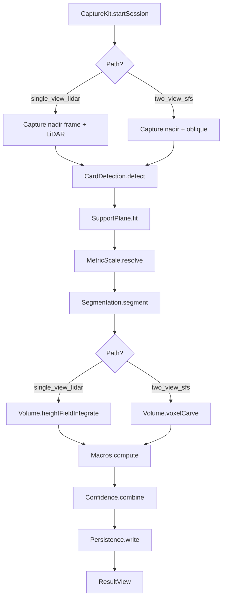

# Research — Design

**Version:** 0.5
**Date:** 2026-05-29
**Status:** Draft (device-MVP phasing pass — Phase 1 dev-stub segmenter; see §0 row "Phase 1 segmenter")
**Branch:** research

This document describes the implementation design for the requirements in `requirements.md` v0.4 and the decisions in `decision_log.md` (D1–D42). It does not restate requirements; it cites them by ID.

---

## 0. v1 Adjustments (May 2026)

Following the requirements diff dated 2026-05-28, the following design deltas apply across the whole document. WHERE a later section conflicts with this list, this list wins.

| Area | Change | Origin |
|---|---|---|
| Hardware floor | iPhone 13 Pro Max only; iOS 26.5 minimum. iPhone 12 Pro and other LiDAR iPhones are no longer in scope. | Req §1.2 |
| Capture-path selection | Replaced auto-derivation (LiDAR-coverage threshold) with a **persistent user-selected** `CaptureMode` (`single` / `double`). Default = `double`. Persisted in `UserDefaults` under `SettingsKeys.captureMode`. | Decision 35 |
| Photo storage | Captured original image is saved to the system Photos library (PhotoKit); `MealRecord` stores `photoAssetID: String` (`PHAsset.localIdentifier`). The app private container no longer holds image bytes. Depth and mask artefacts continue to live in the app's container. | Decision 37, Req §17.3 |
| Retention policy | All retention scheduler and 30/90/365-day settings are **removed**. Photo lifecycle is delegated to the user's Photos library; mask/depth artefacts persist for the meal's lifetime (deleted only on meal delete). | Req §17.3 |
| Macro DB sources | CoFID + AFCD (Australian Food Composition Database) are **both** bundled and queried with a documented priority. IFCDB overlay and `ifcdbOverlayEnabled` setting are **removed**. | Decision 39, Req §11.1 |
| Performance budget | Single 30 s end-to-end soft target (Req §16.1). Per-stage P95 budgets and `XCTClockMetric` per-stage tests are **removed**. | Decision 40, Req §16 |
| MAE bar | Relaxed from ≤ 10 g to ≤ 25 g per meal. Informational only — the harness that measures it is feature-flagged off. | Req §21.3 |
| §21 harness + §6.9 β_c calibration + §6.13 calibration round-trip + §7.3 integration tests + §7.5 mIoU bench | **Feature-flagged off in v1** via the `HARNESS_ENABLED` Swift compile flag. All harness source (`AccuracyHarness`, `BetaCalibrator`, `FixtureLoader`, `FixtureRunner`, `SegBench`, `HarnessCLI/main.swift`, and the `HarnessCLITests` target) is wrapped in `#if HARNESS_ENABLED`. The flag is defined only in the `HarnessCLI` SPM target's `swiftSettings`; the iOS app target never defines it, so the shipping app binary contains zero harness code. No CI gate on harness output. Developer runs the harness locally for pipeline validation. | Decision 41 (supersedes 34), Req §21 |
| Class palette size | 24–40 food classes (inclusive range), not exactly 24. | Req §8.4 |
| Localisation scope | `ifcdbOverlay`-driven Irish-specific path is removed; primary market assumption is "English-speaking" via CoFID + AFCD. | Req §19 |
| Phase 1 segmenter | Phase 1 (RUNNING DEVICE) ships with `StubInferenceEngine` instead of a trained `.mlpackage`. Selected at compile time by the `DEV_STUB_SEGMENTER` Swift flag (defined in the iOS app target's Debug config in `Package.swift`; undefined in Release). Stub emits deterministic per-pixel argmax to a single non-background class. Result view shows a high-contrast Irish-English placeholder banner so dev-stub estimates cannot be confused for real ones. Removed when Phase 3 bundles the trained model. | Decision 42, Req §23 |
| Pipeline wiring | `App.swift`'s `PendingPipeline` stand-in is replaced with `Pipeline.makeForDevice(store:)`, a factory that constructs the real `Pipeline` instance backed by `StubInferenceEngine` (Phase 1) or `CoreMLInferenceEngine` (Phase 3). `PipelineEstimator` protocol signature aligned: `estimate(captureResult:mode:)` — fixes the Xcode-only build error where the protocol declared no `mode:` and the call site / stand-in passed one. | Decision 42, Req §23.1 |
| Delivery phasing | Numeric accuracy (Req §21.3) and segmenter mIoU (Req §8.9) targets apply to Phase 3 only. Phase 1 success is "tap shutter on device, see placeholder carb value on result view, meal persists." Phase 2 is UI/UX iteration on device. | Req "Delivery phases", Req §23 |

---

## 1. Overview

A native iOS application that estimates carbohydrate content of a single meal from one or two photographs using deterministic geometry, an on-device food segmenter, a bundled food-composition database, and per-class bulk-correction factors calibrated offline. Two capture paths share most modules and dispatch only at the volume-estimation stage. **The user selects the capture path explicitly via a persistent toggle on the capture view** (single = LiDAR-only nadir, double = nadir + oblique with ID-1 reference card).

---

## 2. Architecture

### 2.1 Module map

```
medata/
├── App/                          # iOS app target (SwiftUI shell)
│   ├── App.swift
│   ├── CaptureFlowView.swift
│   ├── ResultView.swift
│   └── SettingsView.swift
├── MedataCore/                   # Swift Package, no UIKit/SwiftUI imports
│   ├── Sources/
│   │   ├── CaptureKit/           # AVFoundation/ARKit/Core Motion bridge
│   │   ├── CardDetection/        # Vision rect detection + P4P
│   │   ├── SupportPlane/         # RANSAC + iterative card-only fit
│   │   ├── MetricScale/          # Scale resolver, σ_s
│   │   ├── Segmentation/         # Core ML wrapper, pre/post, ownership
│   │   ├── Volume/               # Metal voxel carve + height-field integration
│   │   ├── Foods/                # GRDB.swift, CoFID + AFCD (both bundled, per §0)
│   │   ├── Macros/               # m_c, C_c per [12]
│   │   ├── Confidence/           # σ_meal combination per [13]
│   │   ├── Persistence/          # SQLite meal records, mask/depth artefact dir, PhotoKit asset reference
│   │   ├── PortableContracts/    # Cross-platform record types
│   │   └── Pipeline/             # Orchestrator that runs the per-path graph
│   └── Tests/
│       ├── UnitTests/            # XCTest, runs on macOS + device
│       └── HarnessCLITests/      # XCTest, gated #if HARNESS_ENABLED per §0 / Decision 41
├── HarnessCore/                  # SPM library, gated #if HARNESS_ENABLED per §0 / Decision 41
│   ├── AccuracyHarness.swift
│   ├── BetaCalibrator.swift
│   ├── FixtureLoader.swift
│   ├── FixtureRunner.swift
│   └── SegBench.swift
└── HarnessCLI/                   # SPM executable, gated #if HARNESS_ENABLED per §0 / Decision 41
    └── main.swift
```

The split keeps every algorithm module in `MedataCore` free of iOS-only types, satisfying [17] and Decision 2. The App target imports only the `Pipeline` module and a small SwiftUI surface.

### 2.2 Data flow



Stages C through L run as a single `async` pipeline driven by `Pipeline.estimate(_:)`. Each stage produces a record consumed by the next; nothing is global mutable state. A stage that refuses (no card + no LiDAR; <50% LiDAR coverage; support-plane fit failure) returns an `EstimationFailure` and the pipeline short-circuits.

### 2.3 Capture-path dispatch

**User-selected, persistent (per §0).** The capture path is owned by a `CaptureMode` setting bound to a segmented control on the capture view:

```swift
public enum CaptureMode: String, Sendable, Codable, CaseIterable {
    case single    // single_view_lidar
    case double    // two_view_sfs (with ID-1 reference card)
}

// SettingsKeys.captureMode in UserDefaults; default = .double on first launch.
// Pipeline.estimate(_:mode:) takes the active mode explicitly; no inference from LiDAR coverage.
```

The path *capability* check still runs (Single mode requires LiDAR-supported hardware), but the threshold-based auto-fallback from prior revisions is gone — Single mode is either selectable (LiDAR present) or refused at capture time with an Irish-English message directing the user to switch to Double. The recorded `capturePath` on the `MealRecord` is the path actually executed, copied from `mode`. Confidence sub-confidences still differ per path per [13.2].

### 2.4 Integration points

| What | Where |
|---|---|
| App-side entry | `Pipeline.estimate(captureResult:mode:) async throws -> MealRecord` (mode is the `CaptureMode` from §2.3) |
| Capture session lifecycle | `CaptureKit.Session` owns the AVCaptureSession + ARSession; releases per [2.5] |
| Photo saving | `Persistence.savePhoto(_:)` writes the captured RGB nadir frame to the system Photos library via `PHPhotoLibrary` and returns a `photoAssetID` (`PHAsset.localIdentifier`). The app private container does not retain the original image bytes. (§0, Req §17.3) |
| Retention | Removed per §0. Photos are kept until the user deletes them from the Photos app; mask/depth artefacts live for the meal's lifetime and are deleted only when the meal is deleted. |
| User correction submission | `Persistence.appendCorrection(mealId:correction:)`, never mutates the original record per [14.2] |
| Export | `Persistence.exportArchive() -> URL` zips the SQLite DB + non-photo artefact directory per [15.8]; the export references photos by `photoAssetID` but does not embed image bytes (the user is responsible for exporting Photos separately). |

### 2.5 Pipeline factory and protocol contract

`App.swift` constructs the `Pipeline` instance via a factory rather than importing each concrete component directly. This is where the segmenter implementation is selected at compile time:

```swift
// MedataCore/Sources/Pipeline/Pipeline.swift
public protocol PipelineEstimator: Sendable {
    func estimate(captureResult: CaptureResult, mode: CaptureMode) async throws -> MealRecord
}

extension Pipeline {
    public static func makeForDevice(
        store: any PersistenceStore,
        palette: ClassPalette = .v1Standard
    ) throws -> Pipeline {
        let metal = try MetalContext.default()
        #if DEV_STUB_SEGMENTER
        let engine: SegmenterInferenceEngine = StubInferenceEngine(palette: palette)
        let source = "dev_stub"
        #else
        let engine: SegmenterInferenceEngine = try CoreMLInferenceEngine(
            modelURL: Bundle.main.url(forResource: "food_segmenter", withExtension: "mlpackage")!,
            palette: palette
        )
        let source = "coreml_\(CoreMLInferenceEngine.modelVersion)"
        #endif
        return Pipeline(
            segmenter: CoreMLSegmenter(engine: engine, palette: palette, metal: metal),
            foods: try GRDBFoodDatabase.bundled(),
            store: store,
            segmenterSource: source
        )
    }
}
```

**Protocol signature fix.** Before this revision, `PipelineEstimator.estimate` declared `(captureResult:)` but `CaptureFlowModel` and the `PendingPipeline` stand-in called `(captureResult:mode:)`. The Xcode build surfaced this as a compile error not caught by `swift build` (which doesn't link the app target). The protocol now declares `mode:` explicitly; all conforming types must accept it. Pipeline carries `mode` through to its volume-estimator dispatch (already present in §2.3).

**Replacement of `PendingPipeline`.** `App.swift` initializer constructs `Pipeline.makeForDevice(store:)` directly. The `PendingPipeline` struct is deleted. The UI-test stand-ins (`StallingPipeline` in `#if DEBUG`) remain — they exercise model state transitions, not the pipeline contract.

---

## 3. Components and Interfaces

Swift signatures only — implementation pseudocode for portable algorithms is in §6.

### 3.1 CaptureKit

```swift
public actor CaptureSession {
    public func start() async throws
    public func captureNadir() async throws -> RawFrame
    public func captureOblique() async throws -> RawFrame      // two-view path only
    public func stop() async                                   // ≤200 ms per [2.5]
}

public enum PixelFormat: String, Sendable, Codable {
    case rgb8 = "RGB8"
    case bgra8 = "BGRA8"
    case rgba8 = "RGBA8"
}

public enum ColourSpace: String, Sendable, Codable {
    case sRGB = "sRGB"
    case linear = "linear"
}

public struct RawFrame: Sendable {
    public let imageBytes: Data                  // pixel data, format per pixelFormat
    public let pixelFormat: PixelFormat          // platform-native; canonicalised in §6.5
    public let colourSpace: ColourSpace
    public let orientation: Int                  // EXIF-style, 1..8
    public let imageWidth, imageHeight: Int
    public let timestampMonotonicNs: Int64       // monotonic, no wall-clock semantics (§6.0)
    public let intrinsics: CameraIntrinsics
    public let gravity: Vec3                     // unit vector in camera-frame, per §6.0
    public let worldFromCamera: Mat4             // platform's "world-from-camera" transform (§6.0)
    public let depth: DepthMap?                  // nil if LiDAR unavailable
}

public struct Vec3: Sendable, Codable {
    public let x, y, z: Float
}

public struct Mat4: Sendable, Codable {
    // Column-major 4×4, per §6.0. m[col][row]:
    public let m: [[Float]]                      // m[0..3][0..3]
}

public struct DepthMap: Sendable {
    public let depthBytesMm: Data                // Float32 row-major, mm (NOT m, per §6.0 unit convention)
    public let confidenceBytes: Data             // UInt8, 0..255 per §6.0; iOS adapts {0,127,255} from ARConfidenceLevel
    public let width, height: Int                // platform-dependent (256×192 on iPhone 12 Pro LiDAR; variable on Android)
    public let rowStrideBytes: Int               // for non-tightly-packed row layouts
    public let depthIntrinsics: CameraIntrinsics
    public let depthFromColour: Mat4             // rigid transform: depth-frame ← colour-frame
}

public struct CameraIntrinsics: Sendable, Codable {
    public let fx, fy, cx, cy: Float             // pixels
    public let distortion: [Float]               // radial-tangential coefficients, [] if none
    public let imageWidth, imageHeight: Int
}
```

The actor enforces serial access so that capture, stop, and frame delivery cannot race. `RawFrame` is `Sendable` to cross actor boundaries cleanly. Every type that crosses a module boundary uses the portable `Vec3` / `Mat4` / `Data`-bytes convention rather than `simd_*` (P2 fix); pixel format is explicit (P3 fix); timestamp is monotonic-ns (P4 fix); LiDAR confidence is normalised UInt8 (P5 fix); depth resolution is variable (P6 fix). On iOS the `simd_float3`/`simd_float4x4` construction is local to `CaptureKit` and converts to `Vec3`/`Mat4` before exposure to other modules.

The distortion polynomial coefficient ordering matches the iOS `AVCameraCalibrationData` order; the Android adapter re-orders Camera2's `LENS_DISTORTION` coefficients into the same canonical order before constructing `CameraIntrinsics`.

#### 3.1.1 Metal context (used by §3.5 and §3.6)

```swift
public struct MetalContext: @unchecked Sendable {
    public let device: MTLDevice
    public let commandQueue: MTLCommandQueue
    public let segmenterLibrary: MTLLibrary    // pre/post-process kernels
    public let volumeLibrary: MTLLibrary       // voxel-carve + height-field kernels

    public static let shared = MetalContext.makeDefault()
}
```

Created once at app launch and held by the App target's `@main`. Injected into `CoreMLSegmenter`, `VoxelCarvingEstimator`, and `HeightFieldEstimator`. Apple's contract: `MTLDevice` and `MTLCommandQueue` are thread-safe for command-buffer creation/submission; `MTLLibrary` is read-only after build. `@unchecked Sendable` is justified by Apple's documented thread-safety. Each `estimate(_:)` call constructs a fresh `MTLCommandBuffer`, encodes its kernels, commits, and awaits completion via `addCompletedHandler` bridged to a Swift continuation. No actor owns the queue; the queue is shared.

### 3.2 CardDetection

```swift
public protocol CardDetector {
    func detect(in frame: RawFrame) async -> CardObservation?
}

public struct CardObservation: Sendable {
    public let cornersImagePx: [simd_float2]    // [topLeft, topRight, bottomRight, bottomLeft]
    public let cardPose: simd_float4x4          // SE(3) card → camera
    public let scaleAtCardPlane: Float          // mm-per-pixel at the card plane
    public let pnpResidualPx: Float             // mean reprojection error in px
}

final class VisionCardDetector: CardDetector {
    // VNDetectRectanglesRequest with aspect 1.5858 ± tolerance, then SVD-based P4P
}
```

Vision returns four corners in normalised coordinates; we convert to pixels and feed into a custom **SVD-based homography decomposition** (a planar four-point P4P specialisation) since Vision has no PnP. The implementation is ~80 lines using Accelerate's LAPACK; we do not pull in OpenCV solely for `solvePnP`.

### 3.3 SupportPlane

```swift
public struct SupportPlane: Sendable {
    public let normal: simd_float3              // unit vector, ≈ gravity
    public let distance: Float                  // signed metres from camera origin
    public let residualMm: Float                // RANSAC inlier σ
    public let convergedIterations: Int?        // nil for LiDAR fit; iter count for card-only
}

public enum SupportPlaneError: Error {
    case lidarFitResidualTooHigh    // > 8 mm σ → refuse per [4.5]
    case noLowerSilhouetteEdges     // card-only path, no edges visible
    case iterationDiverged          // card-only path, > 5 iterations w/o convergence
}

public protocol SupportPlaneFitter {
    func fit(frames: [RawFrame], card: CardObservation?) throws -> SupportPlane
}
```

Two strategies behind the protocol: `LiDARPlaneFitter` (RANSAC over depth points near the lower food-region edge) and `CardOnlyPlaneFitter` (the iterative scheme from Req 4.3). The pipeline picks the LiDAR fitter when depth is available, the card-only fitter otherwise.

### 3.4 MetricScale

```swift
public struct MetricScale: Sendable {
    public let metresPerVoxelEdge: Float
    public let sigmaScale: Float                // σ_s ∈ [ε, 1]
    public let cardScaleAvailable: Bool
    public let lidarScaleAvailable: Bool
}

public protocol MetricScaleResolver {
    func resolve(card: CardObservation?, lidar: LiDARScale?, plane: SupportPlane) -> MetricScale
}
```

The resolver is a pure function; per Req 7 it produces a single scale and σ_s. Ramp formula in Req 7.2 is implemented verbatim.

### 3.5 Segmentation

```swift
public struct ClassPalette: Sendable {
    public let foodClasses: [String]            // 24 entries per [8.4]
    public let background: Int                  // class index for `background`
    public let unknownFood: Int
    public let unsupportedLiquid: Int
    public let version: String                  // matches database version per [11.4]
}

public struct SegmentationResult: Sendable {
    public let probabilities: ProbabilityTensor // [H][W][C], FP16
    public let argmax: ArgmaxMap                // [H][W], UInt8 class id
    public let perClassMeanProb: [String: Float] // food classes only (excludes background, unknown_food, unsupported_liquid)
}

public struct ProbabilityTensor: Sendable {
    // PORTABLE CONTRACT: FP16 IEEE-754 binary16, little-endian, HWC row-major (per §6.0).
    public let bytes: Data                       // size = height * width * classes * 2 bytes
    public let height, width, classes: Int
    public let palette: ClassPalette

    // iOS-private GPU adaptor (NOT part of the portable contract; see Volume/MetalContext).
    // Constructed by Segmentation/CoreMLSegmenter immediately after Core ML emits the tensor;
    // backed by an MTLBuffer with .storageModeShared on Apple Silicon (zero-copy on UMA).
    // Android implementations construct the equivalent compute-shader-side buffer from `bytes`.
}

public struct ArgmaxMap: Sendable {
    // PORTABLE CONTRACT: UInt8 row-major [H × W], top-left origin (per §6.0).
    public let pixels: Data                      // size = height * width bytes
    public let height, width: Int
}

public final class CoreMLSegmenter {
    public init(modelPath: String, palette: ClassPalette, metal: MetalContext) throws
    public func segment(_ frame: RawFrame) async throws -> SegmentationResult
}

// Phase 1 (Req §23.2). Conforms to the same `SegmenterInferenceEngine`
// protocol as `CoreMLInferenceEngine`, emits a deterministic FP16 tensor
// with ≥0.99 probability on `dominantClass` (default: palette class 0)
// and ≤0.01/(N-1) spread elsewhere. No model file required.
public struct StubInferenceEngine: SegmenterInferenceEngine, Sendable {
    public init(palette: ClassPalette, dominantClass: Int = 0)
    public func infer(image: RawFrame) async throws -> ProbabilityTensor
}
```

The full per-pixel probability tensor is retained in memory, not just the argmax label map, because the two-view voxel ownership rule in Req 9.5 needs the per-class probabilities at each voxel's two projected pixels. At 360×360 input × 27 classes × 2 bytes (FP16) ≈ 7 MB per view — comfortably inside the 300 MB peak budget [16.6]. P1 fix: `MTLBuffer` is no longer in the public type; the `bytes` field is the portable contract and the iOS GPU buffer is a private adaptor inside `Segmentation/`.

**Phase 1 dev stub.** `StubInferenceEngine` (Req §23.2) substitutes for `CoreMLInferenceEngine` at the seam already defined by the `SegmenterInferenceEngine` protocol. It is selected at compile time, not at runtime, by the `DEV_STUB_SEGMENTER` Swift flag — the alternative (a runtime factory choice) was rejected because Phase 3 should remove the stub code entirely from Release builds, and a compile flag is the smallest mechanism that achieves that (same rationale as Decision 41 for the harness). The stub does NOT use the real Core ML pre-processing pipeline; it bypasses image resize/letterbox entirely and writes the tensor directly. Pre-processing is exercised in Phase 3 when the real engine is wired.

The dev-stub estimate is surfaced to the user via `MealRecord.segmenterSource` (Req §23.6), a `String` written as `"dev_stub"` for Phase 1 records and `"coreml_<modelVersion>"` for Phase 3 records. The result view branches on this string to show or hide the placeholder banner (Req §23.3); the banner is NOT computed from the build configuration directly so that a Phase 1 record viewed in a later Phase 3 build still surfaces the banner.

### 3.6 Volume

```swift
public enum CapturePath: String, Sendable, Codable {
    case singleViewLidar = "single_view_lidar"
    case twoViewSfS = "two_view_sfs"
}

public struct VolumeResult: Sendable {
    public let perClassVolumesCm3: [String: Float]            // β-corrected, in cm³ per §6.6/§6.7
    public let ambiguousVoxelFraction: Float                  // two-view path only
    public let lidarCoverageFraction: [String: Float]         // single-view path only; per Req 13.2 input
    public let voxelGridSummary: VoxelGridSummary
}

public struct VoxelGridSummary: Sendable, Codable {
    public let edgeMm: Float                                  // 3.0 by default per §6.10
    public let dimsX, dimsY, dimsZ: Int                       // multiples of 8 per §6.10
    public let originCamera1: Vec3                            // mm, camera-1 frame per §6.0
    public let perClassVoxelCount: [String: Int]
}

public struct BetaCorrectionTable: Sendable, Codable {
    public let entries: [String: BetaEntry]                   // class_id → entry
    public let databaseEdition: String                        // matches FoodEntry / database_edition
}

public struct BetaEntry: Sendable, Codable {
    public let beta: Float
    public let status: BetaCalibrationStatus
}

public protocol VolumeEstimator {
    var path: CapturePath { get }
    func estimate(
        frames: [RawFrame],
        masks: [SegmentationResult],
        plane: SupportPlane,
        scale: MetricScale,
        beta: BetaCorrectionTable
    ) async throws -> VolumeResult
}

final class VoxelCarvingEstimator: VolumeEstimator       // two-view, Metal compute shader
final class HeightFieldEstimator: VolumeEstimator        // single-view, Metal compute shader
```

Both estimators use Metal compute shaders (per the chosen compute backend). The two-view voxel carver dispatches one thread per voxel in 8×8×8 threadgroups; the height-field integrator dispatches one thread per nadir-view pixel inside a class mask. Both write into a single `MTLBuffer` of per-class volumes which is reduced on the GPU before readback.

### 3.7 Foods

```swift
public struct FoodEntry: Sendable {
    public let classId: String                  // matches segmenter palette
    public let densityGPerCm3: Float
    public let energyKJPer100g: Float
    public let carbsMonoG: Float                // monosaccharide-equivalent
    public let proteinG: Float
    public let fatG: Float
    public let fibreG: Float
    public let beta: Float                      // β_c per [11.7]
    public let calibrationStatus: BetaCalibrationStatus
    public let densitySource: String            // citation
}

public enum BetaCalibrationStatus: String, Codable {
    case calibrated
    case uncalibratedPooled = "uncalibrated_pooled"
    case uncalibratedUnity = "uncalibrated_unity"
}

public protocol FoodDatabase {
    var version: String { get }                 // current shipped edition, e.g. "CoFID 2024 + AFCD 2024"
    func entry(for classId: String) -> FoodEntry?
    func entry(for classId: String, edition: String) -> FoodEntry?    // honours per-meal edition lookup per §6.12
    func availableEditions() -> [String]        // editions bundled with the app version
}
```

Backed by GRDB.swift over two bundled, read-only SQLite files: `cofid_db.sqlite` (primary) and `afcd_db.sqlite` (secondary). Per §0 and Decision 39 both are always present; a documented priority resolves class collisions (default: CoFID wins for class names present in both). The previous IFCDB overlay and the `ifcdbOverlayEnabled` user setting are removed.

### 3.8 Macros, Confidence, Persistence

```swift
public struct PerClassMacros: Sendable, Codable {
    public let volumeCm3: Float                  // β-corrected
    public let massG: Float                      // V · ρ
    public let carbsG: Float                     // m · κ / 100
    public let densitySource: String
    public let coefficientSource: String
    public let betaUsed: Float
    public let betaStatus: BetaCalibrationStatus
}

public struct ClinicalMacros: Sendable, Codable {
    public let energyKJ: Float
    public let proteinG: Float
    public let fatG: Float
    public let fibreG: Float
}

public struct MacroResult: Sendable, Codable {
    public let totalCarbsG: Float                // displayed rounded to 1 g per [12.4]
    public let perClass: [String: PerClassMacros]
    public let clinicalTotals: ClinicalMacros    // not displayed in v1 per [12.6]
}

public struct GeomSubconfidences: Sendable, Codable {
    public let sigmaView: Float                  // 0.30..1.00 per Req 13.2 lookup
    public let sigmaPlane: Float                 // exp(-r_planefit_mm/5) · iter_penalty
    public let sigmaOccl: Float                  // 1.00 unless single-view inter-class occlusion
    public let sigmaTilt: Float                  // cos(Δθ_capture), floored at ε per Req 13.2 / Decision 44
    // Legacy meal records persisted before sigmaTilt was added decode it as 1.0 via a
    // Codable default; see §4.4 and Req 13.4.
}

public struct ConfidenceResult: Sendable, Codable {
    public let sigmaMeal: Float                  // floored at ε = 0.01 per [13.1] / Decision 45
    public let sigmaScale: Float
    public let sigmaSeg: Float
    public let sigmaGeom: GeomSubconfidences     // view, plane, occl, tilt factors per [13.2]
    public let deltaThetaNadirDeg: Float         // per-stage angular error, Req 13.4
    public let deltaThetaObliqueDeg: Float?      // nil for single-view path
}

public struct UserCorrection: Sendable, Codable {
    public let createdAtMs: Int64
    public let correctedTotalCarbsG: Float?
    public let correctedPerClass: [String: Float]?
    public let note: String?
}

public struct RawFrameMetadata: Sendable, Codable {
    public let viewId: String                    // 'nadir' | 'oblique'
    public let depthFilename: String?
    public let confidenceFilename: String?
    public let maskFilename: String
    public let probsFilename: String
    public let imageWidth, imageHeight: Int
    // imageFilename removed per §0: the original photo lives in the user's Photos library,
    // referenced by MealRecord.photoAssetID.
}

public struct MealArtefact: Sendable, Codable {
    public let kind: String                      // 'image' | 'depth' | 'confidence' | 'mask' | 'probs'
    public let viewId: String
    public let filename: String
    public let bytesSize: Int
    public let sha256Hex: String
}

public struct MealRecord: Sendable, Codable {
    public let id: UUID
    public let createdAt: Date
    public let capturePath: CapturePath           // copied from CaptureMode at capture time
    public let databaseEdition: String            // e.g. "CoFID 2024 + AFCD 2024" per §0
    public let photoAssetID: String               // PHAsset.localIdentifier (§0, Req §17.3)
    public let frames: [RawFrameMetadata]        // depth/mask only; imageFilename absent (image lives in Photos)
    public let calibration: CameraIntrinsics
    public let supportPlane: SupportPlane
    public let scale: MetricScale
    public let volumes: VolumeResult
    public let macros: MacroResult
    public let confidence: ConfidenceResult
    public let perClassCalibration: [String: BetaCalibrationStatus]  // values are all .uncalibratedUnity in v1 per §0 (β calibration deferred)
    public let userCorrection: UserCorrection?
}

public protocol PersistenceStore {
    func save(_ record: MealRecord, artefacts: [MealArtefact]) async throws
    func appendCorrection(mealId: UUID, correction: UserCorrection) async throws
    func deleteArtefacts(olderThan date: Date) async throws
    func exportArchive() async throws -> String   // file path; UI layer wraps in URL on iOS
}
```

Mass and carbohydrate formulas in `Macros` follow [12] verbatim and are unit-tested against fixed input vectors. `Confidence` is the geometric-mean implementation with the ε = 0.01 floor (Decision 45) and the four-factor σ_geom decomposition `σ_view · σ_plane · σ_occl · σ_tilt` (Decisions 43, 44). `Persistence` writes all tabular fields to SQLite and all binary artefacts (image, depth, mask) to a per-meal directory, never as SQLite blobs. Legacy meal records persisted before the `sigmaTilt` field was added decode it as `1.0` via a Codable default, so historical σ_meal values remain unchanged on read (Req 13.4).

### 3.9 Memory lifecycle (per-stage allocation / free)

Peak memory per estimation must stay under 300 MB ([16.6]). The pipeline frees buffers as soon as a downstream stage no longer needs them.

| Stage | Allocates | Frees on completion |
|---|---|---|
| Capture (per view) | RawFrame BGRA (~49 MB), DepthMap (~0.4 MB), confidence (~0.05 MB) | Nothing yet |
| Segmenter input prep (per view) | Letterboxed 513² FP16 (~2 MB) | Releases BGRA reference once `MTLBuffer` upload completes |
| Core ML inference (per view) | ANE working set (~80 MB transient), `ProbabilityTensor` MTLBuffer (~7 MB), `ArgmaxMap` (~1 MB) | ANE working set; Core ML deallocates between calls |
| Mask matching (two-view) | Per-class index lists (~0.1 MB) | Released after voxel carve dispatch |
| Volume — two-view | Voxel-occupancy `MTLBuffer` (~2.3 MB), per-class count buffer (~0.001 MB) | Releases ProbabilityTensors of both views once kernel completes |
| Volume — single-view | Per-class volume accumulator (~0.001 MB) | Releases ProbabilityTensor of nadir once kernel completes |
| Macros + Confidence | Negligible | — |
| Persistence | Compact JSON BLOB encode (~0.05 MB), file writes | All in-memory state after meal record is on disk |

**Worst-case peak (two-view path), at end of segmenter inference 2 / start of voxel carve:** RawFrame ×2 (~98 MB) — *first frame is freed before second frame's segmenter inference; budget shown is overlap window* — `ProbabilityTensor` ×2 (~14 MB), Core ML peak (~80 MB), letterbox inputs (~4 MB). **Safe peak ~210–230 MB.** The pipeline explicitly releases the first frame's BGRA before the second frame's ANE inference begins (single-frame in-flight invariant), keeping peak below the budget.

---

## 4. Data Models

### 4.1 SQLite schema (CoFID + AFCD bundled DBs and meal-record DB use separate files)

`cofid_db.sqlite` and `afcd_db.sqlite` — both bundled, read-only (per §0). The schema below is identical between the two; the runtime queries each by `class_id` with the documented CoFID-wins priority:

```sql
CREATE TABLE foods (
    class_id        TEXT PRIMARY KEY,
    name            TEXT NOT NULL,
    density         REAL NOT NULL,           -- g/cm³
    energy_kj_100   REAL NOT NULL,
    carbs_mono_100  REAL NOT NULL,
    protein_100     REAL NOT NULL,
    fat_100         REAL NOT NULL,
    fibre_100       REAL NOT NULL,
    beta            REAL NOT NULL DEFAULT 1.0,
    beta_status     TEXT NOT NULL DEFAULT 'uncalibrated_unity',
    density_source  TEXT NOT NULL,
    composition_source TEXT NOT NULL
);
CREATE TABLE meta (k TEXT PRIMARY KEY, v TEXT NOT NULL);   -- 'edition', 'palette_version', 'attribution'
```

**Canonical lookup (per §0).** AFCD is attached alongside CoFID; CoFID values win for any class_id present in both:

```sql
ATTACH DATABASE '<afcd-path>' AS afcd;

SELECT
    COALESCE(c.class_id, a.class_id)            AS class_id,
    COALESCE(c.name, a.name)                    AS name,
    COALESCE(c.density,        a.density)       AS density,
    COALESCE(c.energy_kj_100,  a.energy_kj_100) AS energy_kj_100,
    COALESCE(c.carbs_mono_100, a.carbs_mono_100) AS carbs_mono_100,
    COALESCE(c.protein_100,    a.protein_100)   AS protein_100,
    COALESCE(c.fat_100,        a.fat_100)       AS fat_100,
    COALESCE(c.fibre_100,      a.fibre_100)     AS fibre_100,
    COALESCE(c.beta,           a.beta)          AS beta,
    COALESCE(c.beta_status,    a.beta_status)   AS beta_status,
    COALESCE(c.density_source, a.density_source) AS density_source,
    COALESCE(c.composition_source, a.composition_source) AS composition_source
FROM foods c
FULL OUTER JOIN afcd.foods a USING (class_id)
WHERE COALESCE(c.class_id, a.class_id) = ?;
```

In v1 all `beta_status` values are `uncalibrated_unity` and `beta = 1.0` (β calibration deferred per §0).

`meals.sqlite` — created on first launch, app's private container:

```sql
CREATE TABLE meals (
    id              TEXT PRIMARY KEY,        -- UUID
    created_at      INTEGER NOT NULL,        -- unix epoch ms
    capture_path    TEXT NOT NULL,           -- 'single_view_lidar' | 'two_view_sfs'
    database_edition TEXT NOT NULL,          -- e.g. 'CoFID 2024 + AFCD 2024'
    palette_version TEXT NOT NULL,
    sigma_meal      REAL NOT NULL,           -- denormalised for filtering / history sort
    total_carbs_g   REAL NOT NULL,           -- denormalised for history list display
    photo_asset_id  TEXT NOT NULL,           -- PHAsset.localIdentifier (§0, Req §17.3); empty string if user denied Photos add
    record_json     BLOB NOT NULL,           -- compact JSON-encoded MealRecord (canonical)
    artefacts_dir   TEXT NOT NULL            -- relative path under app's container (depth + mask only)
);

CREATE TABLE meal_classes (                  -- denormalised for in-app filtering by class
    meal_id     TEXT NOT NULL,
    class_id    TEXT NOT NULL,
    beta_status TEXT NOT NULL,               -- 'calibrated' | 'uncalibrated_pooled' | 'uncalibrated_unity'
    mass_g      REAL NOT NULL,
    carbs_g     REAL NOT NULL,
    PRIMARY KEY (meal_id, class_id)
);
CREATE INDEX meal_classes_class ON meal_classes(class_id);

CREATE TABLE meal_artefacts (
    meal_id     TEXT NOT NULL,
    kind        TEXT NOT NULL,               -- 'image' | 'depth' | 'mask'
    view_id     TEXT NOT NULL,               -- 'nadir' | 'oblique'
    filename    TEXT NOT NULL,
    bytes_size  INTEGER NOT NULL,
    PRIMARY KEY (meal_id, kind, view_id)
);

CREATE TABLE corrections (
    meal_id     TEXT NOT NULL,
    created_at  INTEGER NOT NULL,
    correction_json BLOB NOT NULL,
    PRIMARY KEY (meal_id, created_at)        -- corrections never overwrite per [14.2]
);

CREATE INDEX meals_created_at ON meals(created_at);

CREATE TABLE meta (k TEXT PRIMARY KEY, v TEXT NOT NULL);    -- 'schema_version', 'app_version'
                                                            -- (per §0: 'last_sweep_at_ms' removed; retention scheduler deleted)
```

Storing the full `MealRecord` as a compact JSON BLOB keeps schema migration trivial and lets the design phase iterate on field shapes without an `ALTER TABLE` per change. Denormalised columns (`created_at`, `capture_path`, `database_edition`, `palette_version`, `sigma_meal`, `total_carbs_g`) support indexing and history queries without parsing the BLOB; the `meal_classes` join table supports per-class filtering ("show all meals containing class X" or "all meals with any uncalibrated class") without `json_extract`. **Queries against fields not denormalised (e.g. specific sub-confidences) use SQLite's `json_extract(record_json, '$.confidence.sigmaSeg')` pattern**; this satisfies Decision 19's debuggability rationale because the `sqlite3` CLI supports JSON1 natively. The .proto schemas in §4.3 remain the canonical record specification; the JSON BLOB is the on-disk encoding of those records.

### 4.2 Artefact directory layout

Byte layouts below are the portable on-disk contract; both iOS and Android write and read these exact formats.

```
{app-container}/meals/
└── {meal-uuid}/
    ├── nadir.image             # PNG-encoded RGB8 in sRGB (after pixel-format canonicalisation, §6.5 step 1)
    ├── nadir.depth_mm          # Float32 little-endian, mm, [height, width] row-major; companion .depth.json with {height, width, row_stride_bytes}
    ├── nadir.confidence        # UInt8, [height, width] row-major; same dims as depth
    ├── nadir.mask              # UInt8 argmax label map (top-left origin, row-major)
    ├── nadir.probs             # FP16 IEEE-754 LE probability tensor, [H, W, C] row-major; retained 30 days
    ├── oblique.image           # two-view path only; PNG RGB8 sRGB
    ├── oblique.mask
    ├── oblique.probs
    └── manifest.json           # SHA-256 checksums + (H,W,C) dims per file, for portability validation
```

Files are immutable. Retention sweep ([17.3]) deletes the directory; the `meals` row is preserved.

### 4.3 Portable contracts (`PortableContracts` module)

Every type that crosses the pipeline boundary in §3 is `Codable` to JSON and has a documented Protocol Buffers schema in `MedataCore/Sources/PortableContracts/Schemas/*.proto`. **The `.proto` files are the canonical specification**; the Swift types are generated from them via `swift-protobuf` (kept committed, not regenerated at build time, to avoid a build-time toolchain dependency). Android co-development consumes the same `.proto` files via `protoc` Kotlin/Java codegen. The persisted JSON BLOB in `meals.record_json` is the protobuf-JSON encoding (RFC 7159, deterministic camelCase) of `MealRecord.proto`, NOT Swift `Codable`'s default encoding — this guarantees byte-identical encoding from iOS Swift and from a future Android Kotlin consumer.

#### Schema inventory (one .proto file per type)

| Type | Schema file | Notes |
|---|---|---|
| `Vec3`, `Mat4` | `Math.proto` | Conventions per §6.0 |
| `RawFrame` | `RawFrame.proto` | `pixel_format`, `colour_space`, `orientation`, `timestamp_monotonic_ns` |
| `DepthMap` | `DepthMap.proto` | Variable resolution; `depth_bytes_mm` is Float32 LE |
| `CameraIntrinsics` | `CameraIntrinsics.proto` | Distortion order matches `AVCameraCalibrationData`; Android adapter re-orders Camera2's `LENS_DISTORTION` |
| `CardObservation` | `CardObservation.proto` | Includes `corners_image_px[4]`, `card_pose: Mat4`, `scale_at_card_plane`, `pnp_residual_px` |
| `SupportPlane` | `SupportPlane.proto` | `normal: Vec3`, `distance: float`, `residual_mm: float`, `converged_iterations: int32` (oneof: present/absent) |
| `MetricScale` | `MetricScale.proto` | `metres_per_voxel_edge`, `sigma_scale`, two availability bools |
| `LiDARScale` | `LiDARScale.proto` | `scale_from_depth_over_food`, `coverage_percent`, `confidence_high_fraction` |
| `ProbabilityTensor` | `ProbabilityTensor.proto` | `bytes` (FP16 LE, HWC); `height`, `width`, `classes`; `palette: ClassPalette` |
| `ArgmaxMap` | `ArgmaxMap.proto` | `pixels` (UInt8, top-left, row-major); `height`, `width` |
| `SegmentationResult` | `SegmentationResult.proto` | Includes `ProbabilityTensor`, `ArgmaxMap`, `per_class_mean_prob: map<string,float>` |
| `ClassPalette` | `ClassPalette.proto` | `food_classes: repeated string`, special-class indices, `version: string` |
| `VoxelGridSummary` | `VoxelGridSummary.proto` | Dims, edge length, origin (Vec3), per-class compressed bounding-set indices |
| `VolumeResult` | `VolumeResult.proto` | `per_class_volumes_cm3: map<string,float>`, `ambiguous_voxel_fraction`, `voxel_grid_summary` |
| `BetaCorrectionTable` | `BetaCorrectionTable.proto` | `entries: map<string, BetaEntry>`, `database_edition: string`. `BetaEntry { float beta; BetaCalibrationStatus status }` |
| `FoodEntry` | `FoodEntry.proto` | All bundled-DB fields plus `beta`, `calibration_status`, `density_source` |
| `ClinicalMacros` | `ClinicalMacros.proto` | `energy_kj`, `protein_g`, `fat_g`, `fibre_g` (computed but not displayed in v1) |
| `PerClassMacros` | `PerClassMacros.proto` | `volume_cm3`, `mass_g`, `carbs_g`, `density_source`, `coefficient_source`, `beta_used` |
| `MacroResult` | `MacroResult.proto` | `total_carbs_g`, `per_class: map<string, PerClassMacros>`, `clinical_totals: ClinicalMacros` |
| `GeomSubconfidences` | `GeomSubconfidences.proto` | `sigma_view`, `sigma_plane`, `sigma_occl`, `sigma_tilt` |
| `ConfidenceResult` | `ConfidenceResult.proto` | `sigma_meal`, `sigma_scale`, `sigma_seg`, `sigma_geom: GeomSubconfidences`, `delta_theta_nadir_deg`, `delta_theta_oblique_deg` (optional) |
| `RawFrameMetadata` | `RawFrameMetadata.proto` | Per-view artefact filenames + image dims (no bytes; bytes live on disk) |
| `UserCorrection` | `UserCorrection.proto` | `corrected_total_carbs_g`, `corrected_per_class: map<string,float>`, `note`, `created_at_ms` |
| `MealArtefact` | `MealArtefact.proto` | `kind`, `view_id`, `filename`, `bytes_size`, `sha256` |
| `MealRecord` | `MealRecord.proto` | The full canonical record; encoded as protobuf-JSON into `meals.record_json` |
| `MealFixture` | `MealFixture.proto` | Defined in §7.3; consumes the schemas above |
| `ClassMappingFile` | `ClassMappingFile.proto` | Schema for `class_mapping_v1_v2.json`: `from_palette: string`, `to_palette: string`, `mappings: map<string, ClassMapping>`, `ClassMapping { string to_class_id_or_unmappable }` |

The Swift types in §3 are typealiases or thin wrappers over the generated protobuf types; algorithm modules consume the generated types directly. No iOS-only type appears in the .proto schemas.

---

## 5. Error Handling

| `EstimationFailure` case | Source req / §6 | Behaviour |
|---|---|---|
| `noLidarDevice` | [1.3] | Refuse app launch into capture flow with named device range |
| `arWorldTrackingLost` | [3.7] | Discard oblique view, prompt retake |
| `lidarUnavailableMidCapture` | [6.5] | Force two-view path |
| `degenerateCardPose` | §6.1 step 5 | Both-sign-of-λ-behind-camera or near-collinear quad. Surface "card not recognised" |
| `cardTooOblique` | §6.1 step 7 (edge case 1) | Card seen >78° edge-on. Surface "place card flat in view" |
| `lidarFitDegenerate` | §6.2 step 3 | Plane-fit covariance singular. Refuse, "place on flat surface" |
| `lidarFitResidualTooHigh` | §6.2 step 5 / [4.5] | Residual >20 mm (raised from 8 mm per Decision 46). Refuse, "place on flat surface". Residuals in (8, 20] mm accept; σ_plane = exp(−r/5) carries the degradation. |
| `iterationDiverged` | §6.3 / [4.3] | Card-only fit best-of-5 residual >1.5 mm. Refuse, "include card in nadir view" |
| `noScaleAvailable` | §6.4 / [7.5] | Neither card nor LiDAR scale. Refuse with message |
| `noFoodPixels` | §6.5 step 12 / [13.1] (edge case 3) | Zero food pixels after silhouette test. Aligned with `(1−q[bg]) ≥ τ_sil`, NOT argmax=bg |
| `noFoodVolumeRecovered` | §6.6 / §6.7 (edge case 2) | All classes below 1 cm³ post-correction |
| `lidarCoverageTooLow` | §6.7 / [3.5], [13.2] (edge case 6) | Single-view: any class with <30% LiDAR coverage (relaxed from 50% per Decision 47). Surface "retake using two-view". 30–50% coverage accepts; σ_view = 0.30 carries the degradation. |
| Class in only one view (two-view) | §6.6 single-class fallback / [10.2] (edge case 4) | Estimate with degraded one-silhouette extrusion + σ_view = 0.75 |
| Class is `unsupported_liquid` only | [8.7] | Estimate other classes; show liquid disclaimer |
| All food pixels are `unknown_food` | [8.6] | Compute volume; report 0-confidence "unknown carbs" |
| `mealsDbCorrupt` | new | Quarantine to `meals.sqlite.corrupt-{ts}` and start fresh; alert user that historical meals are unavailable but capture continues |

`Pipeline.estimate(_:)` is `async throws -> MealRecord`; refusal cases throw a `EstimationFailure` enum value mapped one-to-one with the table above. The UI catches and dispatches a localised Irish-English message per case. Throwing rather than returning `Result` keeps the call-site shape consistent with other `async throws` APIs (Core ML inference, GRDB writes) used inside `Pipeline.estimate`.

---

## 6. Algorithms (portable specification)

This section is the canonical specification. The Swift implementation is required to match these algorithms; the future Android implementation can re-use them verbatim. **Nothing in this section depends on iOS-only types or APIs**; iOS-specific implementation choices are confined to §3 and §8.

### 6.0 Conventions

These conventions apply throughout §6 and to every record persisted by §4 and emitted by §7.3 fixtures. An iOS or Android implementation that obeys §6.0–§6.13 and the .proto schemas in §4.3 / §7.3 will produce numerically equivalent results modulo platform-specific FP16/FP32 rounding noise.

**Coordinate frame.**
- Right-handed, **+X right, +Y up, −Z forward** (camera looks along $-Z$). This matches both ARKit (`ARFrame.camera.transform`) and ARCore.
- All 4×4 transforms are **column-major** (matching simd, OpenGL, and standard linear-algebra notation): a transform $T$ acts on a point $p$ as $T \cdot p$ where $p$ is a column vector $[x, y, z, 1]^\top$.
- $T_{1 \to 2}$ is **camera-1 to camera-2**: $\mathbf{p}_2 = T_{1 \to 2} \cdot \mathbf{p}_1$. Computed from per-view world transforms as $T_{1 \to 2} = T_{\text{world} \to 2} \cdot T_{\text{world} \to 1}^{-1} = T_{\text{world} \to 2} \cdot T_{1 \to \text{world}}$ where each $T_{\text{world} \to k} = (T_{k \to \text{world}})^{-1}$ and $T_{k \to \text{world}}$ is the platform's "world-from-camera" matrix.

**Projection.** With $-Z$ forward, the projection of a camera-frame point $\mathbf{p} = (X, Y, Z)$ to image coordinates is
$$\text{project}(K, \mathbf{p}) = \left( \frac{f_x \cdot X}{-Z} + c_x, \frac{f_y \cdot Y}{-Z} + c_y \right) \quad \text{(valid only for } Z < 0\text{)}.$$
A point with $Z \geq 0$ is behind the camera and is treated as out-of-view.

**Units.** All metric coordinates and lengths in §6 are in **millimetres** unless explicitly stated otherwise. Volumes computed from §6.6 / §6.7 are in **mm³** until the `mm³ → cm³` conversion step at §6.6 / §6.7 emits the persisted $V_c$ in cm³ for downstream macro lookup ([12]).

**Pixel coordinates.** Image pixel coordinates use the **top-left origin**: pixel $(0, 0)$ is the top-left corner; the +x axis points right; the +y axis points down. This is consistent with both `CVPixelBuffer` and Android's `Image.getPlanes()` byte ordering.

**Pixel format and colour space.** The portable contract for `RawFrame.imageData` is RGB8 in sRGB colour space at the platform-native orientation (the `RawFrame.orientation` field carries the EXIF-style orientation tag). The iOS pipeline, which receives BGRA8 from `AVFoundation`, performs a B↔R channel swap inside `Segmentation/`'s pre-processing (§6.5) before normalisation. The Android pipeline, which receives RGBA8 from `Camera2`, drops the alpha channel. **The segmenter input contract is RGB float32, normalised by ImageNet mean/std after sRGB-gamma-encoded values have been scaled to [0, 1]** — this matches `torchvision`'s convention used during training (Decision 28).

**LiDAR confidence.** The portable contract is `confidence: bytes (UInt8, normalised 0..255)`, where higher = more reliable. The iOS adapter maps ARKit's `ARConfidenceLevel.{low, medium, high}` to `{0, 127, 255}`. The Android adapter rescales ARCore's uint16 confidence to UInt8. **The threshold "HIGH" used throughout §6 means $\text{confidence}[p] / 255 \geq \tau_{\text{conf}} = 0.66$.**

**Depth-map resolution.** `DepthMap.height` and `DepthMap.width` are read from the struct, NOT assumed to be $256 \times 192$. Algorithms in §6.2, §6.6, §6.7, §6.10 resample the depth map onto the colour-image grid using bilinear interpolation when resolutions differ, then mask out any pixel whose nearest LiDAR sample has confidence $< \tau_{\text{conf}}$.

**Timestamps.** `RawFrame.timestamp_monotonic_ns` is a 64-bit nanosecond counter, monotonic across a single capture session, with no defined relationship to wall-clock time. Wall-clock semantics are carried separately by the meal record's `created_at` field (§4.1, unix epoch ms).

**Floating-point precision.** The probability tensor is stored as **FP16 IEEE-754 binary16, little-endian, HWC row-major**. The voxel-ownership product $q_1[c] \cdot q_2[c]$ in §6.6 is **promoted to FP32 before argmax** to avoid FP16 rounding sensitivity when top two classes are within ~$10^{-3}$.

**Endianness.** All persisted byte arrays (`DepthMap.depth_m`, `ProbabilityTensor.bytes`, `ArgmaxMap.pixels`) are **little-endian**.

**Random seeds.** RANSAC and any other random-sampling step seeds its RNG with a deterministic hash of the input bytes (e.g. `xxh64(depth.bytes)`), so two runs on the same fixture produce identical results.

### 6.1 P4P card-pose recovery

Given four image-plane pixel coordinates $\mathbf{u}_i \in \mathbb{R}^2$ for $i \in \{1,2,3,4\}$, the known card-plane coordinates $\mathbf{X}_i \in \mathbb{R}^2$ (with $\mathbf{X}_1 = (0,0)$, $\mathbf{X}_2 = (85.60, 0)$, $\mathbf{X}_3 = (85.60, 53.98)$, $\mathbf{X}_4 = (0, 53.98)$ in mm), and the camera intrinsic matrix $K$:

```
1. Normalise pixel coordinates: ũ_i = K^(-1) [u_i; 1]
2. Build the 8×9 DLT matrix from {ũ_i, X_i} pairs
3. Solve for homography h via SVD: A^T A h = 0 (smallest singular vector)
4. Reshape h → H (3×3)
5. Decompose H = [r1, r2, t] up to scale (H acts on normalised image coordinates ũ from step 1):
       λ_mag := 1 / ||H_:,1||                    // valid because step 1 normalised coordinates;
                                                  // if K were not folded out in step 1, use 1 / ||K^{-1} H_:,1||
       λ := λ_mag                                 // tentative
       t := λ · H_:,3
       if t_z ≥ 0:                                // card must be in front of camera (−Z forward, §6.0)
           λ := −λ_mag
           t := λ · H_:,3
       if t_z ≥ 0 still: throw degenerateCardPose // both signs land behind camera; quad is not a card

       r1 := λ · H_:,1
       r2 := λ · H_:,2
       r3 := r1 × r2

   Numerical-stability gate: compute SVD of [3×3 matrix from steps 2–4] and check
       σ_min / σ_max ≥ 10^{-6}; otherwise throw degenerateCardPose.
6. Project [r1 r2 r3] onto SO(3) via SVD: M := [r1 r2 r3]; M = U Σ V^T;
       R := U · diag(1, 1, det(U V^T)) · V^T      // ensures det(R) = +1, right-handed
7. Card pose T_card→cam = [R | t; 0 0 0 1]; ||t|| is the metric distance from camera to card centre, in mm.

   Edge-on refusal: r3 is the card-normal in camera coordinates. If |r3 · ẑ_cam| < 0.2
   (card tilted > 78° from the optical axis, equivalent to seeing the card almost edge-on),
   throw cardTooOblique — PnP becomes ill-conditioned and downstream metric scale is unreliable.
   Where ẑ_cam = (0, 0, −1) is the camera-forward axis per §6.0.

8. Recover the metric scale at the card plane.
   The card plane in camera coordinates passes through t with unit normal n̂ := r3 (oriented per step 5
   so that n̂ · (camera_origin − t) > 0). For the card centroid pixel:
       u_centre := (u_1 + u_2 + u_3 + u_4) / 4
       d_ray   := K^{-1} · [u_centre; 1]                                  // ray direction in camera frame
       d_ray   := d_ray / ||d_ray||                                       // normalise
       α       := (n̂ · t) / (n̂ · d_ray)                                  // ray-plane intersection scalar
       p_card  := α · d_ray                                               // 3-vector, intersection point
       z_centre := −p_card.z                                              // depth (mm), positive forward
       s_card,init := z_centre / f_x                                      // mm-per-pixel along +x at the card plane

   Note: this is the on-axis pixel-to-world scale at the card-plane depth. f_x is in pixels;
   z_centre is in mm; s_card,init is mm/pixel. For non-square pixels (f_x ≠ f_y), use f_y for vertical
   scale; the design assumes square pixels (f_x ≈ f_y) which holds on iPhone main cameras.

9. Reprojection residual: r_pnp = (1/4) Σ ||project(K, R · X_i + t) − u_i||₂   // pixels
   r_pnp is persisted with the meal record but is informational-only (not consumed by σ_meal).
```

`s_card,init` is the mm-per-pixel scale at the card plane and is the input to the iterative support-plane fit in §6.3. `s_card` (food-plane lift) is computed in §6.4 once $\pi_{\text{sup}}$ is known.

### 6.2 LiDAR support-plane fit (RANSAC)

```
Inputs: depth_m[H_d][W_d] (metric depth, m), confidence[H_d][W_d] (UInt8 0..255),
        food_region_mask[H_c][W_c] (resampled to colour-image grid),
        gravity (unit vector in camera-1 frame),
        K_depth, K_colour (intrinsics), depth_to_colour (rigid transform)
Output: π_sup = (n̂, d), residual_mm

# All depth values converted from m to mm at the start to keep §6 unit convention.
# All point coordinates are in camera-1 (nadir) frame, mm.

1. Resample confidence and depth onto the colour-image grid (bilinear for depth, nearest
   for confidence). For each pixel in food_region_mask's lower-edge band (within 30 mm of
   the food bbox lower edge in camera-1 image coords) where confidence/255 ≥ τ_conf (0.66)
   AND the pixel is OUTSIDE food_region_mask: back-project to 3D camera-space:
       p := K_colour^{-1} · [u, v, 1] · z(u,v)        // mm
   Collect points P = {p_k}.

2. RANSAC over P (max 256 iterations).
   Random seed: rng_seed := xxh64(depth_m.bytes)      // deterministic, per §6.0
   For iteration i in 0..<256:
       a. Sample 3 random points (using rng_seed advanced per iteration); fit candidate
          plane (n̂, d) by computing the cross product of two edge vectors;
          n̂ orientation chosen so that n̂ · gravity > 0 (table normal points "up" in §6.0's +Y).
       b. Reject candidate if angle(n̂, gravity) > 15°  (table near-level)
       c. Inliers := { p ∈ P : |n̂·p − d| < 5 mm }
       d. Score := |Inliers|
   Keep best-scoring plane.

3. Refine best plane by least-squares fit on its inliers (compute centroid, then SVD of
   centred-inlier matrix; n̂ is the smallest-singular-vector; d := n̂ · centroid).
   Stability gate: smallest singular value of inlier covariance ≥ 10^{-6} · largest;
   otherwise throw lidarFitDegenerate.

4. residual_mm := sqrt(mean(squared inlier distances)) in mm

5. If residual_mm > 8 mm: throw lidarFitResidualTooHigh
```

**Parameter justification (asserted; sensitivity study in design phase).** Inlier band 5 mm chosen as the standard ARKit LiDAR per-pixel σ. Residual cap 8 mm allows ~1.5σ slack across the inlier set. 15° gravity-angle bias is wide enough to admit a tray on a slight slope but rejects candidates whose normals don't even vaguely align with up. 256 iterations is standard for a 3-point sample; success probability > 0.999 for 50% inliers.

### 6.3 Card-only iterative support-plane fit (Req 4.3)

```
Inputs: views v1, v2; card observation; gravity; s_card,init
Output: π_sup, convergedIterations

h_food_(0) := 0 mm                                              // initial food height above π_sup
π_sup_(0)  := plane(normal=gravity, d=card_centre_depth)        // initial guess: π_sup at card depth
best_residual := ∞
best_plane    := null
best_iter     := -1
for k in 0..<5:
    s_card_(k) := s_card,init * (1 + h_food_(k) / d_card)         // food-plane lift
    edges := lower silhouette edges from v1, v2 back-projected with s_card_(k)
    π_sup_(k+1) := least-squares fit through edges, normal constrained to gravity
    h_food_(k+1) := mean (food_silhouette_centroid_height_above_π_sup_(k+1))
    Δd := ||d_(k+1) − d_(k)||                                    // mm
    if Δd < best_residual:
        best_residual := Δd
        best_plane    := π_sup_(k+1)
        best_iter     := k+1
    if Δd < 1 mm: return best_plane, best_iter

# Best-of-5 fallback: accept oscillating-but-bounded iterations
if best_residual ≤ 1.5 mm: return best_plane, best_iter
throw iterationDiverged
```

`h_food_(k)` is the running estimate of the food's mean height above the current $\pi_{\text{sup}}$, derived from the mid-y pixel of each food silhouette back-projected at $s_{\text{card}}_{(k)}$.

### 6.4 Metric scale resolver (Req 7)

All scales are mm-per-pixel at the food plane. LiDAR-derived scale is converted from m/px to mm/px (factor 1000) before this resolver runs, so both inputs have identical units.

```
function resolve(card?, lidar?, plane) -> (s_meal, σ_s):
    s_card := card.scaleAtFoodPlane(plane)    // None if no card; mm/px
    s_lidar := lidar?.scaleFromDepthOverFood  // None if no LiDAR; mm/px (m/px · 1000)

    if s_card and s_lidar:
        # Symmetric agreement: invariant to which scale is in numerator.
        avg := (s_card + s_lidar) / 2
        disagreement := |s_lidar - s_card| / avg
        a := 1 - min(1, disagreement)             // a ∈ [0, 1], symmetric in inputs
        return (s_lidar, 0.85 + 0.15 * a)
    if s_lidar only:
        return (s_lidar, 0.85)
    if s_card only:
        return (s_card, 0.85)
    refuse: noScaleAvailable
```

The symmetric form replaces v0.2's $|s_{\text{lidar}} - s_{\text{card}}| / s_{\text{card}}$, which produced different agreement scores when the two scales swapped roles and was degenerate at small $s_{\text{card}}$ (M4 fix).

### 6.5 Segmenter pre/post-processing

```
Input: image of size W×H, pixel_format ∈ {RGB8, BGRA8, RGBA8}, color_space = sRGB
       target_size = 513
       mean = (0.485, 0.456, 0.406), std = (0.229, 0.224, 0.225)
       palette: ClassPalette (27 classes total: 24 food + background + unknown_food + unsupported_liquid)

# Step 0: pixel-format normalisation. Output is RGB8 sRGB.
1. If pixel_format == BGRA8: drop alpha, swap channels 0↔2 → RGB8
   If pixel_format == RGBA8: drop alpha → RGB8
   If pixel_format == RGB8: no change
   This is the platform-invariant point per §6.0.

# Step 1–3: aspect-preserving letterbox resize.
2. scale := target_size / max(W, H)
3. Resize bilinearly to (round(W*scale), round(H*scale))
4. To FP32 in [0, 1] (divide by 255, sRGB-gamma values per torchvision convention).
5. Normalise per-channel: x_normalised := (x - mean) / std
6. Letterbox-pad to target_size × target_size with the per-channel post-normalisation value
       pad[c] := (0 - mean[c]) / std[c]
   i.e. pad with the same value the network would see for a perfect-black input. This is
   numerically identical on every platform regardless of pre-normalisation pixel ordering.
7. Cast to FP16 (segmenter is FP16 per Decision 25).

# Inference and post-processing.
8. Run inference → per-pixel logits [target_size, target_size, 27].
9. Softmax over class axis → probabilities P_padded (FP16).
10. Crop P_padded to remove letterbox padding, then resize bilinearly back to (W, H).
    Resize uses pixel-centre alignment (PyTorch / coremltools / ai-edge-torch all default to
    pixel-centre alignment when align_corners=False; that is the contract).
    Output: probability tensor P of shape [H, W, 27], FP16, HWC row-major (§6.0).
11. argmax over class axis → label map L (UInt8, [H, W], top-left origin per §6.0).

# σ_seg input definition (M8 pin).
# σ_seg is the mean over food pixels of the TOP probability across all classes,
# NOT the mean of the per-class probability conditioned on argmax.
12. food_pixels := { p : L[p] ∈ palette.foodClasses }   // excludes background, unknown_food,
                                                          // unsupported_liquid
    if |food_pixels| == 0:
        emit refusal: noFoodPixels                       // aligned with §5 refusal table
    σ_seg := mean over p ∈ food_pixels of (max_c P[p, c])

# perClassMeanProb (informational; persisted but not consumed by σ_meal).
13. perClassMeanProb := { c: mean(P[p, c] for p in food_pixels with L[p] == c)
                          for c in palette.foodClasses }
```

The resize-back-to-original step is required so that voxel back-projection in §6.6 / §6.7 indexes into the original image coordinate frame. The pixel-format normalisation step is the single point where iOS BGRA8 and Android RGBA8 inputs converge to the portable RGB8 contract — every byte of network input downstream is platform-invariant (P3, P9, C3 fix).

### 6.6 Two-view voxel carving with ownership rule (Req 9.4–9.5)

**Sign convention.** $T_{1 \to 2}$ is the rigid transform sending camera-1 coordinates into camera-2 coordinates: $\mathbf{p}_2 = T_{1 \to 2} \mathbf{p}_1$. The voxel grid is anchored in camera-1 (nadir) coordinates; projection into view 2 uses $T_{1 \to 2}$ directly.

**Silhouette definition.** A pixel belongs to the food silhouette if the segmenter's probability of *not* being background is above a threshold:
$\text{silhouette}(u) := (1 - q[u][\text{background}]) \geq \tau_{\text{sil}}$, with $\tau_{\text{sil}} = 0.5$ by default. This is **distinct** from `argmax = background` and is deliberately less aggressive: a 0.51/0.49 background-vs-food pixel remains in the silhouette, so β_c absorbs only shape-bias, not segmenter boundary-confidence calibration.

```
Inputs:
    grid: V_x × V_y × V_z voxels at edge length Δ (mm), anchored per §6.10,
          coordinate frame = camera 1 (nadir, per §6.0)
    P_1, P_2: probability tensors per view (H_v × W_v × C, FP16, HWC row-major per §6.0)
    K_1, K_2: per-view intrinsics
    T_1→2: relative pose camera-1 → camera-2 per §6.0 (p_2 = T_1→2 · p_1)
    π_sup: support plane (camera-1 coords, n̂ pointing toward camera origin)
    background_id, unsupported_liquid_id: class indices from palette
    food_classes: index set excluding background, unknown_food, unsupported_liquid
    classes_in_both_views: set of food classes present in BOTH P_1 and P_2's argmax masks per §6.11
    τ_sil := 0.5         // silhouette inclusion threshold
    τ_v   := 0.04        // voxel-ownership product threshold
    β: BetaCorrectionTable per §11.7
Outputs: V_c per food class (cm³), ambiguousVoxelFraction

# Per-class single-view fallback for classes appearing in only one view (edge case 4):
# classes_single_view := classes_in_view_1 △ classes_in_view_2 (symmetric difference)
# These classes have only one silhouette to constrain volume from. They CANNOT be carved
# meaningfully by the two-view kernel — running the kernel against a degenerate single-
# silhouette would over-include voxels in the missing view. The two-view path therefore
# routes single-view-only classes through a degraded one-silhouette fallback computed
# AFTER the main kernel:
#   For each class c in classes_single_view:
#     V_c_fallback := single_view_height_extrusion(P_v[c], π_sup, K_v) where v is the
#     view containing the class. This extrudes the silhouette down to π_sup with a fixed
#     prior height of 30 mm (the median of food heights in the calibration set).
# Confidence: σ_view = 0.75 per Req 13.2 (already accounts for the degraded path).

# Two-view kernel — runs only over classes_in_both_views.

# Metal compute kernel, one thread per voxel; threadgroup 8×8×8
for each voxel v ∈ grid:
    p_1 := voxel_centre_camera1(v)                                // mm
    if dot(p_1 − π_sup.point, π_sup.normal) < 0: discard           // below support plane
    u_1 := project(K_1, p_1)                                       // §6.0 projection
    p_2 := T_1→2 · p_1
    u_2 := project(K_2, p_2)
    if u_1 outside view-1 bounds or u_2 outside view-2 bounds: discard

    q_1 := P_1[u_1]                                                // C-vector, FP16
    q_2 := P_2[u_2]                                                // C-vector, FP16

    # Silhouette test: voxel must be inside food silhouette in BOTH views (visual hull).
    # Test is on (1 − q[background_id]) ≥ τ_sil, NOT argmax = background, so β_c absorbs
    # only shape bias not segmenter boundary calibration (DB2 fix).
    if (1 − q_1[background_id]) < τ_sil: discard
    if (1 − q_2[background_id]) < τ_sil: discard

    # Ownership: per-pixel-pair argmax over food classes restricted to classes_in_both_views.
    # Product is computed in FP32 to avoid FP16 rounding sensitivity (§6.0 reproducibility).
    best_score := 0
    best_class := -1
    for c in classes_in_both_views:
        score := float32(q_1[c]) * float32(q_2[c])
        if score > best_score:
            best_score := score
            best_class := c
    j_food := best_class
    p_food := best_score

    if j_food == unsupported_liquid_id: discard                    // safety; should be excluded above
    if p_food < τ_v: mark as ambiguous, discard

    record v ∈ O_{j_food}

# Volume computation with explicit unit conversion (M5 fix).
# |O_c| · Δ³ has units of mm³; convert to cm³ for downstream macros (§3.6, §12.1).
V_c_mm3 := |O_c| · Δ³                                              // mm³
V_c_cm3 := V_c_mm3 / 1000                                          // mm³ → cm³
V_c     := V_c_cm3 · β_c                                           // β_c per [11.7]; cm³

# For single-view-only classes, V_c was computed by the fallback above.
# Persisted V_c is the β-corrected value (cm³).

# Zero-area / tiny-class refusal (edge case 2).
# Classes whose total carved voxel count is < 30 (≈ 30·Δ³ = 810 mm³, roughly 1 cm³ of food)
# are discarded from the meal. If ALL classes are below this threshold, refuse the meal:
food_classes_present := { c : |O_c| ≥ 30 OR V_c_fallback exists for c }
if food_classes_present is empty: throw noFoodVolumeRecovered

ambiguousVoxelFraction := |ambiguous| / |voxels passing silhouette+plane tests|
```

**LiDAR top-surface constraint.** Omitted from the two-view kernel: the two-view path is selected only when LiDAR is unavailable, thermally throttled, or the user has explicitly opted into two-view (per [3.5]). When the user opts in with LiDAR available, the height-field path (§6.7) is the more accurate algorithm; we do not partial-augment the voxel carve.

**iOS Metal storage (informational, not part of the algorithm contract).** On iOS, `P_1` and `P_2` reside in `MTLBuffer` instances with `.storageModeShared` (zero-copy on Apple Silicon UMA). The kernel writes per-class voxel counts to `MTLBuffer<atomic_uint>[C]` via `atomic_fetch_add`. The probability product is computed in FP32 (per §6.0); per-voxel atomics on a ≤32-element buffer are not contended. Android Vulkan / OpenGL ES 3.1 compute can use equivalent storage modes — the contract above does not depend on iOS particulars.

### 6.7 Single-view height-field integration (Req 9.4)

```
Inputs:
    nadir frame f (post-§6.5 pipeline), mask L_nadir, P_nadir,
    depth z_top per pixel (mm; resampled onto colour-image grid per §6.0),
    confidence_lidar per pixel (UInt8 0..255 per §6.0),
    π_sup (camera-1 coords), K_nadir, β: BetaCorrectionTable
Outputs: V_c per food class (cm³), lidarCoverageFraction[c] per class

# Per-class accumulators (FP32 — promotion per §6.0).
V_raw_mm3[c] := 0  for each c
covered_pixels[c] := 0
total_pixels[c] := 0

# Metal compute kernel, one thread per nadir-view pixel.
# Edge case 3 alignment: refusal predicate uses the silhouette test, not argmax = bg.
for each pixel p ∈ nadir image:
    if (1 - P_nadir[p][background_id]) < τ_sil: continue        // not in food silhouette
    c := argmax_food(P_nadir[p])                                // argmax over food classes only
    if c == unsupported_liquid_id: continue                     // liquid exclusion
    total_pixels[c] += 1
    if confidence_lidar[p] / 255 < τ_conf: continue             // LiDAR confidence per §6.0
    covered_pixels[c] += 1

    # Camera-frame ray for this pixel (§6.0 projection convention, −Z forward).
    d_ray := K_nadir^{-1} · [u_p, v_p, 1]                       // ray direction
    d_ray := d_ray / ||d_ray||

    # Top surface depth along the ray (LiDAR depth is z-coordinate, mm, positive forward).
    z_t := z_top[p]                                              // mm
    p_top := (z_t / |d_ray.z|) · d_ray                           // 3D point on top surface

    # Support-plane intersection along the same ray.
    α_s := (n̂_sup · t_sup) / (n̂_sup · d_ray)
    p_sup := α_s · d_ray
    z_s := |p_sup.z|                                             // mm

    h := max(0, z_s − z_t)                                       // height above π_sup, mm

    # Off-axis pixel area at z_t (M1 fix).
    # cosθ_p = f / sqrt(f² + (u−c_x)² + (v−c_y)²) where f := mean(f_x, f_y)
    f := (f_x + f_y) / 2
    cos_θ := f / sqrt(f² + (u_p − c_x)² + (v_p − c_y)²)
    a_p := z_t² / (f_x · f_y · cos_θ³)                           // mm² per pixel at depth z_t

    atomic_add(V_raw_mm3[c], h · a_p)                            // mm³

# Per-class LiDAR coverage (edge case 6).
for c in classes_present:
    lidarCoverageFraction[c] := covered_pixels[c] / total_pixels[c]
    if lidarCoverageFraction[c] < 0.50:
        flag class c as lidar_coverage_too_low → refuse meal (per §3.5 / Req 13.2)
    elif lidarCoverageFraction[c] < 0.80:
        flag class c with reduced σ_view per Req 13.2 (handled in §6.8)

# Volume conversion mm³ → cm³ (M5 fix).
V_c := (V_raw_mm3[c] / 1000) · β_c                                // cm³

# Zero-area / tiny-class refusal (edge case 2).
food_classes_present := { c : V_c ≥ 1 cm³ }
if food_classes_present is empty: throw noFoodVolumeRecovered
```

**Off-axis pixel area (M1 fix).** The pixel-area function is
$$a(p) = \frac{z_t^2}{f_x f_y \cos^3\theta_p}, \qquad \cos\theta_p = \frac{f}{\sqrt{f^2 + (u-c_x)^2 + (v-c_y)^2}}, \quad f = (f_x + f_y)/2.$$
The $1/\cos^3\theta_p$ correction is geometrically required and is **not** absorbable by β_c (which is a per-class scalar; the bias is spatial). At iPhone 12 Pro main-camera 73° horizontal FoV, the corner-pixel correction is ~54% (cos(36.5°)⁻³ ≈ 1.94) — well outside what β_c can absorb. v0.2's "6% corner correction absorbed by β_c" claim was numerically wrong and is removed. Computing $a(p)$ at $z_t$ rather than at $\pi_{\text{sup}}$ captures the dominant foreshortening on a non-flat top surface.

### 6.8 Confidence combination (Req 13)

```
ε := 0.01                                                // §6.0 floor (Decision 45)

# Sub-factor computation.
σ_geom_view  := lookup table per [13.2]                  // 0.30..1.00
σ_geom_plane := exp(−r_planefit_mm / 5)                  // r_0 = 5 mm
σ_geom_plane *= (cardOnlyPath AND iterations == 5) ? 0.9 : 1.0   // best-of-5 fallback or LiDAR
σ_geom_occl  := (capturePath == single_view_lidar AND interClassOcclusionDetected) ? 0.80 : 1.00

# Per-stage angular error (Req 3.2 / 3.3). Target axes are vertical (nadir) and 25° from
# vertical (oblique). Δθ in radians for cos(), degrees on the wire.
Δθ_nadir   := angle_between(optical_axis_nadir,   −gravity)            // 0 if perfectly nadir
if capturePath == two_view_sfs:
    Δθ_oblique := |angle_between(optical_axis_oblique, −gravity) − 25°|
    Δθ_capture := max(Δθ_nadir, Δθ_oblique)              // worse of the two views
else:
    Δθ_capture := Δθ_nadir

σ_geom_tilt  := max(ε, cos(Δθ_capture))                  // Decision 44

# σ_geom is the product of the four sub-factors (not floored individually; the FINAL
# σ_meal computation floors the per-input value).
σ_geom := σ_geom_view * σ_geom_plane * σ_geom_occl * σ_geom_tilt

# Floor and combine. Each of the three TOP-LEVEL inputs (σ_s, σ_seg, σ_geom) is floored
# separately at ε. The sub-factors of σ_geom are not floored individually — they are
# real-valued [0, 1] multipliers and floor only at the σ_geom aggregate level (with the
# exception of σ_tilt which floors at the sub-factor level so cos(90°)=0 cannot zero σ_geom).
function sigma_meal(σ_s, σ_seg, σ_geom):
    σ_s_tilde     := max(ε, σ_s)
    σ_seg_tilde   := max(ε, σ_seg)
    σ_geom_tilde  := max(ε, σ_geom)
    return (σ_s_tilde * σ_seg_tilde * σ_geom_tilde) ^ (1/3)

# Bounds: σ_meal ∈ [ε, 1] always.
# Threshold for "Very Low" UI affordance (Req 13.5): σ_meal < 0.2  (lowered from 0.6 per Decision 43).
# Legacy records without sigma_tilt decode it as 1.0 (identity); see Req 13.4.
```

`interClassOcclusionDetected` is computed once per nadir frame as a single-pass 4-neighbour scan:

```
For each pixel p ∈ nadir image:
    for q in 4-neighbours(p):
        if L_nadir[q] != L_nadir[p]                          // class boundary
           and L_nadir[p] ∈ food_classes
           and L_nadir[q] ∈ food_classes
           and |z_top[p] − z_top[q]| > 10 mm:                 // depth discontinuity
            return true
return false
```

O(W·H) total. Runs as a Metal kernel inside the height-field integrator so that depth and label data are already in GPU memory.

### 6.9 β_c calibration (offline, run on macOS via HarnessCLI)

> **Feature-flagged in v1 per §0 and Decision 41.** This algorithm lives in `HarnessCore/BetaCalibrator.swift` behind `#if HARNESS_ENABLED`. The shipping app continues to bundle all classes with `β_c = 1.0` and `beta_status = uncalibrated_unity`. A developer running `swift build --target HarnessCLI` (which defines `HARNESS_ENABLED`) can produce a candidate `food_db.sqlite` for inspection; promoting it into the bundled assets is a deliberate developer step, not automatic.


```
Inputs:
    test_set: set of meals with ground-truth class masses {m_c^*}_c
    seg_outputs: cached segmenter outputs per meal (mask + probabilities)
    pipeline_volumes_uncalibrated: V_c with β_c = 1.0 per meal

Output: β_c per class, calibrationStatus per class

**Assumption: fixed cached class assignments.** Calibration runs against cached segmenter outputs (probability tensors + masks) per meal in the test set. Class assignments per voxel / per pixel are therefore *fixed* during the per-class fit, which makes the per-class objective decouple across classes — the closed-form least-squares fit below is mathematically valid under this fixed-assignments condition. Re-running the segmenter (e.g. retraining for v1.1) invalidates every β_c and requires full recalibration. This coupling is recorded in Decision 9 (negative consequence).

```
1. Partition test_set into calibration_subset (60%) and eval_subset (40%) by stratified
   sampling so each class appears in both subsets if possible. Partition is per-meal
   (a meal is entirely in one subset), with stratification by capturePath and by
   dominant class.

2. For each food class c:
    cal_meals_c := { meal in calibration_subset where c is present AND has gravimetric mass for c }
    if |cal_meals_c| < 30:
        β_c := β_pool (computed below)
        status_c := uncalibrated_pooled
        continue
    # Per-meal predicted-vs-actual ratio.
    # Predicted carbs (uncorrected, β = 1): predicted_c_meal := V_c^uncal · ρ_c · κ_c / 100
    # Actual carbs: C_c^* = m_c^* · κ_c / 100 (gravimetric mass × CoFID coefficient)
    # Log-residual (geometric-mean) closed form — minimises log-MAPE-equivalent objective
    # rather than absolute MAE (M2 fix). Targets the MAPE acceptance bar in Req 21.3.
    #
    # min_β Σ_meal (ln(β) − ln(C_c^* / predicted_c_meal))²
    # closed form:
    log_β_c := mean over cal_meals_c of ( ln(C_c^* / predicted_c_meal) )
    β_c := exp(log_β_c)

    # Numerical stability guard (denominator collapse, near-zero predicted carbs).
    # Refuse if any cal_meal has predicted_c_meal < 10⁻⁹ — class fits are dominated by
    # one outlier and pooled fallback is more reliable.
    if any predicted_c_meal in cal_meals_c < 1e-9:
        β_c := β_pool
        status_c := uncalibrated_pooled
        log warning(class=c, "predicted_carb_too_small_for_log_fit")
        continue

    # Path-specific clamp range (M7 fix).
    # Two-view path: visual hull is upper bound, β ∈ (0, 1].
    # Single-view path: LiDAR top surface + plane closure can over- or under-estimate;
    # allow β up to 1.5.
    if dominant_path(cal_meals_c) == two_view_sfs:
        β_max := 1.0
    else:
        β_max := 1.5

    if β_c not in (0.05, β_max]:
        log warning(class=c, raw_beta=β_c, β_max=β_max, "clamped")
        β_c := clamp(β_c, 0.05, β_max)
    status_c := calibrated

3. Pooled fallback (always computed in v1):
    pooled_meals := union of cal_meals_c for all classes with |cal_meals_c| < 30
    if |pooled_meals| ≥ 30:
        β_pool := same closed-form fit over pooled_meals (treat all under-sampled classes as one class)
    else:
        β_pool := 1.0
        log warning("pooled_fallback_uncomputable")
    Apply β_pool to all classes with status_c = uncalibrated_pooled.
    if |pooled_meals| < 30: re-flag those classes to uncalibrated_unity and use β = 1.0.

4. Evaluate on eval_subset: compute MAPE and MAE per [21.3], with per-class breakdown
   distinguishing calibrated / uncalibrated_pooled / uncalibrated_unity per Req 21.4.

5. Emit a new bundled food_db.sqlite with the calibrated β_c values and the new edition string.
```

**Pooled fallback decision.** v1 ships with `uncalibrated_pooled` enabled (per Decision 20 alternative). This commits the design rather than deferring the choice to release-time as the original Decision 20 contemplated.

The calibration is one-shot pre-release; live user corrections (per [14.3]) are NOT used.

### 6.10 Voxel-grid sizing (Req 9.2, 9.3)

Coordinate frame: camera-1 (nadir), per §6.0. Grid is gravity-aligned (one axis parallel to gravity, two axes perpendicular to it within the support plane).

```
Inputs: nadir-view food silhouette union mask M_food (UInt8 [H, W], top-left origin per §6.0),
        π_sup, K_nadir, gravity (unit vector in camera-1 frame)

# Step 1: back-project the silhouette bbox to the support plane.
bbox_pixels := bounding box of M_food's nonzero pixels (top-left origin)
For each of the four bbox corner pixels u_corner:
    d_ray := K_nadir^{-1} · [u_corner; 1]
    d_ray := d_ray / ||d_ray||
    α := (n̂_sup · t_sup) / (n̂_sup · d_ray)        // ray-plane intersection (§6.0 projection)
    p_corner_world := α · d_ray                     // 3D point on π_sup, mm

# Step 2: extract horizontal extent from the four corners (within π_sup, perpendicular to gravity).
bbox_horizontal_mm := max pairwise distance among {p_corner_world}, projected into π_sup

# Step 3: grid dimensions, rounded up to multiples of 8 for threadgroup efficiency.
grid_extent_xy := min(bbox_horizontal_mm + 30, 360)    // mm
grid_extent_z  := 120                                  // mm above π_sup
edge := 3                                              // mm
grid_dims_x := ceil(grid_extent_xy / edge / 8) * 8     // count of voxels along X
grid_dims_y := grid_dims_x                             // square footprint
grid_dims_z := ceil(grid_extent_z / edge / 8) * 8

# Step 4: voxel-grid origin is the centroid of M_food projected onto π_sup.
u_centroid := centroid pixel of M_food
d_ray_centroid := K_nadir^{-1} · [u_centroid; 1]
d_ray_centroid := d_ray_centroid / ||d_ray_centroid||
α_c := (n̂_sup · t_sup) / (n̂_sup · d_ray_centroid)
origin_camera1 := α_c · d_ray_centroid                  // 3D point on π_sup

# Grid axes:
#   axis_z = −gravity (points up, away from π_sup)
#   axis_x = (camera_x − projection of camera_x onto axis_z), normalised
#   axis_y = axis_z × axis_x
```

The grid is anchored to the food's metric position above the support plane and is oriented by gravity, consistent with §6.6's coordinate-frame convention. Effective rounded grid extents may exceed the silhouette by up to `8 · edge = 24 mm` per axis; downstream §6.6 voxel back-projection uses the rounded dims consistently.

### 6.11 Mask matching across views (Req 10.4)

```
Inputs: argmax masks L_1, L_2 from §6.5; class palette
Outputs: matched_classes (set), single_view_only_classes (set)

classes_in_view_1 := { c : c ∈ food_classes AND any pixel in L_1 has label c }
classes_in_view_2 := { c : c ∈ food_classes AND any pixel in L_2 has label c }
matched_classes := classes_in_view_1 ∩ classes_in_view_2
single_view_only_classes := classes_in_view_1 △ classes_in_view_2     // symmetric difference
```

Class equivalence by label only — no spatial / Hungarian matching is performed in v1. Single-view-only classes flow into the volume kernel with $\sigma_{\text{view}} = 0.75$ per Req 13.2 / Req 10.2.

### 6.12 Palette migration and re-derivation (Req 11.10)

```
Inputs:
    meal_record (with palette_version = v1, database_edition = E1)
    target_palette_version = v2, target_database_edition = E2
    class_mapping_v1_v2.json   : map { v1_class_id → v2_class_id | "unmappable" }
Outputs: re_derived_record OR partial_re_derived_record OR refusal

1. For each per-class entry (V_c, m_c, C_c, ...) in meal_record.volumes:
    let m := class_mapping_v1_v2[c]
    if m is "unmappable":
        retain entry as-is, flagged retained_under_old_edition = E1
    else:
        new_class := m
        new_density := lookup(E2, new_class).density
        new_kappa   := lookup(E2, new_class).carbs_mono_100
        new_beta    := lookup(E2, new_class).beta
        m_c'    := V_c · new_density · new_beta / (old_density · old_beta)
        C_c'    := m_c' · new_kappa / 100
        flag entry: re_derived_class = new_class

2. Persist BOTH the original meal record and a re-derived shadow record (new uuid, references original).
   Original is immutable per [14.2].

3. Surface UI message: "N classes re-derived under v2; M classes retained under v1."

4. Refuse re-derivation if class_mapping_v1_v2.json is missing or malformed.
```

The mapping file ships in the app binary alongside each new database edition (Req 11.4 versioned-pair); palette version transitions without a mapping file are not supported. Persistence stores the mapping file path used for re-derivation in the shadow record.

```swift
public protocol PaletteMigrator {
    func canMigrate(from: String, to: String) -> Bool                           // checks mapping file presence
    func reDerive(meal: MealRecord, to edition: String) async throws -> MealRecord
}
```

### 6.13 β_c calibration round-trip (test obligation, see §7.3)

> **Feature-flagged in v1 per §0 and Decision 41.** Built only when `-D HARNESS_ENABLED` is set; not compiled into the shipping app. The assertion is run by the developer against the internal test set.


The HarnessCLI accuracy mode performs an explicit round-trip assertion: starting from cached segmenter outputs and ground-truth gravimetric masses, run §6.9 to produce β_c values, then evaluate the full §6.6 / §6.7 pipeline on the eval subset, and assert that MAPE and MAE meet the Req 21.3 bar. This catches cases where β_c calibration converges but eval-set accuracy fails (e.g. distribution shift between calibration and eval, or class assignments unstable across the segmenter retrain that produced the calibration fixtures).

---

## 7. Testing Strategy

### 7.1 Unit tests (XCTest, runs on macOS + device)

| Module | Properties / examples |
|---|---|
| CardDetection P4P | Synthesise known card poses, perturb image points by ≤1 px noise; assert recovered translation < 2 mm error and reprojection residual < 1.5 px |
| SupportPlane RANSAC | Synthesise plane + outliers; assert recovered plane normal within 1° of gravity, distance within 2 mm |
| MetricScale resolver | Fixed input vectors covering all four cases of Req 7; assert σ_s exact |
| Segmenter pre/post | Letterbox round-trip: mask resized to 513² then back to original; assert pixel-perfect on letterbox-aware test images |
| Volume two-view | Synthetic cube of known side length; assert volume within 5% of analytical |
| Volume single-view | Synthetic dome with known LiDAR depth; assert volume within 3% of analytical |
| Voxel ownership | Two-view test: assert no voxel mass appears in two classes; assert τ_v threshold discards correctly |
| Confidence | Fixed input vectors per [13.6]; geometric-mean output exact |
| Macros | Per-class formulas: m_c = V_c·ρ_c, C_c = m_c·κ_c/100; round-to-1g display |
| Persistence | Save → reload → assert deep-equal MealRecord; correction append never mutates original |
| PaletteMigrator | v1 → v2 mapping with one mappable + one unmappable class; assert original retained, shadow record created, mapping path persisted |
| RetentionScheduler | sweep with `now`-stamped meals at 29/30/31 days; idempotent across two consecutive sweeps |
| β_c calibration round-trip | Synthetic dataset where ground truth is known; assert recovered β_c within 5% of analytical value |

### 7.2 Property-based tests (`SwiftCheck`)

Properties suited to PBT:

- **P4P round-trip**: For arbitrary card poses in a realistic envelope, `recover(project(pose))` returns a pose within ε of the original.
- **Letterbox resize round-trip**: For arbitrary image dimensions, `resize_back(resize_to_513(mask))` is a no-op modulo bilinear smoothing inside a tolerance.
- **Voxel ownership disjointness**: For arbitrary segmenter probability tensor pairs, the union of per-class voxel sets has no overlap.
- **Confidence floor**: For arbitrary sub-confidence inputs in [0, 1], the output `σ_meal` lies in [ε, 1].
- **Macro additivity**: For arbitrary V_c, ρ_c, κ_c, the sum of per-class C_c equals C_meal (with floating-point tolerance).
- **Retention sweep idempotence**: Running the sweep twice with the same `now` produces identical state.

Generators are written for `CameraIntrinsics`, `SupportPlane`, and `SegmentationResult` in the `Tests/Generators/` target.

### 7.3 Integration tests (HarnessCLI on macOS)

> **Feature-flagged in v1 per §0 and Decision 41.** `HarnessCLI` lives in the tree as an SPM executable target that defines `HARNESS_ENABLED` in its own `swiftSettings`. Every source file in `HarnessCore/` and the `HarnessCLITests` test target is wrapped in `#if HARNESS_ENABLED ... #endif`. No CI gate consumes harness output in v1; the developer runs the harness locally to validate the pipeline.


`HarnessCLI` is a Swift Package executable that, when built under `-D HARNESS_ENABLED`:

- Loads cached `MealFixture` records from a versioned `fixtures/` directory **outside** the app binary (per Req 20 dataset acquisition).
- Runs the full pipeline excluding the camera and the segmenter (which are mocked from cached outputs).
- Computes MAPE, MAE, per-class breakdowns, latency per stage.
- Emits a JSON report for the developer to read.
- Runs β_c calibration per §6.9.
- Performs the calibration round-trip assertion per §6.13.

Test set growth is gated by Req 20; HarnessCLI's accuracy mode requires ≥30 calibration meals per `calibrated` class (or pooled fallback per §6.9 step 3).

#### MealFixture schema (canonical .proto in `PortableContracts/Schemas/MealFixture.proto`)

```proto
syntax = "proto3";

message MealFixture {
    string fixture_id = 1;                              // stable across fixture revisions
    string fixture_revision = 2;                        // versioning of THIS schema (not the data)
    string palette_version = 3;
    string database_edition = 4;
    string segmenter_checkpoint_sha256 = 5;             // fixture is invalid if this hash != current checkpoint

    // Image bytes: PNG-encoded RGB8 in sRGB colour space, top-left origin.
    // (Field name "image" not "bgra" — pixel order is RGB after §6.5 step 1 canonicalisation.)
    bytes nadir_image = 6;                              // PNG, RGB8, sRGB
    bytes oblique_image = 7;                            // optional; PNG, RGB8, sRGB

    // Depth: Float32 little-endian, mm, [height, width] row-major. Depth metadata in DepthMap.
    DepthMap nadir_depth = 8;                           // optional; bytes_layout: see §4.2

    // Probability tensor: FP16 IEEE-754 binary16 LE, [H, W, C] row-major (HWC), top-left origin.
    // H == oblique_intrinsics.image_height; W == oblique_intrinsics.image_width;
    // C == palette.classes count (including background, unknown_food, unsupported_liquid).
    bytes nadir_probs = 9;                              // size = H * W * C * 2 bytes
    bytes oblique_probs = 10;

    // Argmax label map: UInt8 [H, W] row-major, top-left origin, value in [0, C).
    bytes nadir_argmax = 11;                            // size = H * W bytes
    bytes oblique_argmax = 12;

    CameraIntrinsics nadir_intrinsics = 13;
    CameraIntrinsics oblique_intrinsics = 14;
    Mat4 t_1_to_2 = 15;                                 // optional, two-view; column-major per §6.0
    Vec3 gravity = 16;                                  // unit vector in nadir-camera frame

    map<string, float> ground_truth_class_mass_g = 17;  // gravimetric, per class
    float ground_truth_total_carbs_g = 18;

    string capture_path_canonical = 19;                 // 'single_view_lidar' | 'two_view_sfs'
}
```

**Byte layout for every `bytes` field is documented in the field comment** so an Android engineer can decode each fixture using only the .proto file and §6.0's conventions, without consulting any iOS or Swift code (P14 fix).

Fixtures live in a separate Git LFS repository (`medata-fixtures`), versioned alongside the segmenter checkpoint that produced the cached `*_probs` data. The `segmenter_checkpoint_sha256` field is a hard guard: HarnessCLI refuses to load a fixture whose checkpoint hash does not match the currently-bundled segmenter weights, ensuring the segmenter-β_c coupling noted in §6.9 cannot silently invalidate a calibration.

### 7.4 On-device performance tests (XCTest with `XCTMetric`)

Per §0 the per-stage P95 budgets and the corresponding `XCTClockMetric` assertions are removed. A single soft end-to-end check remains:

```swift
func testEndToEndUnder30s() async throws {
    let mode: CaptureMode = .single   // or .double; run both
    let start = ContinuousClock.now
    _ = try await pipeline.estimate(fixture, mode: mode)
    let elapsed = start.duration(to: .now)
    XCTAssertLessThan(elapsed, .seconds(30))   // Req §16.1
}
```

Run on an iPhone 13 Pro Max device (the v1 hardware floor per §0). No CI threshold gate; the 30 s bar is a soft target for v1 (Req §16.1 is "for usability", primary target is accuracy).

### 7.5 Segmenter mIoU bench (Req 8.9)

> **Feature-flagged in v1 per §0 and Decision 41.** `seg-bench` lives in `HarnessCore/SegBench.swift` under `#if HARNESS_ENABLED`. The developer runs it on demand against the held-out segmenter test set; the mIoU floor of 0.60 is interpreted by the developer rather than enforced in CI.


`HarnessCLI seg-bench` mode loads the held-out segmenter test set, runs Core ML inference, and reports:

- Mean IoU averaged over the 24 food classes (excluding `background`, `unknown_food`, `unsupported_liquid` per Decision 14).
- Per-class IoU.
- Confusion matrix.

The mean food-class mIoU < 0.60 reference is the developer's quality bar for interpreting the output; it does not gate CI in v1.

---

## 8. Portability Notes (per algorithm and per platform binding)

**Algorithm-level mapping.** The §6 algorithms are platform-neutral. The following table maps the iOS v1 framework choices to their Android equivalents. Any deviation between platforms is confined to the rows below; the algorithms themselves are not modified.

| Algorithm | iOS v1 | Android equivalent |
|---|---|---|
| Camera capture + intrinsics | `AVFoundation` + `AVCameraCalibrationData` | `Camera2` + `CameraCharacteristics.LENS_INTRINSIC_CALIBRATION` |
| World tracking + gravity | `ARKit` + `Core Motion` | `ARCore` + `SensorManager` |
| LiDAR depth | `ARFrame.sceneDepth` | `ARCore Depth API` (note: stereo on most devices, not LiDAR — single-view path requires true ToF) |
| Card rectangle detection | `VNDetectRectanglesRequest` | OpenCV `findContours` + `approxPolyDP` |
| P4P solver | Custom (§6.1), Accelerate's LAPACK | Custom (§6.1) ported to Kotlin/JNI; OpenCV `solvePnP` is acceptable if pulled in |
| Support-plane RANSAC | Pure Swift | Pure Kotlin |
| Segmenter inference | Core ML + ANE | TFLite + NNAPI/GPU delegate (model exported via `ai-edge-torch`) |
| Voxel carving / height-field | Metal compute shader | Vulkan compute shader or OpenGL ES 3.1+ compute shaders |
| SQLite | GRDB.swift | `androidx.sqlite` (raw) or Room (same on-disk format) |
| Background retention | `BackgroundTasks` framework | `WorkManager` |
| Foreground retention sweep | `Persistence.sweepIfDue()` on app foregrounding + estimate completion | Same — both platforms call the portable `sweepIfDue()` regardless of the OS-level scheduler |
| Archive export | `Foundation` + `ZIPFoundation` | `java.util.zip` |

**Type-level mapping.** Portable contract types and their per-platform bindings.

| Portable contract | iOS Swift binding | Android Kotlin binding |
|---|---|---|
| `Vec3`, `Mat4` (column-major, RH, −Z forward) | typealias of generated protobuf type; `simd_float3`/`simd_float4x4` used internally to `CaptureKit` and converted at module boundary | data class generated from .proto; `floatArrayOf` or `androidx.compose.ui.geometry.Vector3` etc. used inside Android-only modules |
| Image bytes | `Data` after BGRA→RGB swap (§6.5) | `ByteArray` direct from `Image.getPlanes()`; RGBA→RGB swap if pixel format is RGBA8 |
| Pixel format enum | `PixelFormat` (RGB8/BGRA8/RGBA8) | Same enum from generated .proto |
| Colour space | `ColourSpace.sRGB` (always) | Same; Camera2 default is sRGB |
| Timestamp | `Int64` ns (monotonic, no wall-clock); iOS: `clock_gettime_nsec_np(CLOCK_UPTIME_RAW)` | `Image.getTimestamp()` (CLOCK_MONOTONIC) |
| Depth bytes | `Data` Float32 LE mm | `ByteBuffer` Float32 LE mm |
| LiDAR confidence | `Data` UInt8 0..255 (iOS adapts ARKit `ARConfidenceLevel` `{0,1,2}` → `{0,127,255}`) | `ByteArray` UInt8 0..255 (ARCore uint16 confidence rescaled to UInt8) |
| Depth resolution | Variable (`width`, `height` fields); iPhone 12 Pro LiDAR = 256×192 | Variable (typically 160×120 for ARCore Depth software-stereo, device-dependent for ToF) |
| File path | `String`, wrapped in `URL` only at iOS UI layer (P8 fix) | `String`, wrapped in `File` only at Android UI layer |
| `MTLBuffer` (segmenter probability tensor backing) | iOS-private adaptor inside `Segmentation/`; portable `bytes` field is the canonical storage | Vulkan `VkBuffer` or compute-shader SSBO; same portable `bytes` field |
| Compute-shader random seed | `xxh64(input.bytes)` per §6.0 | Same |
| Distortion polynomial coefficient order | matches `AVCameraCalibrationData` order; documented in `CameraIntrinsics.proto` | Android adapter re-orders Camera2's `LENS_DISTORTION` coefficients to the canonical order before constructing `CameraIntrinsics` |

The single source-of-truth segmenter is trained in PyTorch (per Decision 28). It is exported once via `coremltools.convert(...)` directly to Core ML for iOS and once via `ai-edge-torch` directly to TFLite for the future Android port. **The legacy ONNX hop (PyTorch → ONNX → tf2onnx → TFLite, or PyTorch → ONNX → Core ML) is bypassed** because both `coremltools` 8.x and `ai-edge-torch` consume `torch.export` artefacts directly, which is more reliable than ONNX op-coverage.

---

## 9. Pattern-Extension Audit

The design adds two new algorithms (single-view height-field integration; voxel-level argmax ownership) alongside the literature-canonical two-view voxel carving. Pattern audit:

| Site | Existing pattern | New pattern | Parity needed |
|---|---|---|---|
| `VolumeEstimator` protocol | Two-view canonical | Single-view added as a sibling implementation | yes — both implement `estimate(_:)` |
| Confidence combination | Single σ_geom value | σ_geom decomposed into 3 factors | yes — combination updated, all callers re-test |
| Mask matching across views | Class-label match (two-view) | N/A on single-view | no — single-view has no second view |
| Persistence schema | Single `capturePath` field added | All meal-record consumers must dispatch on `capturePath` for re-derivation | yes — `PaletteMigrator.reDerive(meal:to:)` (§6.12) must check `capturePath` |
| Test harness | Mocks segmenter outputs | Same harness runs both paths from the same fixtures | yes — `MealFixture` (§7.3) includes `capture_path_canonical` |
| Database edition lookup | Single global edition | Per-meal `database_edition` lookup honoured by `FoodDatabase.entry(for:edition:)` | yes — every macro / β_c lookup must dispatch on `meal.databaseEdition`, not the latest version |

No call site of an existing pattern is left without a parallel implementation for the new path.

---

## 10. UI Design — Deferred to `specs/ui`

The capture-flow UI (real-time tilt indicator with degree readout per Req 3.1, two-view-opt-in affordance per Req 3.5, and the uncertain-estimate prompt per Req 13.5) is **deferred to a separate `specs/ui` track**. This research spec covers the algorithm-and-data architecture only. The App target in §2.1 contains placeholder SwiftUI views (`CaptureFlowView`, `ResultView`, `SettingsView`) that conform to the data interfaces defined here; the visual design lands in `specs/ui` and is replaceable without changes to `MedataCore`.

The `Pipeline` actor exposes the state needed by the UI:

```swift
public protocol CaptureFlowDelegate: AnyObject, Sendable {
    func didUpdateTiltDegrees(_ degrees: Float)             // for tilt indicator
    func didUpdateLiDARCoverage(_ percent: Float)           // for capture-path indicator
    func didDetectInterClassOcclusion()                     // for two-view-opt-in prompt
    func didProduceEstimate(_ record: MealRecord)           // for result + uncertain prompt
}
```

The data needed by every UI requirement is already in `MealRecord` / `RawFrame` / `LiDARStatus`; `specs/ui` consumes this protocol.

---

## 11. Non-Goals (assertion check vs. requirements out-of-scope)

| Out-of-scope per requirements | Design verifies absent |
|---|---|
| AWAP cycle, carb decay, CGM | No `Clinical` module; the `clinicalTotals: ClinicalMacros` field on `MacroResult` is computed and persisted but never displayed; the type is a plain struct of energy/protein/fat/fibre totals (no clinical logic) |
| Liquid handling sub-pipeline | No container-detection module; `unsupported_liquid` is a single segmenter class only |
| Cloud validation | No network-bound module; `Pipeline.estimate(_:)` is a pure local function |
| Person-first language guidelines | No localisation review beyond [19.1] string audit |
| Instance segmentation | Segmenter outputs class probabilities only, not instance ids |
| UI design | Deferred to `specs/ui` per §10; no visual specification in this document |

---

## Open Items Resolved at Design

- **Voxel-grid edge length sensitivity study**: defaulted to 3 mm; harness exposes a `--edge` flag for design-phase sweep at 2 mm and 5 mm before release.
- **Mask-matching algorithm**: simple class-equivalence on per-view label maps (§6.11); no Hungarian assignment in v1.
- **Segmenter base architecture**: DeepLabV3 with MobileNetV3-Large backbone, FP16 weight-compressed, input 513² (Decision 25).
- **Voxel-carving compute**: Metal compute shader, 8×8×8 threadgroups (Decision 26).
- **Asset packaging**: Bundle weights + CoFID + AFCD in app binary (Decision 27, Decision 39).
- **Training stack**: PyTorch + `coremltools` + `ai-edge-torch`; ONNX hop bypassed (Decision 28).
- **Serialisation format**: SQLite + protobuf-JSON BLOB for meal records (Decision 31); `.proto` schemas for portable contracts at module boundaries.
- **Pooled β_c fallback**: enabled in v1 per §6.9 step 3; under-sampled classes use `β_pool` if computable, else `β = 1.0`.
- **Silhouette test**: `(1 − q[background]) ≥ 0.5` rather than `argmax = background → discard` (DB2 fix in §6.6) to decouple β_c from segmenter boundary calibration.
- **β_c calibration objective**: log-residual closed form (Decision 30), aligned with MAPE acceptance bar (Req 21.3).
- **Off-axis pixel area**: $1/\cos^3\theta_p$ correction (Decision 29) in §6.7; β_c absorbs only true per-class shape bias.
- **Voxel-ownership product**: computed in FP32 (promoted from FP16) per §6.0 to avoid rounding sensitivity at class boundaries.
- **Probability-tensor portable contract**: `bytes` field (FP16 LE, HWC row-major) is canonical; `MTLBuffer` is iOS-private (Decision 31).
- **Pixel-format normalisation**: §6.5 step 1 canonicalises iOS BGRA8 / Android RGBA8 to portable RGB8 before any algorithm runs.
- **Composite class curation**: top-K (K=24) by aggregate carb-relevance computed from a 6-month panel of UK/Irish dietary intake data + manual review; specific classes finalised in design-phase prior to dataset acquisition (Req 20).
- **UI design**: deferred to a separate `specs/ui` track (§10).
