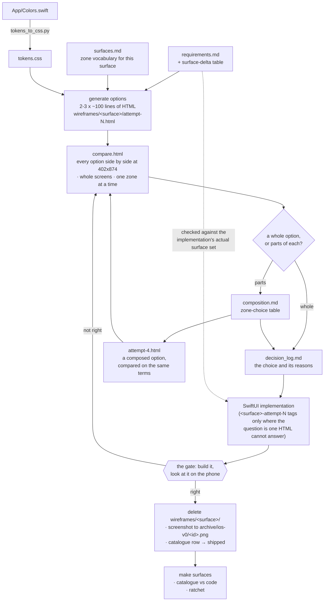

# Design: UI Wireframe Library

**Version:** 0.1
**Date:** 2026-08-17
**Requirements:** [`requirements.md`](requirements.md)
**Preconditions:** [`prerequisites.md`](prerequisites.md) · **Rationale:** [`decision_log.md`](decision_log.md)

This document is the HOW. It does not restate what must be true (that is `requirements.md`) or argue for
the choices (that is `decision_log.md`). Every number below is measured in this tree; where a measurement
is dated, it was taken on 2026-08-17.

---

## 1. Overview

### 1.1 What this is for

Three options for one readout is the convention working, not failing. `docs/agent-notes/device-build-and-test.md`,
under "Comparing UI attempts on the phone", describes the third shape as "three whole App layers for one
readout" and states that "Nothing merges until a person looks at all three and picks one". The three
insulin-dosing branches were commissioned deliberately, and the differences between them were the
deliverable — the developer wanted three things to look at.

What failed is what happened **after** they existed. The options turned out to be almost unusable:

- **Costly to generate.** `git diff --stat research...insulin-dosing-ui-{1,2,3}-on-research` measures
  542 + 1,565 + 1,015 = **3,122 lines of SwiftUI across three branches**, to try three versions of one
  readout. At that price, three options is a project rather than a routine.
- **Impossible to see together.** Each option needs `git checkout` plus `make deploy-device` to be seen
  at all, one at a time. The convention asks that "a person looks at all three"; nothing lets a person
  look at all three *at once*. The comparison happens from memory, across rebuilds.
- **Impossible to recombine.** Having looked, there is no way to say *"attempt 2's total row with
  attempt 1's scale control"* except by writing another paragraph of prose — which restarts exactly the
  loop that produced the three branches.

That last point is where the 443-line `specs/data/insulin-dosing/design-direction.md` belongs in the
argument. It is not evidence that prose is imprecise: it carries tokens quoted from `App/Colors.swift`,
point sizes ("44pt heavy mono"), opacities, control metrics ("h 48, medataAccent, r 12"), a Dynamic Type
shed order, verbatim VoiceOver strings and an explicit Forbidden list. It was committed on 2026-08-14,
the attempts are dated 2026-08-16, and attempt 1 quotes the document in its own code comments — it was
followed. It is evidence of something narrower and more useful: **even perfect prose cannot be pointed
at.** Prose is a poor medium for *describing* a look; SwiftUI is an expensive medium for *trying* one.

So this design has three jobs, and every artifact below serves one of them:

1. make an option **cheap to generate** — HTML instead of an App layer;
2. make every option for a surface **visible side by side**, at true device metrics, in one page;
3. make the parts of an option **nameable**, so parts of one can be taken into another and the result
   written down in a table anyone can build from.

### 1.2 Four artifacts, four lifetimes

The second organising idea is about keeping, not making: **the expensive part of a UI artifact is never
writing it — it is keeping it.** `design-system/pages/` holds 14 hand-written prose pages that cost real
effort to author and more to maintain badly: since `design-system/` was last touched by a commit
(2026-08-09, `4a469d6`), `App/` has taken **2,353 insertions across 29 distinct files**, in 18 commits.
The pages did not follow.
Rot is not a discipline failure to be exhorted away; it is the predictable outcome of a maintenance bill
nobody scheduled.

So: make the layer that must be permanent **cheap enough to be one line per state**, and make the layer
that is expensive **disposable, so it cannot rot**.

| Layer | Artifact | Lifetime | Why that lifetime |
| --- | --- | --- | --- |
| Catalogue | `design-system/surfaces.md` | **Permanent**, edited in the commit that changes a surface | One table row per surface x state is small enough that updating it costs less than skipping it |
| Archive | `design-system/archive/` | **Frozen**, write-once, superseded only by a new `-vN` generation | A file nobody may edit cannot drift; it is a record of a moment, not a description of the present |
| Options | `design-system/wireframes/<surface>/` — the attempts, the compare page and the composition record | **Disposable files, permanent record**: the HTML is deleted when the implementation lands, the zone-choice table moves to the owning spec's `decision_log.md` | A rendering cannot go stale if it does not outlive the choice it was made for; the reasoning has to outlive it |
| Contract | Surface-delta table in each UI-touching `requirements.md` | **Per-spec**, lives and dies with its spec | It is a claim about one change, checked once against an attempt branch's real surface set |

The layers answer different questions and must not be collapsed:

- the catalogue answers *what surfaces and states exist right now*, and *what the regions of each surface
  are called*;
- the archive answers *what did generation N look like*;
- an options folder answers *which of these renderings do we want, and which parts of which*.

Two supporting pieces make the layers work: `design-system/tokens.css`, generated one-directionally from
`App/Colors.swift`, so an option cannot invent a colour; and `tools/check_surfaces.sh`, wired to
`make surfaces`, so the catalogue cannot silently fall behind the code.

The mechanism that carries job 3 — **zones**, the shared per-surface region vocabulary that makes an
option a set of choices rather than an indivisible picture — is §3, immediately after the catalogue that
declares it.

---

## 2. The catalogue — `design-system/surfaces.md`

One markdown table per functional area, one row per **surface x state**. As built it is 1,021 lines
carrying **418 iOS state rows across 67 distinct surfaces**, plus the frozen web generation (101 rows
across 28 surfaces at `status: web-v0`, with its successor mapping), a 33-entry exemptions table and a
coverage section. Alongside the tables it declares the **zone vocabulary** for the surfaces that have one
— 23 surfaces across 19 distinct lists — which is §3.

### 2.1 Row schema

| Column | Contents | Constraint |
| --- | --- | --- |
| `id` | `<surface>/<state>`, kebab-case | The citation key. Unique. Renaming one is a breaking change to every spec that cites it |
| `surface` | The Swift type that renders it, or the construction site where no type exists | Matched by the check against declarations in `App/` and `MeData/MeDataWidgets/` |
| `file` | Repository-relative path | — |
| `kind` | `screen` \| `cover` \| `sheet` \| `overlay` \| `component` \| `control` \| `row` \| `shape` \| `layout` \| `representable` \| `widget` \| `bundle` \| `notification` | Closed list |
| `state` | The distinguishable visual state, phrased as what you would see on the phone | Prose, not code |
| `state source` | The thing in code that produces it — an enum case, a predicate, a stored flag | Written `<Enum>.<case>` where an enum produces it; this is what makes the row machine-checkable |
| `view-model` | The `App/<X>Model.swift` that owns the surface, or `—` | Records what is **actually** there |
| `data` | MedataCore product and type, `Product · Type` | **Names only.** Records the **intended** binding |
| `direction` | `read` \| `write` \| `read-write` \| `none` | — |
| `archive` | `pending` (screenshot owed) or `n/a` (nothing photographable in isolation, or retired) | On the iOS half the path is `archive/ios-v0/<id>.png` by construction, so the cell never carries one. The frozen `web-v0` rows spell theirs out (`archive/web-v0/<id>.png · pending`), because they land in a different generation directory and their ids already carry the `web/` prefix |
| `status` | `shipped` \| `planned` \| `retired` \| `web-v0` | Only `shipped` counts towards the coverage ratchet, and only the iOS half is ratcheted at all; the 101 `web-v0` rows are frozen record (§5) |

### 2.2 A worked row

```
| capture/tracking-lost | CaptureFlowView | App/CaptureFlowView.swift | screen |
  Hint "hold steady", shutter disabled | `CaptureState.trackingLost` | CaptureFlowModel |
  CaptureKit · ARKitCaptureEngine | none | pending | shipped |
```

Read left to right: the key you cite is `capture/tracking-lost`. `CaptureFlowView` in
`App/CaptureFlowView.swift` renders it, as a full `screen`. On the phone you see the hint "hold steady"
and a disabled shutter. That state exists because `CaptureState.trackingLost` is the current case — so
the check can confirm the row against the declaration in `App/CaptureState.swift` rather than trusting
the prose. `CaptureFlowModel` owns it. Behind the model sits `ARKitCaptureEngine` from `CaptureKit`, and
this state reads nothing from it, hence `direction: none`. Its screenshot is owed
(`archive/ios-v0/capture-tracking-lost.png`), and it is `shipped` today.

### 2.3 The id grammar, and why one key everywhere

`<surface>/<state>`, kebab-case, both halves. The same string is used by:

- the catalogue row's `id` cell;
- specs citing a surface, and `rune` task titles;
- agent prompts ("build two attempts at `meal-review/dose-suggestion`");
- the wireframe path — `design-system/wireframes/<surface>/<attempt>.html`, with the id in its opening
  HTML comment;
- the archive filename — `design-system/archive/ios-v0/<id>.png`, with the id's slash flattened to a
  hyphen because a filename cannot carry one: `capture/tracking-lost` becomes
  `archive/ios-v0/capture-tracking-lost.png`. Flattening is only safe while it stays injective; it is
  today, across all 418 iOS ids, and a collision is a reason to rename one of the two ids.

The reason to insist on one key is the failure it prevents. The records screen is `RecordsView.swift` in
`App/`, and `design-system/pages/` carries three pages that all claim some part of it —
`meals-tab.md`, `photo-tab.md` and `data.md` — named after two screens, `MealsTabView` and `DataView`,
whose files were both deleted and which no longer exist in the tree. Two of the three carry a hand-written
supersession banner ("Superseded by design-handoff-00 … do not implement against it"), which is the honest
version of this and also the point: the join is a sentence somebody remembered to write, in the file that
is wrong, pointing at another file rather than at the screen. Nothing mechanical connects a page to a
surface, so nothing notices when one stops being about anything. A single key makes the join greppable —
which is what lets the check in §9 exist at all.

Cite a row by its id **and quote its state text**; never by row number. Rows move.

### 2.4 Rows without a struct

Seven rows (every `dose-notification/*`) describe surfaces with no renderable type at all — a local
notification's banner and its actions are constructed in `App/DoseScheduleModel.swift` and
`App/LocalReminderScheduler.swift`. Those rows are keyed on the construction site rather than a type.
They are visible surfaces the user sees; excluding them because Swift has no struct for them would put a
hole in the baseline exactly where the least-reviewed UI lives.

### 2.5 Exemptions

A declared type that could be mistaken for a surface gets an explicit row in the **Exemptions** section
with a reason — row data, identity wrappers for `.sheet(item:)`, decoding shims, metric and formatting
helpers. The grammar is `exempt: <Name>`, backticks optional and several names comma-separated, with the
reason in the same row; a marker with no reason fails the check rather than excusing anything. Silence is
not permitted: the check treats an unexplained conforming type as a missing row.

33 entries cover the current tree, and **none of them conforms to one of the six scanned protocols**, so
the check reports `exempt=0` and every one of the 61 scanned structs is carried by a real row rather than
by an excuse. The entries are written down anyway, because the question they answer — why is this type not
a surface — otherwise has to be re-derived by each reader.

---

## 3. Zones and composition

This is the mechanism that turns *"take the best of each"* from a wish into an operation. It is a naming
convention and nothing else — no format, no code, no build step — and that is the whole reason it is
affordable.

### 3.1 A zone is a named region, declared once per surface

A **zone** is a region of a surface that a person points at when comparing two versions of the same
screen: `total-row`, `scale-control`, `food-rows`. The names are declared **once per surface in
`design-system/surfaces.md`** and reused by every option for that surface, so the vocabulary is shared
rather than reinvented by each wireframe. For `meal-review` the list is:

```
photo · total-row · primary-action · scale-control · accessory-line · food-rows
```

Nothing there is invented. It matches `App/MealReviewView.swift` member for member (`photoSection`,
`totalRow`, `primaryAction`, `scaleControl`, `accessoryLine`, `foodRow`), it matches the "Layout zones"
block in `design-system/pages/meal-review.md`, and it is the order
`specs/data/insulin-dosing/design-direction.md` §2 fixes: "Layout order is fixed and must not change:
photo (40%) / totalRow / primaryAction / scale control / 1px divider / scrolling rows". The vocabulary is
harvested from what the code and the page files already call these regions, because a name nobody
recognises is not a shared name.

**Where the declaration lives.** Under the catalogue section heading that owns the surface, as prose —
**not** as a table column. Zones are per *surface*; the table is per *surface x state*, and as
`design-system/surfaces.md` puts it, "an eleven-column table does not need a twelfth". A zone list can
also carry what a screenshot cannot: the `meal-review` list records that the above-the-fold boundary
falls after `scale-control`, and that the very-low variant **occupies** `scale-control` rather than
adding a region — which is why `meal-review/very-low` is a choice about that zone and not a seventh one.

**Only where they earn their keep.** 23 surfaces declare zones, across 19 distinct lists (the five
`row-*` record rows share one). Most surfaces declare none, and that is correct: a 76 pt shutter button,
a confidence pill, a widget family variant and a notification action have nothing to point at that a
state row does not already name. Declaring zones nobody will use is how a convention becomes noise.

**In a wireframe** the zone is marked in the markup and nowhere else:

```html
<section data-zone="total-row"> … </section>
```

`design-system/wireframe.css` styles `:root.zones [data-zone]` with an outline and an `::after` carrying
`attr(data-zone)`, so zone boundaries can be turned on when you want to see the parts as parts and stay
invisible otherwise. That is the entire technical footprint. Zones generate no code, no Swift type has to
exist for one, nothing imports anything because of one, and nothing checks that an implementation
respects the boundaries its wireframe declared. A zone says what a region looks like; it never says how
that region is factored in Swift.

### 3.2 An option is a set of zone choices

Once every option for a surface marks the same regions with the same names, the sentence a person wants
to say becomes a table they can write. This is the worked one from
`design-system/wireframes/insulin-dose/composition.md`, over the three real insulin-dosing options:

| zone | taken from | reason |
| --- | --- | --- |
| `photo` | attempt-1 | Identical in all three; taken from the option that changed nothing |
| `total-row` | attempt-2 | The extracted middle-dot line. The divisor is the parameter the feature exists to measure, and it sheds first, so at any width where it does not fit the line is byte-identical to attempt 1's |
| `primary-action` | attempt-1 | Unchanged `Record 60 g`. No option proposed anything else, and the screen's single accent budget is spent here |
| `scale-control` | attempt-1 | 44x34 capsules kept where they are, because `specs/ui/meal-review/requirements.md` says "The scale control SHALL be visible without scrolling when the surface first appears." |
| `accessory-line` | attempt-1 | One expandable line, unchanged; nothing in the three options touched it |
| `food-rows` | attempt-3 | Its chip and commit treatments, which `App/EntryChrome.swift` on `insulin-dosing-ui-3-on-research` describes as "the plate-fraction control's, moved to the grouped palette" |

Six lines, and the next artifact is unambiguous. **That table is the description of what you want to see
next** — writable in a minute, buildable directly as the next wireframe or as the SwiftUI, and reviewable
by someone who was not in the room. It is the thing the 443-line prose document could not be, not because
the prose was vague but because a paragraph has no handles.

Two things the table deliberately cannot say, and where each goes instead:

- **A change to the set of surfaces is not a zone choice.** Attempt 3's actual proposition is that
  `meal-review` carries no dose readout at all and that three manual-entry sheets become one —
  `App/LogSheet.swift` calls itself "ONE manual-entry surface, three modes … This is that third sheet
  refusing to exist", and `git diff --name-only research...insulin-dosing-ui-3-on-research` does not list
  `App/MealReviewView.swift`. Zones compose *within* a surface; the surface-delta contract (§8) records
  changes *to the set of* surfaces, as a `consolidate` row naming the ids involved. The two artifacts are
  complementary and neither substitutes for the other.
- **A zone choice does not settle decomposition.** Attempts 1 and 2 render the second line identically in
  places; attempt 1 built it inline in `App/MealReviewView.swift`, attempt 2 extracted
  `App/DoseReadoutLine.swift`. If the factoring matters it belongs in the decision, not in the table.

### 3.3 The compare page — options seen at once

`design-system/wireframes/<surface>/compare.html` puts **every option for one surface in one page, at true
device metrics, adjacent**. For `meal-review/dose-suggestion` that is 538 lines of self-contained HTML
that opens by double-clicking the file: no server, no build step, no framework.

This is the highest-value artifact in the design, and the reason is the complaint it answers. The three
options existed before this page did; what did not exist was any way to look at them together.
Each needed `git checkout` plus `make deploy-device` to be seen at all, so "a person looks at all three"
meant looking at one, rebuilding, looking at the next, and holding the first in memory. A page that
removes the rebuild and the memory from that loop is worth more than any amount of additional precision
in the description of a single option.

What the page provides, all of it in three small behaviours and no dependencies:

| Control | What it does | Why |
| --- | --- | --- |
| Whole screens | All options in one strip at 402x874, unscaled | The default: the comparison the developer could not previously make at all |
| Per-zone view | One region of every option beside itself, one button per declared zone | "Attempt 2's total row against attempt 1's" becomes a two-second judgement instead of a memory exercise |
| Outline zones (`z`) | Draws each `data-zone` boundary with its name | Makes the parts visible as parts when you are deciding which part you want |
| Fit to window (`f`) | Scales the strip to 0.72x, **labelled "not true metrics"** | An honest escape hatch on a narrow display; the label is there because a scaled screen is no longer evidence about size |

Each zone button carries **the question that zone decides**, written where the decision is made rather
than in a document beside it — for `total-row`: "Attempt 1 appends one segment to the line that already
ships; attempt 2 appends two, carrying the divisor at every meal; attempt 3 appends none." Two renderings
with no stated difference are a mood board; two renderings with a stated question are a decision with an
answer.

One deliberate ugliness: the compare page carries its own copy of each option's screen markup, because a
`file://` page cannot read its siblings — no `fetch`, no cross-frame scripting — and adding a server or a
build step to a disposable artifact would cost more than the duplication does. The whole folder, options
and compare page together, is deleted when the implementation lands, so the duplication lives for days,
not months.

### 3.4 A composed option is an ordinary option

Composing zones from three attempts produces `attempt-4.html`, written like any other option, marked with
the same `data-zone` names, and dropped into `compare.html` beside the other three on exactly the same
terms. There is no separate category for it, no "merged" state, no special notation.

That matters twice over. It means composition costs nothing to express beyond writing the table and the
~100 lines that render it. And it means composition earns no privilege: a fourth option assembled from
the best parts of three is still an *option*, not a decision. It goes back into the same page, and then
onto the same phone, as everything else.

### 3.5 The files are disposable; the record is not

The zone-choice table is the part that has to survive, because in a year the question will be *why does
the total row look like that* and the answer is in the reasons column, not in the picture. On
implementation:

1. The composition table, with its reasons, moves into the owning spec's `decision_log.md` as an Enhanced
   Nygard entry — where the **alternatives considered are the zones not taken**, which is a rare case of
   that field writing itself.
2. The chosen render goes to `design-system/archive/ios-v0/<id>.png` —
   `meal-review-dose-suggestion.png` for this surface.
3. The catalogue row for that id flips to `shipped`.
4. `design-system/wireframes/<surface>/` is deleted, `composition.md` included.

The reasoning is preserved in the spec, the appearance is preserved as a picture, and the HTML — which
was only ever a way of looking — is gone. That is what makes the choice reviewable a year later without
keeping a folder of renderings alive to rot.

---

## 4. The UI↔data seam

This is the load-bearing section. Requirement: *translate between app UI and data easily, without
introducing cross-layer dependencies.*

### 4.1 The architecture the columns record

```
View  ──►  App/<X>Model.swift  ──►  MedataCore product (Persistence, Pipeline, Foods, …)
 │              │                            │
 │              │                            └── `data` column: "Persistence · DoseOccurrence"
 │              └── `view-model` column: "DoseScheduleModel"
 └── `surface` + `file` columns
```

The catalogue records this path as **names**. Three consequences follow, and all three are the point:

1. **It generates no code.** There is no build step reading `surfaces.md`, no emitted Swift, no emitted
   Kotlin, no manifest.
2. **It creates no import.** Naming `Persistence · DoseOccurrence` in a markdown cell does not make
   `App/HomeView.swift` depend on `Persistence`. The join is readable by a human or an agent and invisible
   to the compiler.
3. **It has no build-time coupling.** `make build`, `make test` and the Xcode project are unaffected by
   the catalogue's existence. `make surfaces` reads it; nothing else does.

This is the mechanism `specs/PROCESS.md` §3 already prescribes for cross-domain capability, which
"*references the other domains' specs rather than duplicating them*". A documentation join is that rule
applied one level down: to types instead of specs.

### 4.2 The measured current state, stated honestly

The seam exists in the architecture. It is **not enforced in the code.**

`App/` contains 22 files matching `*View.swift` or `*Sheet.swift`. Of those, **19 import at least one
MedataCore module directly** — the number `tools/check_surfaces.sh` prints today as
`layer_violations=19 (report-only)`. Counting only the six products the `data` column actually names —
`Persistence`, `Pipeline`, `Foods`, `PortableContracts`, `CaptureKit`, `Segmentation` — **18 of 22**
import one directly, distributed as:

| Product | View/Sheet files importing it |
| --- | --- |
| `Persistence` | 10 |
| `Pipeline` | 7 |
| `Foods` | 3 |
| `PortableContracts` | 2 |
| `CaptureKit` | 2 |
| `Segmentation` | 1 |

(Counts overlap — `App/BenchmarkView.swift` alone imports `Benchmark`, `Foods`, `Persistence` and
`Segmentation`.) The remaining difference between 18 and 19 is `App/GlucoseConnectionsView.swift`
importing `GlucoseIngestion`, a data product not on the six-name list.

The `view-model` column records the same honesty from the other side: `—` means no model owns the
surface today, which is exactly where a view holds a `PersistenceStore` and its own `@State` instead —
`ResultView`, `MealOverviewView`, `MaskOverlayLoader`, `QuickPresetEditSheet`, most of `SettingsView`.
`MealHistoryModel` is the mirror image: a live model no view currently instantiates.

### 4.3 Why the `data` column records the intended binding, not the observed one

Deriving the column from actual imports is the obvious automation and it is the wrong one. It would bake
19 files' worth of layering violation into the catalogue **as if it were the design** — the document
whose stated purpose is to define the app as the baseline for moving forward would instead ratify the
thing we want to move away from. Worse, it would make the catalogue *agree* with the code by
construction, so it could never disagree with it, so it could never tell you anything.

The `view-model` column takes the opposite rule deliberately: it records what is actually there, because
its `—` cells are a to-do list. The two columns together read as *"this is where the data should come
from, and this is whether anything currently mediates it."*

### 4.4 Why the layer check is report-only at first

Nineteen files already violate the rule. A check that fails on day one for pre-existing reasons gets
deleted, disabled or `|| true`-ed within a week — and then the check is gone, including for the cases it
would have caught. Report-only means the number is visible on every run and can only be argued down.
Promoting it to a failure is a separate, later decision that becomes cheap once the number is small; the
ratchet in §9 is the pattern to copy when it happens.

---

## 5. The archive — `design-system/archive/`

Write-once. Never edited. Superseded only by a new generation.

```
design-system/archive/
├── ios-v0/<id>.png     rendered screenshots of shipped iOS surfaces
├── web-v0/<id>.png     the SvelteKit screens on `main`
└── pages-v0/*.md       the 14 current prose pages, frozen verbatim
```

**Why frozen artifacts cannot drift.** Drift is the gap between what a document claims about the present
and what the present is. A frozen artifact makes no claim about the present — `ios-v0/` says *this is
what the app looked like at generation 0*, which stays true forever. `design-system/pages/` rots because
it is phrased as a description of the app; the same bytes, relabelled `pages-v0/`, stop rotting the
moment they stop claiming to be current.

**The `-vN` generation rule.** An archived file is never updated in place and never deleted. When a
surface is redesigned enough that the old screenshot misleads, the *whole generation* is superseded by
`ios-v1/` and the old one stays. `N` is a generation counter, not a version number — everything remains
v0 until `main` (`docs/agent-notes/device-build-and-test.md`, "Everything stays v0 until main").

**`pages-v0/` and the live pages.** Freezing a copy is not deleting the originals. `design-system/pages/`
continues to exist and to be maintained where it is still used; `pages-v0/` fixes the 2026-08-17 state so
that "what did the page say before we changed it" is answerable without archaeology.

**`web-v0/` is an expiring option.** The SvelteKit app on `main` is catalogued as **28 surfaces / 101
state rows across 22 source files**, every row at `status: web-v0`, with a **Successor mapping**
subsection naming what each web surface became on iOS — or that it was dropped, as for the Apply Preset
sheet and the toast system. Cataloguing it costs nothing extra now that the rows exist; *photographing*
it has a deadline, because the Node toolchain that renders those screens is no longer maintained on
`research`. Roughly an afternoon now, impossible later. That asymmetry is the only expiry date in this
work.

The web half is catalogued but **not ratcheted**: `tools/check_surfaces.sh` reads the whole file and
checks only the iOS numbers, because there is no `main` code to keep the web rows honest against and no
options being generated for a frozen app. It is a design input to point at, not a build target.

**No PNGs exist yet.** 378 iOS rows and all 101 web rows carry a `pending` archive cell; the directories
are created by the backfill work in [`tasks.md`](tasks.md). Which goal that work serves is stated plainly
in §11.

---

## 6. The options folder — `design-system/wireframes/<surface>/`

**What "disposable" means, precisely.** The **option files** are disposable: `attempt-N.html` and
`compare.html` are deleted when the implementation lands, and they are written in the knowledge that they
will be. The **decision record is not**: the zone-choice table and its reasons move into the owning
spec's `decision_log.md`, and the chosen render is archived as a PNG (§3.5). Nothing that answers *why*
is thrown away; only the things that answer *what does it look like*, which the screenshot answers better
and the shipped Swift answers best.

That split is what makes the folder maintenance-free. A rendering that outlives its decision has to be
kept true against a moving app, which is the bill `design-system/pages/` is still paying. A rendering
that dies with its decision has no such bill, and a decision log entry has none either, because it is
dated and makes no claim about the present.

### 6.1 Format

One folder per surface under active design, one self-contained HTML file per option:
`<surface>/attempt-N.html`, plus `compare.html` and `composition.md` for that surface. Each option opens
with a comment naming its catalogue id, its attempt number, the **one thing it is testing** and the zone
vocabulary it marks — as the three committed files do:

```html
<!--
  catalogue id: meal-review/dose-suggestion
  attempt:      3  (branch `insulin-dosing-ui-3-on-research`)
  testing:      whether the readout belongs on meal review at all — attempt 3 leaves that
                surface untouched and puts the dose where a dose is logged …
  zones:        photo · total-row · primary-action · scale-control · accessory-line · food-rows
                (declared for `meal-review` in design-system/surfaces.md).
-->
```

Naming the question is not decoration. Two renderings with no stated difference are a mood board; two
renderings with a stated difference are a decision with an answer. Naming the zones is what lets the
answer be *"the second one's, but with the first one's capsules"*.

### 6.2 True metrics

`design-system/wireframe.css` (551 lines, hand-written) sets `--device-w: 402px` and `--device-h: 874px`
— iPhone 16 Pro logical points at 1pt = 1px, so a value written in the wireframe is the value written in
Swift. Spacing is the `MASTER.md` scale as variables (`--space-1..6` = 4/8/16/24/32/48), type roles are
variables (`--type-total: 44px` is `MealReviewView`'s 44pt heavy mono), and the primary control is
`--control-h: 48px` / `--radius-control: 12px`.

Two caveats are written into the stylesheet itself rather than left to be rediscovered: `--status-band`
and `--home-band` are the *drawn* chrome strips, not a claim about UIKit safe-area insets; and the
stylesheet must never introduce the `MASTER.md` anti-patterns (shadows, blur behind chrome, a second
accent colour, gradients as control fills).

### 6.3 The token link

Every option links `../../tokens.css` then `../../wireframe.css`, and so does `compare.html`. Every
**hue** comes from a `--medata-*` custom property or it is wrong: `wireframe.css` makes 40 token
references across 16 distinct tokens and names no hue
that `App/Colors.swift` does not define. What it does name outside the tokens is **neutrals** — the greys
of the page furniture around the device (`--frame-page`, `--frame-edge`, `--frame-note`), the striped fill
standing in for a photo, and white at various opacities. The last of those is the app's own OLED chrome
convention rather than a token set (`design-system/MASTER.md`: "white-on-black chrome"); `App/Colors.swift`
defines only `captureChromeBG` at `white.opacity(0.10)`, so a wireframe's other white levels are the one
place it is working without a token. §7 covers generation.

### 6.4 Lifecycle

1. **Generate two or more options.** One option is a draft, not a choice. This mirrors the standing
   convention in `docs/agent-notes/device-build-and-test.md`: a UI surface worth deciding about ships as
   several renderings because the gate is a person looking at a screen.
2. **Compare them side by side** in `compare.html` — whole screens first, then zone by zone.
3. **Compose, if the answer is parts of each.** Write the zone-choice table in `composition.md` and, when
   it is worth seeing rather than only reading, build it as `attempt-4.html` and compare it on the same
   terms (§3.4).
4. **Decide**, and record the table with its reasons in the owning spec's `decision_log.md`.
5. **Implement**, tagging per the `<surface>-attempt-N` convention if options continue into Swift for a
   question HTML cannot answer.
6. **Delete the folder.** Render the winner to `design-system/archive/ios-v0/<id>.png` and flip that row
   in `design-system/surfaces.md` to `shipped`.

Steps 4 and 6 together are the maintenance strategy in full: the reasoning is kept where reasoning is
kept, and the files are deleted. There is no review cadence, no staleness audit and no freshness marker,
because there is nothing left to be stale.

### 6.5 What an option costs

The convention today generates options *in Swift*: build the variant, tag it, install it, look. It works,
and the price is why three options is currently an expedition. The three insulin-dosing options measure
(`git diff --stat research...<branch>`):

| Attempt | Files changed | Insertions |
| --- | --- | --- |
| `insulin-dosing-ui-1-on-research` | 8 | 542 |
| `insulin-dosing-ui-2-on-research` | 17 | 1,565 |
| `insulin-dosing-ui-3-on-research` | 14 | 1,015 |

The same three options in this design's medium — `design-system/wireframes/insulin-dose/attempt-{1,2,3}.html`
— are **104, 100 and 160 lines**, the third being longer because it renders two surfaces to make its
argument. Add `compare.html` (538 lines — one page per surface, however many options it holds) and
`composition.md` (89 lines).

The point is not that HTML is a cheaper way to be precise. **The point is what happens to the cost of a
second and third option.** At ~542–1,565 lines of Swift on its own branch, an option is a decision to
spend a day, so three of them is a three-branch project that gets planned, scheduled and defended. At
~100 lines of HTML sharing one stylesheet, an option is an hour — so generating three, looking at them
together, and then generating a fourth out of their best parts becomes an ordinary morning rather than
an undertaking. Cheap options mean **more** options, which is the outcome the
convention wanted and the price prevented.

The ratio is measured in this repo's own history at scale, not assumed. `design-handoff-00` rendered the
same screen set twice — 14 view files under `MedataApp/Views/` against the same screens as JSX
components. `design-system/wireframes/design-handoff-00/wireframes/screens/*.jsx` totals **1,033 lines**
(plus 544 lines of shared CSS), against **2,229 lines** of Swift across 24 files in
`design-handoff-00/MedataApp/`. Roughly half the cost for the same picture — and that comparison
understates the case here, because a wireframe renders one surface in one state while the Swift has to
render all of them.

The tag convention is unchanged — the tags, the clean-tree rule, the three shapes, the build stamp all
stay exactly as documented. What changes is *what gets tagged*: cheap options happen in HTML, and Swift
options are reserved for the questions HTML cannot answer (§11).

---

## 7. Tokens — one direction only

`tools/design_tokens/tokens_to_css.py` (230 lines, stdlib only) parses the `static let` lines of
`App/Colors.swift` into `design-system/tokens.css` custom properties.

- **`App/Colors.swift` stays hand-written and authoritative. `App/` does not change.** The generator
  reads it and never writes it.
- **Naming is mechanical with no exceptions:** `static let <name>` → `--medata-<kebab(name)>`, so
  `medataAccent` becomes `--medata-medata-accent`. An ugly name in one place beats an exception every
  wireframe author has to remember.
- **`Color(uiColor: .systemX)` has no fixed sRGB value** — UIKit resolves it per appearance, per contrast
  setting and per OS release. The wireframes commit to OLED-dark, so each is emitted at its documented
  dark-appearance value and marked `approx` in a comment beside the property. The approximation is
  visible in the output rather than hidden in it.
- **`--check` mode** exits non-zero when the on-disk CSS is stale and writes nothing, so regeneration can
  be verified without a diff.

Current output: `tokens=22 approx=13 alias=3 groups=6 out=design-system/tokens.css` on a write, and
`tokens=22 stale=0 out=design-system/tokens.css` under `--check`. Thirteen properties carry an `approx`
comment against twelve `Color(uiColor:)` tokens, because `bandActivity` inherits the approximation from
the `seriesActivity` it aliases. All 22 `static let` tokens in `App/Colors.swift`
round-trip, including the four (`bandActivity`, `seriesActivity`, `seriesInsulinBasal`,
`seriesInsulinBolus`) that `design-system/MASTER.md`'s hand-copied Swift snippet is missing — it lists 18.
That snippet is replaced by a pointer to `App/Colors.swift`, which removes the only place the token list
is hand-maintained twice.

### Why there is no SwiftPM `Tokens` target

This was proven, not assumed. A shared SwiftPM target would be the tidier-looking answer and it does not
build:

- `Makefile` `build:` is `swift build`, run on the **macOS host**;
- `Package.swift` declares `.macOS(.v14)` in its platforms list, so every target must compile for macOS;
- **12 of the 22 tokens** use `Color(uiColor:)`, which does not exist on macOS.

Adding the target therefore breaks `make build` — the repo's primary check — for a cosmetic gain. A
generator sidesteps the platform question entirely and matches the convention this repo already uses for
derived artifacts (`tools/food_db/generate.py`, `tools/segmenter/export.py`): a committed output with a
named script that regenerates it.

---

## 8. The surface-delta contract

A table in each **UI-touching spec's `requirements.md`**, written *before* implementation:

| surface | change | catalogue id | note |
| --- | --- | --- | --- |

`change` ∈ `add` | `modify` | `delete` | `consolidate`. `catalogue id` is the §2.3 key: an existing one
where the change lands on a state that already exists, a newly minted one where the change adds a surface
or a new state to an existing surface. A `—` in the `change` column marks a surface deliberately named as
**out of scope** — the row exists to say "this must survive unchanged", which is a claim the contract can
be checked against. The table lives in `requirements.md` because it is a statement of what must be true
of the finished work, not of how it is built.

**This is the part with teeth.** An option shows you one surface beautifully; the contract is what
notices a surface that nobody built. It separates divergence you commissioned — three looks at one
readout, deliberately, which is the point of the whole exercise — from divergence nobody noticed, such as
a whole requirement area silently absent. Zones compose *within* a surface (§3); this table records
changes *to the set of* surfaces. Neither substitutes for the other.

### Worked example: the three surface-set gaps this table would have caught

Had `specs/data/insulin-dosing/` carried this table before the three attempts branched — the ids are
those that would have been minted at that moment; the activity surface has since landed and is
catalogued as `activity/*`:

| surface | change | catalogue id | note |
| --- | --- | --- | --- |
| Meal review dose line | modify | `meal-review/dose-suggestion` | Derived register, appended to the existing total row |
| Activity entry sheet | add | `activity/entry` | New surface; reachable from home and from `medata://activity/add` |
| Carb entry sheet | modify | `intake/sheet-new-entry` | Gains the dose readout; stays a distinct sheet |
| Insulin dose sheet | modify | `insulin-dose/bolus` | Gains the suggestion seed; stays a distinct sheet |
| Metric chip flow | — | `chip-flow/single-line`, `chip-flow/wrapped` | Not in scope; must survive unchanged |

Checked against each attempt branch's actual surface set:

1. **Attempt 1 built no activity surfaces at all** — no `App/ActivitySheet.swift`, no
   `App/ActivityModel.swift`, while attempts 2 and 3 both did. The `add` row for `activity/entry` has no
   corresponding surface on that branch: a whole commissioned requirement area is simply absent, and the
   table says so in one line.
2. **Attempt 3 consolidated three entry sheets into one** — it added `App/LogSheet.swift` (135 lines on
   that branch)
   over `ActivitySheet`, `CarbEntrySheet` and `InsulinDoseSheet`. That is a `consolidate` the contract
   did not authorise. It may well be the better design; the contract's job is to make it a *decision*
   ("this is that third sheet refusing to exist" is an argument worth having) rather than a fact
   discovered during review.
3. **Attempt 3 deleted `ChipFlow`** — 57 lines removed from `App/TrendsView.swift`, `private struct
   ChipFlow: Layout` and its comment, in a single hunk (`@@ -397,60 +397,6 @@`, 3 insertions against 57
   deletions in that file), incidental to the work and mentioned nowhere. The
   `—` row makes the omission explicit rather than assumed, and §9's conformance regex catches the
   deletion mechanically even when nobody thought to write the row.

Three gaps, three different mechanisms — one missing, one unauthorised, one incidental — and the same
one-line table catches all three because it is written down before rather than reconstructed after. None
of them is the three options differing from each other; all of them are the surface set differing from
what was asked for.

---

## 9. The check — `tools/check_surfaces.sh`, wired to `make surfaces`

330 lines of bash — above the 150–250 estimated before it was written, and the estimate is the number
that was wrong. `tools/check_spelling.sh` is 168 lines for a materially easier job (one regex family over
one file type), and this one parses markdown tables, tracks Swift brace depth and extracts enum cases.
Output is compact `key=value` lines, per the repo convention that tools emit numbers and specs carry
interpretation.

### Stage 1 — struct coverage (FAILS)

Every struct in `App/` and `MeData/MeDataWidgets/` conforming to one of

```
View | Shape | Layout | UIViewRepresentable | UIViewControllerRepresentable | Widget
```

must have a catalogue row, or an explicit exemption in the form `exempt: <Name>` — backticks optional,
several names comma-separated — with the reason later in the same row. The reason is required: a marker
without one is reported as `exempt_no_reason` and fails, so an exemption cannot decay into a bare name.

**The wide conformance list is the whole point of this stage.** A `struct .*: View` grep — the obvious
implementation — is blind to `ChipFlow: Layout`, `MaskContourShape: Shape`, `ARPreviewView:
UIViewRepresentable` and `ShareSheet: UIViewControllerRepresentable`. `ChipFlow` is *exactly* the
component an attempt silently deleted (§8), and it is both `private` and `: Layout`: the narrow grep is
blind to precisely the case that has already gone wrong once here. Nested types get a qualified name
(`MedataSymbolGeometry.Bowl`, not a bare `Bowl`) by brace-depth tracking, with comments and string
literals blanked first so a `{` in prose cannot shift the depth.

The markers are normalised once — backticks stripped, comma lists expanded to one marker per name — and
the coverage search then runs over a copy with those markers blanked, so `exempt: ChipFlow` cannot satisfy
the coverage rule by naming the very struct it fails to excuse. The name boundary excludes `.` for the
same reason in reverse: `exempt: ResultView.FoodRow` must not read as a reasonless exemption of
`ResultView`.

### Stage 2 — state enum cases (FAILS)

For each named state enum, every case must appear in some row's `state source` cell as `<Enum>.<case>`.
The enum **names** are an editorial choice and are listed in the script — `CaptureState`,
`ConfidenceLevel`, `CalibrationBannerState`, `PlateFraction`, `ShutterButtonState`, `TiltGuideState`,
`CaptureStage`, `MealRoute`, `CaptureRoute`, `PermissionSubject`. Their **cases** are parsed out of the
Swift source and never hard-coded, so adding or renaming a case shows up as a catalogue miss instead of
passing silently.

Two parsing rules earn their place: cases are collected only at the enum body's own brace depth, which
keeps the `case .veryLow:` arms of a `switch` inside a computed property out of the list; and
associated-value lists are stripped before splitting on commas, so
`case capturing(stage: CaptureStage, frozen: GatingSnapshot)` yields one case and not three.

### Stage 3 — coverage ratchet (FAILS on regression)

Prints `covered=N total=M baseline=B` against `covered_min=` in `tools/surfaces_baseline.txt`. `total` is
the scanned structs less the exempted ones. Falling below the baseline fails; rising above it prints a
`ratchet_raise` line naming the value to lock in, in the same commit that added the rows.

Coverage is deliberately **stricter than stage 1**: a struct counts as covered only when one of its rows
has status `shipped`. A row alone is not coverage. This is the design's answer to its own worst failure
mode — a green boolean over a table of `planned` rows is worse than today's visibly absent file, because
it converts "we have not done this" into "the check passes". The baseline is raised only in the commit
that earns it: it starts at `covered_min=0`, and `tools/surfaces_baseline.txt` now reads `covered_min=61`
because the first pass of the catalogue gave every scanned struct a `shipped` row.

### Stage 4 — layer report (REPORT-ONLY)

Lists `App/*View.swift` and `App/*Sheet.swift` files importing a MedataCore module directly, one
`layer file=… imports=…` line each, then `layer_violations=N (report-only)`. The module list is read off
`MedataCore/Sources/` at run time so it cannot rot as products are added. §4.4 covers why this never
fails the build today.

### Current output

The catalogue and the check land together. Its first run found four real catalogue defects, which is the
useful outcome — a check that passed immediately would have told us nothing:

- two `missing_row` lines for the nested `Shape`s in `App/MedataLoadingSymbol.swift`, because the rows
  named them `MedataLoadingSymbol.Bowl` / `.Dot` while the declarations are inside
  `enum MedataSymbolGeometry`;
- two `missing_state` lines for `MealRoute.overview` and `MealRoute.result`, whose rows described the
  destinations in prose without writing the enum case in the `state source` cell.

All four were catalogue-side and are fixed. The same pass found one script-side gap that nothing was
failing on yet — the exemption grammar did not read the backticked, comma-separated form the catalogue
actually writes — and that is fixed in `tools/check_surfaces.sh` rather than by rewriting 33 readable
rows into the parser's convenience. As of 2026-08-17 `make surfaces` reports:

```
catalogue=design-system/surfaces.md rows=647
structs=61 missing=0 exempt=0
enum=TiltGuideState cases=0 note=namespace-enum
enum_cases=30 missing=0 enums_not_found=0
covered=61 total=61 baseline=61
… 19 layer lines …
layer_violations=19 (report-only)
OK: every surface and state enum case has a catalogue row.
```

`rows=647` is every non-separator table row after the first: the 418 iOS state rows, the 101 `web-v0`
rows and their 28 successor-mapping entries, the repeated per-section headers, the 33 exemptions and the
coverage tables. It is a parse figure, not a claim about surfaces — the surface numbers live in the
catalogue's own Coverage section, counted per half because only the iOS half is ratcheted. `exempt=0` is the
correct answer rather than a miss: all 33 written exemptions name types that
conform to nothing the scan looks for, so none of the 61 scanned structs is excused by one (§2.5).

---

## 10. How this changes the loop

**Before.** A surface is described in prose, however precisely. Two or three Swift options are built
against it, each a full App-layer branch (542 / 1,565 / 1,015 insertions). They are installed one at a
time, so all three are never on screen together and the comparison is done from memory across rebuilds.
Taking a part of one into another is unsayable, so an option wins or loses whole. Changes to the *set* of
surfaces — a commissioned activity sheet nobody built, a `ChipFlow` quietly deleted — surface by reading
diffs afterwards, or not at all. The prose page is updated, or is not.

**After.** The surface-delta table is written in `requirements.md` first. Two or three ~100-line HTML
options are generated against the zone vocabulary the catalogue already declares for that surface, and
opened together in `compare.html` — whole screens, then zone by zone. If the answer is parts of each, the
zone-choice table is written; where it is worth seeing rather than only reading, it is built as
`attempt-4.html` and compared on the same terms. The choice and its reasons go to `decision_log.md`.
*Then* the Swift is written — once, or still as tagged attempts where the remaining question is one HTML
cannot answer. The folder is deleted, a screenshot lands in `archive/ios-v0/`, the catalogue row flips to
`shipped`, and `make surfaces` refuses to let the surface set drift out from under the catalogue.



The last step is the one that has not moved. **The gate is still a person looking at a screen on an
iPhone 16 Pro**, exactly as `CLAUDE.md` states. Nothing here is a substitute for that, and nothing here
is a test suite: no new test target, no visual-regression harness, no screenshot comparison. This work
makes options cheap, comparable and recombinable, and makes the surface set legible; the gate is
unchanged.

---

## 11. Limits, and what this does not solve

Stated here rather than buried, because each one is a case where someone could reasonably expect this
design to help and it will not.

- **Nothing mechanically forces an option to be wireframed before it is built in SwiftUI.** That stays a
  habit. There is no hook, no CI rule and no proposed one. What the design offers instead is that
  wireframing is *cheaper* than not — ~100 lines against ~1,000 (§6.5) — which is a better lever than a
  rule and is still not a guarantee.
- **Zones are a convention, not a construct.** Nothing verifies that a SwiftUI implementation respects
  the zone boundaries its wireframe declared, and nothing could without generating code, which is
  explicitly out of scope. Two people can agree the zone table and still build different things inside a
  zone. The value is only that they mean the same region by the same word.
- **A composed option is still an option, not a decision.** Zone-picking makes a fourth candidate cheap
  to express; it does not make it right, and assembling the best-liked part of each can produce a screen
  that is worse than any of its parents. It goes back into `compare.html`, and then onto the phone, like
  everything else.
- **Neither a wireframe nor a zone choice settles decomposition.** Attempts 1 and 2 rendered the dose
  line identically in places; attempt 1 inlined it in `App/MealReviewView.swift`, attempt 2 extracted
  `App/DoseReadoutLine.swift` (146 lines). A rendering has no channel for that distinction and a zone
  choice does not add one — zones say what a region looks like, never how it is factored in Swift. So
  inline-versus-extracted, state models and settings keys remain decisions made in Swift and recorded in
  a decision log. This is the class of question tagged Swift attempts are still for.
- **A catalogue keyed on surface x state presupposes the surface set** rather than settling it. It can
  tell you a row is missing; it cannot tell you three sheets should have been one. That is precisely why
  the surface-delta contract is in scope as a separate artifact.
- **HTML can lie** about Dynamic Type, safe areas and `ViewThatFits`. `wireframe.css` labels its status
  and home bands as drawn strips rather than insets for this reason, and `compare.html`'s fit-to-window
  control labels itself "not true metrics". It is a medium for choosing between options, never for
  proving one works: treat every metric in a wireframe as a starting position to check on the phone.
- **Backfilling shipped surfaces does not help generate options, and is not claimed to.** `App/*.swift`
  is already the canonical answer for anything `shipped`, and a screenshot of it teaches an author
  nothing the running app does not. It serves the *baseline* goal — define the app as-is, so a new option
  is described as a change to something written down, and so the zone vocabulary a future option will use
  exists before it is needed. Which goal each part of this work serves: §2 and §5 serve the baseline;
  §3 and §6 serve generating, comparing and composing options; §8 catches changes to the surface set;
  §9 keeps §2 true.
- **The dominant historical rot cause is out of reach of all of it.** `design-handoff-00`'s `MANIFEST.md`
  attributes its deviations to "*user direction after seeing the implementation*" — the design changing
  **after** the phone showed it. No forward-only wireframe→code flow can catch that. What the catalogue
  can do is make the resulting change cheap to write down; what it cannot do is make it unnecessary.
